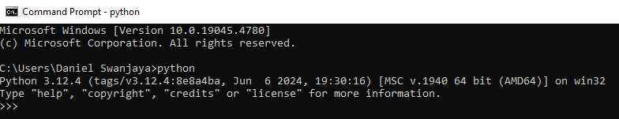
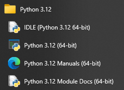
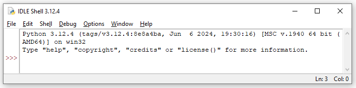
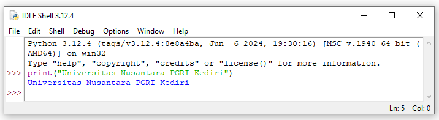

# DASAR PYTHON
## Pengenalan Lingkungan Pemrograman Python
### 1. Pengenalan Python
Python merupakan bahasa pemrograman dinamis yang mendukung pemrograman berbasis objek dan memiliki sifat dynamic semantics. Python dapat digunakan untuk berbagai keperluan pengembangan perangkat lunak dan dapat berjalan di berbagai platform sistem operasi. Saat ini skrip python dapat dijalankan pada sistem berbasis : Windows, Linux / Unix, Mac OS X, OS/2, Amiga. Python didistribusikan dengan beberapa lisensi yang berbeda dari beberapa versi. Lisensi Python tidak bertentangan baik menurut definisi Open Source maupun General Public License (GPL).

Python merupakan bahasa pemrograman tingkat tinggi yang diracik oleh Guido van Rossum. Python banyak digunakan untuk membuat berbagai macam program, seperti: program CLI, Program GUI (desktop), Aplikasi Mobile, Web, IoT, Game, Program untuk Hacking, dsb. Python juga dikenal dengan bahasa pemrograman yang mudah dipelajari, karena struktur sintaknya rapi dan mudah dipahami.

  Gambar 1. Guido van Rossum

Sisi utama yang membedakan Python dengan bahasa lain adalah dalam hal aturan penulisan kode program. Bagi para programmer di luar Python siap-siap dibingungkan dengan aturan indentasi, tipe data, Tuple, dan Dictionary. Python memiliki kelebihan tersendiri dibandingkan dengan bahasa lain terutama dalam hal penanganan modul, ini yang membuat beberapa programmer menyukai Python. Selain itu Python merupakan salah satu produk yang open source, free, dan multiplatform.

Menurut sebuah survey yang diselenggarakan oleh TIOBE ([Sumber](https://www.tiobe.com/tiobe-index/)), Python merupakan bahasa pemrograman yang paling banyak dipakai. Secara umum Python merupakan salah satu bahasa pemrograman yang paling populer di dunia karena aturan dan sintaksnya yang sederhana untuk dipelajari bagi pemula. Logo dari Python dapat dilihat pada Gambar 2.

 Gambar 2. Logo Python

Beberapa kelebihan dari bahasa pemrograman Python antara lain:
1.	Dukungan pustaka pihak ketiga yang sangat kaya dan beragam. Pustaka-pustaka tersebut menyebabkan Python dapat digunakan untuk menyelesaikan masalah di berbagai macam bidang. Sebagai contoh Python banyak digunakan di bidang data science karena ada banyak sekali pustaka-pustaka pendukung seperti pandas, numpy, tensorflow, keras dan librarylibrary machine learning lainnya.
2.	Pustaka bawaan dari Python sendiri sudah sangat beragam dan mencakup banyak sekali aspek-aspek dasar yang umumnya dibutuhkan oleh programmer, antara lain dukungan terhadap basis data, pengaksesan jaringan, pengaksesan fitur-fitur di sistem operasi dan masih banyak lainnya.
3.	Python memiliki lisensi Open Source sehingga dapat digunakan secara bebas bahkan dapat digunakan untuk keperluan komersial tanpa perlu membayar lisensi. Selain itu Python juga aktif dikembangkan sehingga fitur-fitur dan kemampuannya selalu bertambah.
4.	Python relatif mudah dipelajari untuk pemula karena sintaksnya yang sederhana dan sangat menyerupai bahasa Inggris. Selain itu juga tersedia banyak dokumentasi, tutorial dan bahkan online course tentang Python yang memudahkan seorang pemula untuk mempelajarinya.

### 2. Python Mode Interaktif
Untuk menggunakan Python, kita bisa memilih dua cara yang umum digunakan, yaitu lewat Python Interpreter Prompt dan mengeksekusi file Python dari command line. Pada mode interaktif anda harus mengetik perintah-perintah yang diinginkan satupersatu. Setiap perintah yang anda masukkan langsung dijalankan oleh interpreter Python. Mode interaktif ini cocok digunakan untuk mencoba-coba fungsi atau perintah-perintah baru karena hasilnya akan langsung didapatkan. Kekurangan dari mode interaktif adalah anda harus mengetik perintahnya satu-persatu dan harus mengulanginya lagi jika anda sudah terlanjur keluar dari mode interaktif. Untuk masuk mode interaktif (Python Interpreter Prompt), jalankan perintah ‘python’ atau ‘py’ pada Command prompt (Gambar 3), setelah proses instalasi Python sukses dan proses setting Path pada Environment Variable telah dilakukan. Atau menggunakan aplikasi bawaan Python IDLE Shell (Gambar 4 & 5), yang dapat diakses dari Start Menu.

 Gambar 3. Python mode interaktif menggunakan Command Prompt

 Gambar 4. Launcher aplikasi IDLE Shell di Start Menu

 Gambar 5. Tampilan Aplikasi IDLE Shell

Penggunaan mode interaktif ini memungkinkan anda memasukkan perintah satu-persatu dan langsung diproses oleh interpreter Python. Prompt >>> menandakan bahwa Python siap menerima perintah. Misal kita akan mencetak Teks “Universitas Nusantara PGRI Kediri”, maka kita dapat mengetikan secara langsung di IDLE Shell, dan untuk mengeksekusi perintahnya dengan menekan tombol Enter, seperti pada Gambar 6. Untuk keluar dari mode interpreter prompt, gunakan kombinasi Ctrl+d atau Ctrl+z kemudian tekan enter.

 Gambar 6. Contoh penggunaan IDLE Shell

Interpreter merupakan sebuah program yang berfungsi untuk menerjemahkan kode yang kita ketik secara langsung, tanpa harus dikompilasi terlebih dahulu menjadi bahasa mesin secara keseluruhan. Interpreter akan membaca kode kita baris demi baris. Setelah proses pembacaan tersebut, kode yang kita tulis akan langsung di eksekusi. Berbeda dengan ketika menggunakan compiler yang setiap baris diubah dahulu menjadi bahasa mesin baru proses eksekusi dilakukan (dengan file .exe misalnya), seperti pada gambar 7.

 Gambar 7. Skema Interpreter

Kekurangan dari mode interaktif adalah anda harus mengetik perintahnya satu-persatu dan harus mengulanginya lagi jika anda sudah terlanjur keluar dari mode interaktif.

### 3. Instalasi Phyton & Visual Studio Code
Sebelum memulai pembelajaran Python lebih lanjut, perlu perlu dipahami bahwa dalam proses perkuliahan mata kuliah PBO ini digunakan Python versi 3.12.4 ([sumber](https://www.python.org/downloads/windows/)) dan Editor Teks Visual Studio Code versi 1.92.2 ([sumber](https://marketplace.visualstudio.com/items?itemName=ms-python.python)) dengan dilengkapi extension Python ([sumber](https://marketplace.visualstudio.com/items?itemName=ms-python.python)). Cara instalasi Python, Visual Studio Code & Extension yang dibutuhkan silakan lihat di video dari channel Kelas Terbuka ([Tautan](https://www.youtube.com/watch?v=xETkm9H6aaY)).