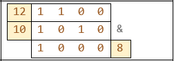
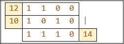
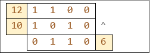
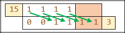
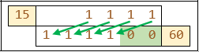

# DASAR PYTHON
## Dasar pemrograman Python
### 1. Mencetak Informasi di Console
Penyampaian informasi ke layar monitor bisa dilakukan melalui dua media, Console dan Graphical User Interface. Pada pembelajaran awal masih tampilan menggunakan Console dalam hal ini Command Prompt. Pada Python perintah yang digunakan untuk menampilkan informasi ke layar monitor adalah print, seperti gambar 1. File ContohM0201.py adalah contoh lain penggunaan perintah `print`. Untuk mengetikan program tersebut, gunakan aplikasi Visual Studio Code.

<br>Gambar 1. Contoh penggunaan perintah print

##### ContohM0201.py
```python
print ("Aku belajar dasar Python") 
print ("Aku pasti bisa")
```

Terdapat beberapa karakter khusus atau biasa disebut dengan escape character, merupakan karakter yang ditulis setelah tanda backslash (\) dan memiliki fungsi tertentu sesuai dengan kode karakter masing-masing,  seperti pada tabel 1. Contoh penggunaannya seperti pada file ContohM0202.py.

##### Tabel 1. Escape Character di Python
|Notasi|Deskripsi|
|:-:|:-|
|`\b`| Backspace |
|`\n`| Newline |
|`\t`| Tab |
|`\‘`| Petik Tunggal (Single Quote) |
|`\”`| Petik Ganda (Double Quote) |
|`\\`| Backslash |
|`\ooo`| Octal value |
|`\xhh`| Hexa value |
|`\u`| Format pencetakkan (termasuk simbol) |

##### ContohM0202.py
```python
print ("Selamat\b Pagi")
print ("Selamat\n Siang")
print ("Selamat\t Sore")
print ("Hari Jum\'at")
print ("\\(\"o\")/")
print ("\113\105\104\111\122\111")
print ("\x48\x41\x52\x4D\x4F\x4E\x49")
print ("x\u00b2")
```

### 2. Komentar
Komentar (comment) adalah kode di dalam script Python yang tidak dieksekusi atau tidak dijalankan mesin. Komentar hanya digunakan untuk menandai atau memberikan keterangan tertulis pada script. Komentar biasa digunakan untuk membiarkan orang lain memahami apa yang dilakukan script. atau untuk mengingatkan kepada programmer sendiri jika suatu saat kembali mengedit script tersebut. Untuk menggunakan komentar terdapat 2 cara yaitu satu baris dan beberapa baris. Semua karakter yang ditulis setelah lambang #, sampai akhir baris, menunjukkan bahwa baris tersebut merupakan keterangan. Interpreter dari Python tidak menganggap baris itu ada (sebagai komentar saja). Komentar yang lebih dari satu baris dapat juga ditulis di dalam tanda petik, dengan menggunakan string literal yang dibuka dan ditutup dengan """. File ContohM0203.py adalah contoh pemberian komentar pada script program Python.

##### ContohM0203.py
```python
# Nama File : ContohM203.py
"""
Program ini memberikan contoh bagaimana membuat komentar
pada script program Python
"""
print ("Komentar di Python")
```

### 3. Kata Kunci (Keyword)
Di Python terdapat kata-kata yang berlaku sebagai kata-kunci. Kata-kata yang tergolong sebagai kata-kunci digunakan secara khusus oleh Python dan tidak boleh digunakan misalnya untuk nama variabel atau fungsi. Sebagai contoh, True menyatakan nilai benar dan False menyatakan nilai salah. Gambar 2 mencantumkan kata-kunci yang terdapat pada Python.

<br>Gambar 2. Keyword di Python

### 4. Pengenal (Identifier)
Pengenal adalah nama yang digunakan untuk variabel, fungsi, kelas, dan lain-lain. Pemberian nama pengenal harus mengikuti aturan yang berlaku di Python. Berikut adalah aturannya :
1.	Pengenal dapat mengandung huruf (A-Z, a-z), angka (0-9), dan garis-bawah (_).
2.	Pengenal tidak boleh berawalan angka.
3.	Huruf kecil dan huruf kapital dibedakan (Case Sensitif). Dengan demikian, lebar dan LEBAR menyatakan pengenal yang berbeda.
4.	Pengenal tidak diperkenankan menggunakan kata-kunci, misalnya for dan true.

Perlu diingatkan bahwa dalam penamaan (identifier) sebaiknya menggunakan nama yang deskriptif. Hal ini memudahkan kita dalam mengingat penamaan, contohnya `kmp=”UNP Kediri”` adalah benar, hanya saja ini tidak deskriptif, bagusnya dalam penamaan menggunakan `kampus=”UNP Kediri”`.

### 5. Variabel
Variabel adalah lokasi memori yang dicadangkan untuk menyimpan nilai-nilai. Ini berarti bahwa ketika Anda membuat sebuah variabel Anda memesan beberapa ruang di memori. Variabel menyimpan data yang dilakukan selama program dieksekusi (Gambar 3), yang nantinya isi dari variabel tersebut dapat diubah oleh operasi-operasi tertentu pada program yang menggunakan variabel. Variabel dapat menyimpan berbagai macam tipe data. Di dalam pemrograman Python, variabel mempunyai sifat yang dinamis, artinya variabel Python tidak perlu didekralasikan tipe data tertentu dan variabel Python dapat diubah saat program dijalankan. Pemberian nama pengenal harus mengikuti aturan penamaan Identifier.

<br>Gambar 3. Ilustrasi Variabel dan Data

Berbeda dengan bahasa lain, seperti C ataupun C++, variabel di Python tidak perlu dideklarasikan. Deklarasi variabel itu bertujuan untuk menentukan tipe data yang diwakili oleh suatu variabel sehingga deklarasi variabel dapat dilakukan tanpa memberikan nilai ke variabel. Di Python, variabel tidak perlu dideklarasikan terlebih dahulu karena memang variabel itu tidak mempunyai tipe; yang mempunyai tipe data adalah nilai yang dinyatakannya. Itulah sebabnya, satu variabel di Python dapat menyatakan data bertipe bilangan pada suatu saat dan menyatakan data bertipe string pada waktu yang lain. Contoh pemberian nilai (Assignment) ke variabel adalah seperti file ContohM0204.py.

##### ContohM0204.py
```python
# Cara pertama
NilaiA = 10
NilaiB = 10
NilaiC = 10
print("NilaiA = ",NilaiA); print("NilaiB = ",NilaiB) ; print("NilaiC = ",NilaiC)
# Cara Kedua
NilaiD = NilaiE = NilaiF = 20
print("NilaiD = ",NilaiD); print("NilaiE = ",NilaiE) ; print("NilaiE = ",NilaiE)
# Cara ketiga
NilaiG, NilaiH, NilaiI = 15, 17, 19
print("NilaiG = ",NilaiG); print("NilaiH = ",NilaiH) ; print("NilaiI = ",NilaiI)
# Tukar isi
NilaiA, NilaiD = NilaiD, NilaiA
print("Setelah penukaran :")
print("NilaiA = ",NilaiA) ; print("NilaiD = ",NilaiD)
```

Pada assignment cara pertama, baris ke-2 sampai dengan 4, adalah cara umum yang digunakan untuk pemberian nilai. Cara kedua, baris ke-7, adalah cara lain jika terdapat beberapa Variabel yang mempunyai nilai yang sama. Cara ketiga, baris ke-10, adalah cara untuk memberi nilai pada beberapa Variabel secara bersamaan. Cara ketiga juga bisa digunakan untuk menukar isi beberapa Variabel seperti pada baris ke-13. Output dari ContohM0204.py, jika bagian nilai variabel diperhatikan, terdapat spasi tambahan, misal NilaiA =  10, dimana setelah tanda sama dengan terdapat 2 spasi, padahal pada perintah cetaknya tidak ada 2 spasi. Hal ini disebabkan oleh arti tanda koma pada perintah print adalah separator default antar teks berupa spasi, misal terdapat perintah berikut :
```python
print("Teknik","Informatika","Universitas","Nusantara","PGRI","Kediri")
```
Maka hasilnya adalah Teknik Informatika Universitas Nusantara PGRI Kediri. Tetapi separator antar teks dapat diganti dengan lainnya, misal kita ganti dengan karakter sep="->", maka perintah cetaknya menjadi :
```python
print("Teknik","Informatika","Universitas","Nusantara","PGRI","Kediri", sep="->")
```
Sehingga hasilnya menjadi Teknik->Informatika->Universitas->Nusantara->PGRI->Kediri.

### 6. Tipe Data
Secara umum, tipe data primitif dalam python dibagi menjadi tiga jenis, Numerik/Bilangan, Teks/String dan Boolean/Logika. Meskipun variabel di Python tidak perlu dideklarasikan, tetapi setiap tipe data punya aturan penulisannya masing-masing.
#### 1. Numerik/Bilangan
Tipe data numerik adalah jenis data Python yang bersifat angka yang bisa ditambah, dikurangi, dikali maupun dibagi. Beberapa tipe data yang dimiliki data numerik pada Python seperti:
- Integer : Tipe data integer adalah tipe data numerik yang menampung bilangan bulat. Contohnya bilangan 1,2,3 dan seterusnya. Sehingga setiap variabel yang memiliki nilai bilangan bulat, maka ia akan dikategorikan sebagai integer. Dalam bahasa Python, panjang dari data integer dibatasi oleh besarnya memori yang tersedia
- Float : Tipe data float dipergunakan untuk variabel-variabel yang memiliki nilai pecahan / desimal. Tipe data float juga termasuk ke dalam tipe data numerik karena jenis data ini menyimpan bilangan pecahan atau disebut juga dengan bilangan real. Pemisah dari bilangan desimal menggunakan tanda titik (.) bukan koma (,).
- Complex : Tipe data Complex merepresentasikan nilai imajiner. Bilangan imajiner merupakan suatu simbol sehingga pada dasarnya tidak ada dan hanya dituliskan saja sebagai bahasa komputasi, misal 5i yang berarti 5×√(-1). bilangan ini tidak banyak digunakan pada operasi matematika, sehingga jarang digunakan pada pemrograman. Bilangan kompleks adalah bilangan riil “ditambah” dengan bilangan imajiner, misal 2+5i yang berarti 2+(5×√(-1)), jika dituliskan pada Python menjadi 2 + 5j, dimana j sama artinya dengan simbol i pada notasi matematika.
#### 2.	Teks/String
Tipe data ini digunakan untuk menyimpan sebuah teks, seperti huruf, tanda baca, dan karakter spesial lainnya. Data yang bertipe string harus diapit oleh tanda kutip, baik tanda kutip satu ( ' ) maupun tanda kutip dua ( " ) setelah karakter sama dengan ( = ). Tanda kutip pembuka dan penutup harus sama, tidak boleh berbeda. Seperti berikut :
```python
prodi = 'Teknik Informatika'
univ = "UNiversitas Nusantara PGRI Kediri"
```
Adapun penulisan seperti 'Teknik Informatika", yang menggunakan awalan berupa petik tunggal dan akhiran petik ganda tidak diperkenankan. Jika hendak menuliskan string Jum’at, maka bisa dilakukan dengan 2 cara yaitu :
```python
Hari1 = 'Jum\'at'
Hari2 = "Jum'at"
```
ContohM0205.py merupakan contoh penulisan beberapa nilai dengan tipe data yang berbeda, beserta cara mengetahui tipe dari nilai tersebut, dengan mengingat bahwa yang memiliki tipe bukan variabelnya tetapi nilai yang dirujuk suatu variabel.

##### ContohM0205.py
```python
vari = 17; print(vari, type(vari))
vari = 17.08 ;print(vari, type(vari))
vari = '17.08.1945'; print(vari, type(vari))
vari = 0xABC; print(vari, type(vari)) 
vari = 0o77; print(vari, type(vari))
vari = 0b110011; print(vari, type(vari))
vari = 30.5e3; print(vari, type(vari))
vari = 2 + 5j; print(vari, type(vari))
```
Pada baris ke-4 sampai 6 adalah cara penulisan bilangan Heksadesimal (basis-16), Oktadesimal (basis-8) dan Biner (basis-2), tetapi saat dicetak akan diubah dalam bentuk desimal. Tetapi jika menghendaki nilai yang dicetak dalam bentuk tertentu, maka kita bisa menggunakan fasilitas format di Python, seperti berikut :
```python
vari = 0xABC
print(format(vari,'04x'))
vari = 0o77
print(format(vari,'05o'))
vari = 0b110011
print(format(vari,'08b'))
```
Dimana `'04x'` berarti nilainya akan diformat ke bentuk 4 digit Heksadesimal, `'05o'` berarti nilainya akan diformat ke bentuk 5 digit Oktadesimal, dan `'08b'` berarti nilainya akan diformat ke bentuk 8 digit biner. Selain digunakan untuk mengkonversi bentuk bilangan, format juga bisa digunakan untuk memperpendek perintah pencetakan, misalnya dari ContohM0204.py. baris ke-5 bisa diganti menjadi :
```python
print("NilaiA = %d\nNilaiB = %d\nNilaiC = %d" %(NilaiA,NilaiB,NilaiC))
```
Dimana %d akan digantikan dengan variabel pertama pada runtutan variabel yang ada di akhir perintah print, dalam hal ini %(NilaiA,NilaiB,NilaiC). Tanda %d pertama akan digantikan nilai variabel NilaiA, tanda %d kedua akan digantikan nilai variabel NilaiB dan tanda %d ketiga akan digantikan nilai variabel NilaiC. Tanda %d mewakili integer, %f mewakili float dan %s mewakili string. Untuk membuat n angka di belakang koma, gunakan %.nf, misal %.3f, yang berarti nilai variabel akan memiliki 3 digit dibelakang koma.

Selain menggunakan format integer, float dan string, bisa juga menggunakan perintah format seperti berikut :
```python
print('NilaiA = {}\nNilaiB = {}\nNilaiC = {}\n'.format(NilaiA, NilaiB, NilaiC))
```
Dalam format ini, kita bisa mengatur urutan variabel yang ditampilkan, sehingga tidak harus sesuai dengan urutan pada bagian format, misalnya perintahnya diubah menjadi :
```python
print('NilaiA = {2}\nNilaiB = {0}\nNilaiC = {1}\n'.format(NilaiB, NilaiC, NilaiA))
```
Materi tentang tipe data String lebih lanjut kita bahas pada [M8](../M08/README.md)

### 7. Input
Input atau inputan (dalam konteks pemrograman) merupakan sebuah data, informasi, atau nilai apa pun yang dikirimkan oleh user kepada komputer untuk diproses lebih lanjut. Dalam Python untuk keperluan pemasukkan data dari pengguna dapat dilakukan dengan memanfaatkan fungsi input. Nilai yang didapat dari fungsi input berupa String, sehingga jika kita perlu nilai bertipe selain integer, maka kita perlu mengkonversi tipe data string menjadi tipe yang diperlukan, misalnya jika ingin mengkonversi ke tipe integer, maka dapat diubah menggunakan fungsi int(). jika ingin mengkonversi ke tipe integer, maka dapat diubah menggunakan fungsi float(). Contoh M0206.py adalah contoh penggunaan fungsi input, int() dan float().
##### ContohM0206.py
```python
panjang = int(input("Panjang = "))
lebar = int(input("Lebar = "))
tinggi = float(input("Tinggi = "))
luas = panjang * lebar
volume = luas * tinggi
print('Luas Alas =', luas)
print('Volume =', volume)
```

Tetapi terkadang karena kebiasaan orang Indonesia menuliskan pecahan menggakan tanda koma bukan titik, maka hal ini bisa menyebabkan terjadinya runtime error atau kesalahan saat program dijalankan, seperti gambar 9. Untuk mengatasi hal ini gunakan exception handling, yaitu kemampuan program Python untuk menangani kesalahan. ContohM0207.py adalah contoh penggunaan Exception Handling di Python.

<br>Gambar 4. Runtime Error karena kesalahan penulisan pemisah desimal

##### ContohM0207.py
```python
panjang = int(input("Panjang = "))
lebar = int(input("Lebar = "))
try :
    tinggi = float(input("Tinggi = "))
except :
    print('terjadi kesalahan, maka tinggi = 1.')
    tinggi = 1
luas = panjang * lebar
volume = luas * tinggi
print('Luas Alas =', luas)
print('Volume =', volume)
```

Setelah penggunaan try-except maka ketika terjadi kesalahan, maka program tidak akan berhenti, tetapi mengeksekusi bagian except (baris ke-6 dan 7), kemudian melanjutkan script program berikutnya, baris ke-8 sampai 11.
Pada baris ke 4, 6 & 7 terlihat bagian script yang menjorok ke dalam, hal ini disebut sebagai indentasi, Indentasi digunakan untuk mengindikasi tingkatan kode pada Python atau biasa disebut sebagai blok program. Karakter  white space yang bisa digunakan untuk indentasi baris adalah spasi atau tab (pada bahasa pemrograman lainnya biasanya menggunakan tanda kurung kurawal atau kata kunci). Tetapi karakter white space yang digunakan untuk indentasi harus konsisten dalam satu file program Python. Jika karakter white space yang digunakan berbeda, maka Python akan memberikan pesan kesalahan.

### 8. Operator
Suatu Ekspresi dimaksudkan untuk menghasilkan suatu nilai. Umumnya, ekspresi mengandung operator dan operan. Operator adalah simbol yang mewakili suatu operasi. Sebagai contoh, + menyatakan operasi penjumlahan dan * menyatakan operasi perkalian. Adapun operan adalah bagian yang dikenai operasi oleh operator. Misalnya ekspresi 2 + 3 * 4,  bagian yang sebut sebagai operator adalah + dan *, sedangkan bagian yang disebut sebagai operan adalah 2, 3 dan 4. Terdapat beberapa jenis operator dalam pemrograman Python, yaitu :

#### 1.	Operator Aritmetika
Operator aritmetika digunakan untuk melaksanakan perhitungan Matematika. Operator aritmetika yang tersedia dapat dilihat pada Tabel 2. Terdapat pula cara mempersingkat (shortcut) suatu ekspresi seperti varA = varA + 5 bisa disingkat menjadi varA += 5, shortcut untuk operator Aritmatika lainnya seperti pada Tabel 3.

##### Tabel 2. Operator Aritmatika
|Operator|Keterangan|Contoh|
|:-:|-|-|
|`**`| Pangkat |`3 ** 2 = 9`<br>`25 ** 0.5 = 5`|
|`-`| Negasi |`-5`|
|`*`| Perkalian |`2 * 3 = 6`|
|`/`| Pembagian pecahan |`3 / 2 = 1.5`<br>`3 / 1.2 = 2.5`|
|`//` | Pembagian bulat<br>(Tipe hasil menyesuaikan tipe operan) |`3 // 2 = 1`<br>`3 // 1.2 = 2.0`|
|`%`| Sisa pembagian |`3 % 2 = 1`<br>`8 % 3 = 2`|
|`+`| Penjumlahan |`2 + 3 = 5`|
|`-`| Pengurangan |`5 - 3 = 2`|

##### Tabel 3. Shortcut Operator Aritmatika
|Operator|Keterangan|Contoh|Arti|
|:-:|-|-|-|
|`**=`|Pangkat|`varA **= 5`|`varA = varA ** 5`|
|`*=`|Perkalian|`varA *= 5`|`varA = varA * 5`|
|`/=`|Pembagian pecahan|`varA /= 5`|`varA = varA / 5`|
|`//=`|Pembagian bulat|`varA //= 5`|`varA = varA // 5`|
|`%=`|Sisa pembagian|`varA %= 5`|`varA = varA % 5`|
|`+=`|Penjumlahan|`varA += 5`|`varA = varA + 5`|
|`-=`|Pengurangan|`varA -= 5`|`varA = varA - 5`|

Khusus operator + dan * dapat digunakan pada operasi teks (String). Operator + digunakan untuk menggabung teks dan operator * digunakan untuk mengulang teks. ContohM0208.py adalah contoh penggunaan operator + dan * pada operasi teks.

##### ContohM0208.py
```python
varA = 'Informatika-'
varB = 'Kediri'
varC = varA + varB
varD = varA * 3
print(varC)
print(varD)
```

#### 2. Operator Pembanding
Operator pembanding berguna untuk membandingkan dua operan dengan hasil berupa nilai bertipe bool (yakni True atau False). Tipe dari Operan bisa berupa bilangan atau teks. Daftar operator pembanding ditunjukkan pada Tabel 4. ContohM0209.py adalah contoh penggunaan operator pembanding untuk data bilangan dan teks. Pembandingan string didasarkan pada nilai ASCII karakter-karakter yang menyusun string. Tabel ASCII dapat dilihat di situs https://www.ascii-code.com/.

##### Tabel 4. Operator Pembanding
|Operator|Keterangan|Contoh|Hasil|
|:-:|-|-|-|
|`>`|Lebih dari|`8 > 7`|` True`|
|`<`|Kurang dari|`8 < 7`|`False`|
|`==`|Sama dengan|`8 == 7`|`False`|
|`!=`|Tidak sama dengan|`8 != 7`|`True`|
|`>=`|Lebih dari atau sama dengan|`8 >= 7`|`True`|
|`<=`|Kurang dari atau sama dengan|`8 <= 7`|`False`|

##### ContohM0209.py
```python
varA = 8 ; varB = 7
varC = 'TEKS' ; varD = 'teks'
print(varA > varB, varA < varB, varA == varB)
print(varA >= varB, varA <= varB, varA != varB)
print(varC > varD, varC < varD, varC == varD)
print(varC >= varD, varC <= varD, varC != varD)
```

#### 3. Operator Logika
Operator logika berguna untuk membentuk suatu keadaan logika (benar atau salah) berdasarkan satu atau dua ekspresi Boolean (ekspresi yang menghasilkan nilai True atau False). Tiga operator logika dapat dilihat pada Tabel 5. Tabel kebenaran ketiga operator logika ditunjukkan pada Tabel 6. ContohM0210.py adalah contoh penggunaan operator Logika, hasilnya sama seperti Tabel 6.

##### Tabel 5. Operator Logika
|Operator|Keterangan|Contoh|Hasil|
|:-:|-|-|-|
|`and`|Operasi “dan”|`True and False`|`False`|
|`or`|Operasi “atau”|`True or False`|`True`|
|`not`|Operasi negasi (kebalikan)|`not True`|`False`|

##### Tabel 6. Operator Logika
|varA|varB|not varA|not varB|varA and varB|varA or varB|
|:-:|:-:|:-:|:-:|:-:|:-:|
|`True`|`True`|`False`|`False`|`True`|`True`|
|`True`|`False`|`False`|`True`|`False`|`True`|
|`False`|`True`|`True`|`False`|`False`|`True`|
|`False`|`False`|`True`|`True`|`False`|`False`|

##### ContohM0210.py
```python
varA0 = varB0 = False
varA1 = varB1 = True
print("varA\tvarB\t(not varA)\t(not varB)\t(varA and varB)\t(varA or varB)")
print(f"{varA1}\t{varB1}\t{not varA1}\t\t{not varB1}\t\t{varA1 and varB1}\t\t{varA1 or varB1}")
print(f"{varA1}\t{varB0}\t{not varA1}\t\t{not varB0}\t\t{varA1 and varB0}\t\t{varA1 or varB0}")
print(f"{varA0}\t{varB1}\t{not varA0}\t\t{not varB1}\t\t{varA0 and varB1}\t\t{varA0 or varB1}")
print(f"{varA0}\t{varB0}\t{not varA0}\t\t{not varB0}\t\t{varA0 and varB0}\t\t{varA0 or varB0}")
```

Perintah cetak pada ContohM0210.py baris ke-4 hingga 7 menggunakan F-string. F-string (atau formatted string literal) adalah cara yang lebih modern dan efisien untuk memformat string di Python. Dengan f-string, kita bisa langsung menyisipkan nilai variabel ke dalam string dengan cara yang lebih intuitif. F-string mulai dikenalkan pada Python versi 3.6. Aturan penggunaannya adalah sebagai berikut :
1. Awali string dengan huruf `f` sebelum tanda kutip
2. Kurung kurawal `{}` untuk menandai tempat di mana kita ingin menyisipkan nilai
3. Nama Variabel atau Ekspresi Perhitungan dapat diletakan di dalam tanda kurung kurawal

Terdapat fitur tambahan yang disediakan oleh Python pada F-String, yaitu format spesifikasi, dimana kita bisa menggunakan format spesifik untuk mengontrol tampilan nilai. cara penggunaanya adalah `f"{nilai:format_spesifikasi}"`. Format spesifikasi yang dapat digunakan adalah :
- Lebar kolom & penjajaran: Menentukan berapa banyak karakter yang akan digunakan untuk menampilkan nilai, dan menentukan apakah nilai akan sejajar ke kiri, kanan, atau tengah. Misal :
```python
nama = "Daniel"
print(f"|{nama:<18}|") # < , sejajar kiri
print(f"|{nama:^18}|") # ^ , sejajar tengah
print(f"|{nama:>18}|") # > , sejajar kanan
```
- Jumlah desimal: Mengatur berapa banyak angka di belakang koma. Misal :
```python
euler = 2.718281828
print(f"Nilai bilangan euler adalah: {euler:.2f}")
```
- Pengisian: Menentukan karakter yang akan digunakan untuk mengisi ruang kosong. Misal :
```python
nilai = 23
print(f"{nilai:05d}")
```
- Konversi tipe: Mengubah tipe data nilai sebelum ditampilkan. Kode format untuk konversi tipe seperti pada Tabel 7. Misal :
```python
bilangan = 10
print(f"{bilangan:b}")
print(f"{bilangan:x}")
```
##### Tabel 7. Kode Format untuk Konversi Tipe
|Kode|Keterangan|
|:-:|-|
|`b`|Mengubah nilai menjadi bilangan biner|
|`x`|Mengubah nilai menjadi bilangan heksadesimal (huruf kecil)|
|`X`|Mengubah nilai menjadi bilangan heksadesimal (huruf besar)|
|`o`|Mengubah nilai menjadi bilangan oktal|
|`n`|Mengubah nilai menjadi format angka yang sesuai dengan lokal|
|`e`|Mengubah nilai menjadi notasi ilmiah (dengan huruf e)|
|`E`|Mengubah nilai menjadi notasi ilmiah (dengan huruf E)|
|`f`|Mengubah nilai menjadi bilangan desimal (float)|
|`%`|Mengubah nilai menjadi persentase|

#### 4. Operator Berbasis Bit
Bit berasal dari “binary digit”. Satu bit menyatakan satu angka 0 atau 1. Sebagaimana diketahui, pada sistem biner, angka yang dikenal hanya berupa 0 atau 1. Untuk memahami operasi pada tataran bit, penomoran bit seperti yang diperlihatkan pada Gambar 10 perlu diperhatikan. Bit terendah mempunyai posisi 0. Angka 158 pada contoh tersebut berasal dari :<br>
`0 x 2`<sup>`0`</sup>` + 1 x 2`<sup>`1`</sup>` + 1 x 2`<sup>`2`</sup>` + 1 x 2`<sup>`3`</sup>` + 0 x 2`<sup>`4`</sup>` + 0 x 2`<sup>`5`</sup>` + 0 x 2`<sup>`6`</sup>` + 1 x 2`<sup>`7`</sup>
<br>Penulisan literal dalam sistem biner telah diperkenalkan pada ContohM0205.py. Sebagai contoh, 158 dalam sistem desimal dapat ditulis menjadi `0b10011110`. Selain itu Fungsi bin() bisa digunakan untuk keperluan ini. Misalnya bin(158) akan menghasilnkan `0b10011110`. Python menyediakan enam operator yang berbasis bit, seperti pada tabel 8. Shortcut untuk operator Berbasis bit seperti pada tabel 9. ContohM0211.py adalah contoh penggunaan Operator Berbasis Bit, hasil eksekusinya seperti contoh & hasil pada tabel 8.

##### Tabel 8. Operator Berbasis bit
|Operator|Keterangan|Contoh|Hasil|Penjelasan|
|:-:|-|-|-|-|
|`&`|Operasi bit “atau”|`12 & 10`|`8`||
|`\|`|Operasi bit “atau”|`12 \| 10`|`14`||
|`^`|Operasi bit “XOR”|`12 ^ 10`|`6`||
|`~`|Operasi komplemen<br>Hasil, `~var = -(var)-1`|`~12`<br>`~-12`|`-13`<br>`11`|`-(12)-1 = -13`<br>`-(-12)-1 = 11`|
|`>>`|Operator geser bit ke kanan|`15 >> 2`|`3`||
|`<<`|Operator geser bit ke kiri|`15 << 2`|`60`||

##### Tabel 9. Shortcut Operator Berbasis bit
|Operator|Keterangan|Contoh|Arti|
|:-:|-|-|-|
|`&=`|Operasi bit “dan”|`varA &= 2`|`varA = varA & 2`|
|`\|=`|Operasi bit “atau”|`varA \|= 2`|`varA = varA \| 2`|
|`^=`|Operasi bit “XOR”|`varA ^= 2`|`varA = varA ^ 2`|
|`>>=`|Operator geser bit ke kanan|`varA >>= 2`|`varA = varA >> 2`|
|`<<=`|Operator geser bit ke kiri|`varA <<= 2`|`varA = varA << 2`|

##### ContohM0211.py
```python
varA, varB, varC, varD = 12, 10, 15, 2
print(f"{varA} & {varB} = {varA & varB}")
print(f"{varA} | {varB} = {varA | varB}")
print(f"{varA} ^ {varB} = {varA ^ varB}")
print(f"~{varA} = {~varA}")
print(f"~{-varA} = {~(-varA)}")
print(f"{varC} >> {varD} = {varC >> varD}")
print(f"{varC} << {varD} = {varC << varD}")
```

|[# Awal](../README.md)<br>[# Materi Sebelumnya](../M01/README.md)<br>[# Materi Berikutnya](../M03/README.md)|
|-|