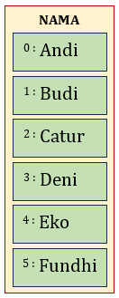
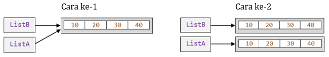

# DASAR PYTHON
## Tipe Data Kolektif (List)
### 1. Membuat List
List adalah struktur data yang menyimpan data secara terurut, anda dapat menyimpan serangkaian data atau objek menggunakan list. Secara teknik, penulisan item list pada python menggunakan kurung siku `[ ]`. Kurung siku ini adalah tempat untuk menyimpan item kedalam list. List memiliki sifat **mutable**, artinya item yang ada didalam list dapat ditambah, dikurangi atau dapat juga mencari item yang terdapat didalam list. List dibuat dengan menulis item yang terlampir dalam tanda kurung siku, dengan item dipisahkan dengan koma. Tipe data dari data yang disimpan ke dalam List tidak harus sama. Berikut contoh pembuatan List
```python
kosong = []
label = ['Prodi','Fakultas','Universitas']
tahun = [2020, 2021, 2022, 2024, 2025]
biodata = ['2013020012', 'Donny Firdani', 160.5, 83, True]
NAMA = ['Andi','Budi','Catur','Deni','Eko','Fundhi']
```

<br>Gambar 1. Ilustrasi isi List `NAMA`

### 2. Indexing pada List
Indexing digunakan untuk mengakses elemen tunggal dalam sebuah List. Elemen-elemen dalam list di-index mulai dari 0, artinya elemen pertama memiliki indeks 0, elemen kedua memiliki indeks 1, dan seterusnya. Indeks negatif dapat digunakan untuk mengakses elemen dari akhir list. Misalnya, indeks -1 mengacu pada elemen terakhir, -2 mengacu pada elemen kedua dari akhir, dan sebagainya. Data indeks idx dari List `LIST` dapat diakses dengan cara `LIST[idx]`. ContohM0301.py adalah contoh pembuatan List dan pengaksesan nilai dalam List.

##### ContohM0301.py
```python
label = ['Prodi','Fakultas','Universitas']
isi = ['Teknik Informatika','Teknik','Universitas Nusantara PGRI Kediri']
print(label)
print(isi)
print(label[0],':',isi[-3])
print(label[1],':',isi[-2])
print(label[2],':',isi[-1])
```

### 3. Update Nilai dalam List
Kita juga dapat memperbarui satu atau beberapa nilai di dalam list dengan cara memberikan potongan di sebelah kiri operator penugasan. Misal, kita akan mengubah nilai List 'isi' indeks ke-1 pada ContohM0301.py, maka kita bisa menambahkan baris perintah berikut  pada baris ke-3 :
```python
isi[2] = "Teknik dan Ilmu Komputer"
```

### 4. Slicing pada List
Salah satu operasi dasar pada List adalah membentuk irisan, misal membuat irisan dari List LIST dapat menggunakan cara `LIST[start:stop:step]`, dimana :
- `start`: Indeks elemen pertama yang ingin diakses (default: 0)
- `stop`: Indeks setelah elemen terakhir yang ingin diakses (default: panjang list)
- `step`: Langkah antara elemen-elemen yang diakses (default: 1)

Misal `LIST[awal:akhir]` berarti mengambil data dari indeks ke-awal hingga akhir-1. Jika data yang diambil adalah data ke ke-awal hingga data terakhir List LIST, maka dapat menggunakan cara LIST[awal:].  Jika irisan yang diinginkan adalah keseluruhan data atau dengan kata lain menyalin semua data List LIST, maka dapat menggunakan cara LIST[:]. ContohM0302.py adalah beberapa contoh penggunaan Slicing pada List.
##### ContohM0302.py
```python
angka = [1, 2, 4, 8, 16, 32, 64, 128, 256, 512, 1028]
print('Tes 01: ',angka[2:8:2])
print('Tes 02: ',angka[-9:-3:2])
print('Tes 03: ',angka[8:2:-2])
print('Tes 04: ',angka[-3:-9:-2])
print('Tes 05: ',angka[3:])
print('Tes 06: ',angka[3::])
print('Tes 07: ',angka[-8::])
print('Tes 08: ',angka[:3])
print('Tes 09: ',angka[:3:])
print('Tes 10: ',angka[:-8:])
print('Tes 11: ',angka[::3])
print('Tes 12: ',angka[::-3])
print('Tes 13: ',angka[-5::-2])
print('Tes 14: ',angka[-2::-5])
print('Tes 15: ',angka[2:8])
print('Tes 16: ',angka[-9:-3])
print('Tes 17: ',angka[8:2])
print('Tes 18: ',angka[-3:-9])
```

### 5. Penyalinan List
Proses penyalinan suatu List dapat menggunakan cara berikut :
- Cara ke-1 : `ListA = listB`
- Cara ke-2 : `ListA = listB[:]`
- Cara ke-3 : `ListA = listB.copy()`
Tetapi kedua cara tersebut mempunyai efek yang berbeda, dimana cara ke-1 hanya menyalin alamat, sedangkan cara ke-2 & 3 akan menyalin semua data. Efek dari cara ke-1 adalah saat dilakukan pengubahan nilai data pada ListA maka listB akan juga berubah, karena listA dan listB merujuk pada satu (alamat) List yang sama. Gambar 1 merupakan ilustrasi perbedaan kedua cara tersebut. ContohM0302.py menenujukan perbedaan cara penyalinan suatu List.

<br>Gambar 1. Ilustrasi perbedaan hasil menyalin List

##### ContohM0303.py
```python
angka = [1, 2, 4, 8, 16, 32, 64, 128, 256, 512, 1028]
 
copy1[4] = 17
print('copy1 =',copy1)
print('angka =',angka)
copy2 = angka.copy()
copy2[5] = 35
print('copy2 =',copy2)
print('angka =',angka)
copy3 = angka
copy3[6] = 67
print('copy3 =',copy3)
print('angka =',angka)
```

### 6. Metode bawaan : append(), insert() & extend()
Python menyediakan beberapa metode bawaan yang memungkinkan kita untuk menambah elemen dari sebuah list.

Metode `append()` adalah salah satu metode dasar yang digunakan untuk menambahkan elemen baru ke akhir sebuah list dalam Python. Pada bagian argumen kita bisa memasukkan elemen yang ingin ditambahkan. `append()` biasa digunakan untuk :
- Membangun list secara dinamis: kita dapat menggunakan append() untuk menambahkan elemen secara bertahap ke dalam list yang awalnya kosong.
- Menggabungkan list: kita dapat menggunakan append() untuk menggabungkan dua list atau lebih.

Metode `insert()` digunakan untuk menambahkan elemen baru ke posisi tertentu dalam sebuah list di Python. pada bagian argumen kita bisa memasukkan dua nilai: (1) Indeks: Ini adalah posisi di mana Anda ingin menambahkan elemen. Indeks dimulai dari 0. (2) Elemen: Elemen yang ingin ditambahkan. `insert()` biasanya digunakan untuk :
- Menambahkan elemen pada posisi tertentu: Jika Anda ingin menambahkan elemen di tengah-tengah list, insert() adalah metode yang tepat.
- Mengurutkan list: Anda dapat menggunakan insert() untuk mengurutkan list secara manual dengan menambahkan elemen pada posisi yang sesuai.

Metode `extend()` digunakan untuk menambahkan elemen-elemen dari satu list ke akhir list lain di Python. Pada bagian argumen kita bisa memasukkan list yang ingin ditambahkan. `extend()` biasanya digunakan untuk :
- Menggabungkan data: Anda dapat menggunakan extend() untuk menggabungkan data dari beberapa sumber menjadi satu list.
- Memperluas list: Jika Anda ingin menambahkan banyak elemen ke akhir list, extend() dapat lebih efisien daripada menggunakan append() secara berulang.

ContohM0304.py adalah contoh penggunaan metode append(), insert() & extend().
##### ContohM0304.py
```python
fruits = []
print('fruits 1: ',fruits)
fruits.append('apple')
fruits.append('banana')
fruits.append('cherry')
print('fruits 2: ',fruits)
fruits.insert(1,'avocados')
print('fruits 3: ',fruits)
others = ['plums', 'kiwis', 'lemons']
fruits.extend(others)
print('others: ',others)
print('fruits 4: ',fruits)
```

Jika menggunakan fungsi `extend()`, maka mengubah list secara langsung. Tetapi jika kita hendak mempertahankan 2 list asal, maka kita bisa menggunakan operator `+`. Sehingga ContohM0304.py baris ke-10 hingga 12 bisa diubah menjadi :
```python
gabung = fruits + others
print('fruits 4: ',fruits)
print('others: ',others)
print('gabung: ',gabung)
```

### 7. Metode bawaan : remove(), pop() & clear()
Python menyediakan beberapa metode bawaan yang memungkinkan kita untuk menghapus elemen dari sebuah list.

Metode `remove()` digunakan untuk menghapus satu kemunculan pertama dari elemen yang ditentukan dalam sebuah list. Pada bagian argumen kita bisa memasukkan nilai yang ingin dihapus. `remove()` hanya menghapus satu kemunculan pertama dari nilai yang ditentukan. Jika elemen yang akan dihapus tidak ada di dalam List, maka akan memunculkan error. `remove()` biasanya digunakan untuk :
- Menghilangkan elemen yang tidak diinginkan: Anda dapat menggunakan remove() untuk menghapus elemen-elemen yang tidak lagi diperlukan.
- Membersihkan data: Jika list Anda mengandung duplikat atau elemen-elemen yang tidak valid, remove() dapat membantu membersihkannya.

Metode `pop()` digunakan untuk menghapus dan mengembalikan elemen dari sebuah list di Python. Pada bagian perameter, secara opsional kita bisa memasukkan indeks elemen yang ingin dihapus. Jika tidak ada indeks yang diberikan, secara default akan menghapus dan mengembalikan elemen terakhir. `pop()` biasanya digunakan untuk :
- Menghapus elemen: Anda dapat menggunakan pop() untuk menghapus elemen yang tidak lagi diperlukan.
- Mengimplementasikan struktur data: pop() sering digunakan dalam implementasi struktur data seperti stack atau queue.
- Mengambil elemen: Jika Anda ingin mengambil elemen dari list dan sekaligus menghapusnya, pop() adalah pilihan yang tepat.

Metode `clear()` digunakan untuk menghapus semua elemen dalam sebuah list, sehingga list tersebut menjadi kosong. `clear()` tidak membutuhkan argumen. `clear()` biasa digunakan untuk :
- Inisialisasi ulang: Anda dapat menggunakan clear() untuk mengosongkan list yang sudah ada dan menggunakannya kembali untuk menyimpan elemen baru.
- Pembersihan data: Jika Anda tidak lagi membutuhkan elemen dalam list, Anda dapat menggunakan clear() untuk menghapusnya.

ContohM0305.py adalah contoh penggunaan metode remove(), pop() & clear().
##### ContohM0305.py
```python
fruits = ['apple', 'avocados', 'banana', 'cherry', 'plums', 'kiwis', 'lemons']
print('fruits 1: ',fruits)
fruits.remove('plums')
print('fruits 2: ',fruits)
buah1 = fruits.pop()
print('buah1: ',buah1)
print('fruits 2: ',fruits)
buah2 = fruits.pop(2)
print('buah2: ',buah2)
print('fruits 3: ',fruits)
fruits.clear()
print('fruits 4: ',fruits)
```

### 8. Metode bawaan : index(), operator `in` & `not in`
Metode `index()` digunakan untuk mencari indeks pertama dari suatu elemen dalam sebuah list di Python. Pada bagian argumen ada 3 varian yaitu :
- index(var) : Mendapatkan indeks dari Data var
- index(var,idx1) : Mendapatkan indeks dari Data var setelah indeks ke-idx1
- index(var,idx1,idx2) : Mendapatkan indeks dari Data var antara indeks ke-idx1 hingga indeks ke-(idx2-1)

`index()` biasanya digunakan untuk :
- Menemukan posisi elemen: Anda dapat menggunakan index() untuk mengetahui di mana suatu elemen berada dalam list.
- Verifikasi keberadaan: Anda dapat menggunakan index() untuk memeriksa apakah suatu elemen ada dalam list.
- Pengolahan data: index() sering digunakan dalam algoritma pencarian dan pengolahan data.

ContohM0306.py adalah contoh penggunaan metode index().
##### ContohM0306.py
```python
fruits = ['apple', 'banana', 'cherry', 'plums', 'apple', 'banana', 'cherry', 'apple', 'banana']
print(fruits.index('apple'))
print(fruits.index('apple',3))
print(fruits.index('apple',5,8))
```

Operator `in` dan `not in` digunakan untuk memeriksa apakah suatu elemen ada atau tidak ada dalam sebuah list di Python. Operator `in` mengembalikan `True` jika elemen tersebut ada dalam list, dan `False` jika tidak. Sedangkan, Operator `not in` mengembalikan `True` jika elemen tersebut tidak ada dalam list, dan `False` jika ada. ContohM0307.py adalah contoh penggunaan Operator `in` dan `not in`.
##### ContohM0307.py
```python
fruits = ['apple', 'avocados', 'banana', 'cherry', 'plums', 'kiwis', 'lemons']
cari1 = 'apple'
cari2 = 'orange'
print('fruits: ',fruits)
print(f'Apakah "{cari1}" ADA di dalam list ? {(cari1 in fruits)}')
print(f'Apakah "{cari1}" TIDAK ADA di dalam list ? {(cari1 not in fruits)}')
print(f'Apakah "{cari2}" ADA di dalam list ? {(cari2 in fruits)}')
print(f'Apakah "{cari2}" TIDAK ADA di dalam list ? {(cari2 not in fruits)}')
```

### 8. Metode bawaan : sorted(), sort() & reserve()
Metode `sorted()` adalah fungsi bawaan Python yang digunakan untuk membuat list baru yang berisi elemen-elemen dari list yang diberikan, diurutkan sesuai dengan urutan yang ditentukan. Secara default, sorted() mengurutkan elemen secara naik. Anda dapat mengubah urutan menjadi turun dengan menggunakan argumen `reverse=True`. `sorted()` biasa digunakan untuk :
- Membuat list baru yang diurutkan: sorted() sangat berguna ketika Anda ingin membuat list baru yang diurutkan tanpa mengubah list asli.
- Pengurutan sementara: Anda dapat menggunakan sorted() untuk mengurutkan list secara sementara untuk operasi tertentu tanpa mengubah list asli.

Metode `sort()` digunakan untuk mengurutkan elemen-elemen dalam sebuah list secara naik atau turun. Secara default, sort() mengurutkan elemen secara naik berdasarkan nilai ASCII. kita dapat mengubah urutan menjadi turun dengan menggunakan argumen `reverse=True`. `sort()` biasa digunakan untuk :
- Mengurutkan data: sort() digunakan untuk mengurutkan berbagai jenis data, seperti angka, string, atau objek-objek yang dapat diurutkan.
- Pencarian efisien: Setelah list diurutkan, pencarian elemen dapat dilakukan lebih efisien dengan menggunakan algoritma pencarian seperti binary search.

Metode `reversed()` digunakan untuk mengembalikan iterator yang iterasi melalui elemen-elemen list dalam urutan terbalik. Ini berarti elemen terakhir akan menjadi elemen pertama, elemen kedua menjadi elemen terakhir, dan seterusnya. `reversed()` biasanya digunakan untuk pemrosesan data dalam urutan terbalik, dalam beberapa kasus, kita mungkin perlu memproses elemen-elemen list dalam urutan terbalik.

ContohM0308.py adalah contoh penggunaan metode sorted(), sort() & reserve().
##### ContohM0308.py
```python
fruits = ['apple', 'banana', 'cherry', 'plums', 'apple', 'banana', 'cherry', 'apple', 'banana']
fruits1 = sorted(fruits)
fruits2 = sorted(fruits, reverse=True)
print('metode sorted()')
print('fruits = ', fruits)
print('fruits1 = ', fruits1)
print('fruits2 = ', fruits2)
fruits3 = fruits.copy()
fruits4 = fruits.copy()
fruits3.sort()
fruits4.sort(reverse=True)
print('metode sort()')
print('fruits = ', fruits)
print('fruits3 = ', fruits3)
print('fruits4 = ', fruits4)
fruits5 = list(reversed(fruits))
print('metode reversed()')
print('fruits5 = ', fruits5)
```

Pada baris ke-16, terdapat fungsi `list()`, yang digunakan untuk :
- Mengubah iterable menjadi list: Mengubah tipe data lain seperti tuple, string, atau bahkan objek yang dapat diiterasi (seperti dictionary) menjadi sebuah list.
- Membuat list kosong: Jika tidak diberikan argumen, `list()` akan membuat sebuah list kosong.

Iterable adalah objek yang elemen-elemennya dapat diakses secara berurutan, seperti:
- String: Setiap karakter dalam string akan menjadi elemen dalam list.
- Tuple: Elemen-elemen tuple akan menjadi elemen dalam list.
- Range: Hasil dari fungsi range() akan menjadi elemen dalam list.
- Dictionary: Hanya key dari dictionary yang akan menjadi elemen dalam list.

*Tuple & Dictionary akan kita pelajari pada materi berikutnya*

ContohM0309.py adalah contoh penggunaan metode list(), untuk mengubah setiap karakter dalam string akan menjadi elemen dalam list & mengubah hasil dari fungsi range() akan menjadi elemen dalam list.
##### ContohM0309.py
```python
teks = 'Informatika'
listTeks = list(teks)
listRange = list(range(10,50,5))
print('listTeks = ',listTeks)
print('listRange = ',listRange)
```

### 8. Metode statistik bawaan
Metode `len()` digunakan untuk mendapatkan panjang (jumlah elemen) dari sebuah list di Python. `len()` biasa digunakan untuk :
- Iterasi: Anda dapat menggunakan len() untuk mengontrol iterasi dalam loop for atau while.
- Validasi: Anda dapat menggunakan len() untuk memvalidasi apakah sebuah list kosong atau tidak.

Metode `count()` digunakan untuk menghitung jumlah kemunculan suatu elemen tertentu dalam sebuah list. Pada bagian argumen kita dapat memasukkan elemen yang ingin dihitung kemunculannya. `count()` biasa digunakan untuk :
- Analisis data: Anda dapat menggunakan count() untuk menghitung frekuensi kata-kata dalam teks, nilai-nilai unik dalam dataset, atau elemen-elemen lainnya.
- Validasi data: Anda dapat menggunakan count() untuk memeriksa apakah suatu elemen ada dalam list atau tidak, dan berapa kali muncul.

Metode `max()` digunakan untuk mencari elemen maksimum (terbesar) dalam sebuah list. Metode `min()` digunakan untuk mencari elemen terkecil dalam sebuah list.

Metode `sum()` digunakan untuk menghitung jumlah semua elemen **numerik** dalam sebuah list. `sum()` biasa digunakan untuk :
- Menghitung total: `sum()` digunakan untuk menghitung total nilai dalam berbagai konteks, seperti menghitung total penjualan, jumlah poin, atau nilai rata-rata.
- Analisis data: `sum()` dapat digunakan sebagai bagian dari analisis data untuk mendapatkan informasi statistik.

ContohM0310.py adalah contoh penggunaan metode len(), count(), max(), min() dan sum().
##### ContohM0310.py
```python
data = [1, 2, 3, 4, 3, 5, 3, 2, 1, 3]
panjang_list = len(data)
banyak_tiga = data.count(3)
nilai_maks = max(data)
nilai_min = min(data)
total = sum(data)
print('data = ',data)
print("Panjang list:", panjang_list)
print("Banyak angka 3:", banyak_tiga)
print("Nilai maksimum:", nilai_maks)
print("Nilai minimum:", nilai_min)
print("Jumlah semua elemen:", total)
```

##### Tabel 1. Metode bawaan untuk mengolah List
|Fungsi|Keterangan|
|-|-|
|`len(L)`|Banyak data dalam List L|
|`max(L)`|Data terbesar dari List L|
|`min(L)`|Data terkecil dari List L|
|`sum(L)`|Jumlah semua data dalam List L|
|`L.count(var)`|Banyak var pada List L|
|`L.copy()`|Menyalin List L, seperti cara ke-2 pada gambar 1.|
|`L.append(var)`|Menyisipkan var di akhir List L|
|`L.index(var)`|Mendapatkan indeks dari Data var pada List L|
|`L.index(var,idx1)`|Mendapatkan indeks dari Data var pada List L, setelah indeks ke-idx1|
|`L.index(var,idx1,idx2)`|Mendapatkan indeks dari Data var pada List L, antara indeks ke-idx1 hingga indeks ke-(idx2-1)|
|`L.clear()`|Mengosongkan List L|
|`L.extend(M)`|Menyisipkan List M di akhir List L<br>del(L[idx])	Menghapus data ke-idx dari List L<br>Jika idx < 0, maka indeks -1 adalah data terakhir pada List L|
|`L.remove(var)`|Menghapus data var dari List L.<br>Jika terdapat beberapa data var,<br> maka data dengan indeks terkecil yang akan dihapus|
|`L.insert(idx,var)`|Menyisipkan var pada indeks ke-idx List L|
|`L.sort()`|Mengurutkan data dari List L secara ascending.|
|`L.sort(reverse=True)`|Mengurutkan data dari List L secara descending.|
|`L.sort(key=str.lower)`|Mengurutkan data teks dari List L secara ascending,<br>tanpa membedakan huruf besar dan kecil|
|`L.sort(reverse=True,key=str.lower)`|Mengurutkan data teks dari List L secara descending,<br>tanpa membedakan huruf besar dan kecil|
|`L.pop()`|Mengeluarkan (dan menghapus) data terakhir yang ada di List L|
|`L.pop(idx)`|Menghapus data ke-idx dari List L|
|`reserve()`|Membalik urutan data dari List L<br>Jika ingin mempertahankan List aslinya, maka bisa menggunakan perintah M = list(reversed(L))<br>sehingga List M akan berisi kebalikan dari List L, tetapi urutan List L tetap.|

<br>Gambar 2. Ilustrasi Metode bawaan untuk mengolah List

### 9. Operator `*` dan `==`
Operator `*` pada list di Python digunakan untuk mengulang suatu list sebanyak n kali, di mana n adalah angka yang dikalikan dengan list tersebut. Hasilnya adalah sebuah list baru yang terdiri dari elemen-elemen list awal yang diulang sebanyak n kali.

Operator `==` pada list digunakan untuk membandingkan apakah dua buah list memiliki elemen yang sama dalam urutan yang sama. Jika semua elemen pada kedua list sama persis, maka hasil perbandingannya adalah `True`, jika tidak maka hasilnya adalah `False`. Jika kedua list memiliki panjang yang berbeda, maka hasilnya pasti `False`.

ContohM0311.py adalah contoh penggunaan Operator `*` dan `==`.
##### ContohM0311.py
```python
fruits1 = ['orange'] * 3
fruits2 = ['orange','lemons'] * 2
fruits3 = ['apple', 'banana', 'cherry']
cek1 = ['apple', 'banana']
cek2 = ['apple', 'banana', 'cherry']
cek3 = ['banana', 'cherry', 'apple']
print('fruits1: ',fruits1)
print('fruits2: ',fruits2)
print('fruits3: ',fruits3)
print('cek1: ',cek1)
print('cek2: ',cek2)
print('cek3: ',cek3)
print('cek1 == fruits2: ',(cek1 == fruits3))
print('cek2 == fruits2: ',(cek2 == fruits3))
print('cek3 == fruits2: ',(cek3 == fruits3))
```

|[# Awal](../README.md)<br>[# Materi Sebelumnya](../M02/README.md)<br>[# Materi Berikutnya](../M04/README.md)|
|-|