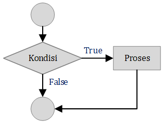
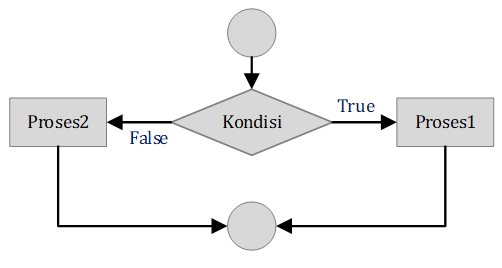
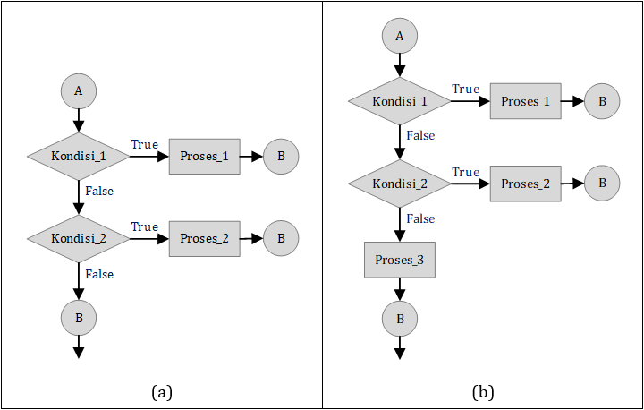
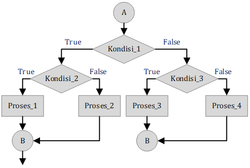
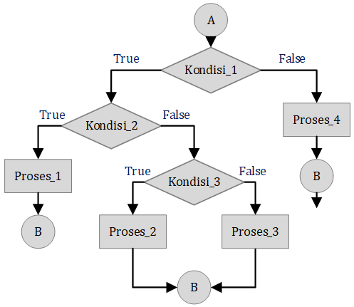

# STRUKTUR KONTROL
## Percabangan (Conditional Statements)
### 1. Statement `if`
Pernyataan if adalah salah satu struktur kontrol paling dasar dalam pemrograman Python. Ia digunakan untuk membuat keputusan berdasarkan suatu kondisi. Jika kondisi tersebut bernilai `True`, maka kode di dalam blok if akan dijalankan. Jika kondisi bernilai `False`, maka kode tersebut akan dilewati. Gambar 1 adalah Diagram Alir Statement `if`.

<br>Gambar 1. Diagram Alir Statement `if`

Sintaks Dasar:
```python
if kondisi:
    # Kode yang akan dijalankan jika kondisi benar
```

Cara Kerja:
1. **Evaluasi Kondisi**: Python akan mengevaluasi ekspresi di dalam kurung setelah kata kunci `if`. Ekspresi ini harus menghasilkan nilai boolean (`True` atau `False`).
2. **Eksekusi Blok Kode**: Jika hasil evaluasi adalah `True`, Python akan menjalankan semua pernyataan yang ada di dalam blok kode yang mengikuti `if`. Blok kode ini ditandai dengan indentasi (biasanya 4 spasi).
3. **Lewati Blok Kode**: Jika hasil evaluasi adalah `False`, Python akan langsung melewati blok kode di dalam `if` dan melanjutkan ke baris kode berikutnya.

Misal :
```python
umur = 18
if umur >= 17:
    print("Anda sudah cukup umur untuk memiliki SIM.")
```

Indentasi adalah penambahan spasi di awal baris kode. Dalam Python, indentasi digunakan untuk menunjukkan hirarki atau tingkatan dalam kode. Blok kode yang memiliki tingkat indentasi yang sama dianggap sebagai bagian dari blok kode yang sama. Aturan Indentasi di Python
- Konsisten: Gunakan jumlah spasi yang sama untuk setiap tingkat indentasi. Umumnya, 4 spasi adalah standar yang paling umum digunakan.
- Tab vs Spasi: Sebaiknya hindari mencampurkan tab dan spasi dalam satu file. Pilih salah satu dan gunakan secara konsisten.
- Editor Teks: Sebagian besar editor teks modern memiliki fitur otomatis untuk indentasi. Manfaatkan fitur ini untuk menjaga konsistensi indentasi.

Kesalahan Umum Terkait Indentasi
- Indentasi Tidak Konsisten: Menggunakan jumlah spasi yang berbeda untuk tingkat indentasi yang sama dapat menyebabkan IndentationError.
- Lupa Menutup Blok: Jika lupa menutup sebuah blok dengan mengurangi indentasi, Python akan menganggap baris berikutnya masih bagian dari blok sebelumnya.

ContohM0901.py adalah contoh penggunaan statement `if` untuk mengecek Bilangan Genap.
##### ContohM0901.py
```python
angka = int(input("Masukkan sebuah angka: "))
if angka % 2 == 0:
    print(angka, "adalah bilangan genap.")
```
ContohM0902.py adalah contoh penggunaan statement `if` untuk memeriksa Nilai Ujian.
##### ContohM0902.py
```python
nilai = int(input("Masukkan nilai ujian: "))
if nilai >= 80:
    print("Selamat, Anda mendapatkan nilai A!")
```
ContohM0903.py adalah contoh penggunaan statement `if` untuk mengecek Karakter Vokal.
##### ContohM0903.py
```python
karakter = input("Masukkan sebuah karakter: ")
if karakter in 'aiueoAIUEO':
    print(karakter, "adalah huruf vokal.")
```
ContohM0904.py adalah contoh penggunaan statement `if` untuk memeriksa kesesuaian Username dan Password.
##### ContohM0904.py
```python
username_benar = "admin"
password_benar = "rahasia123"
username = input("Masukkan username: ")
password = input("Masukkan password: ")
if username == username_benar and password == password_benar:
    print("Login berhasil!")
```
ContohM0905.py adalah contoh penggunaan statement `if` untuk memeriksa Jenis Segitiga Sama Sisi.
##### ContohM0905.py
```python
sisi_a = 5
sisi_b = 5
sisi_c = 5
if sisi_a == sisi_b and sisi_b == sisi_c:
    print("Segitiga sama sisi.")
```
ContohM0906.py adalah contoh penggunaan statement `if` untuk memeriksa Jenis Segitiga.
##### ContohM0906.py
```python
sisi_a = 5
sisi_b = 5
sisi_c = 5
if sisi_a == sisi_b and sisi_b == sisi_c:
    print("Segitiga sama sisi.")
if sisi_a == sisi_b or sisi_b == sisi_c or sisi_a == sisi_c:
    print("Segitiga sama kaki.")
if sisi_a != sisi_b and sisi_b != sisi_c and sisi_a != sisi_c:
    print("Segitiga sembarang.")
```
ContohM0907.py adalah contoh penggunaan statement `if` untuk memeriksa Kelulusan dengan Bobot Nilai, Kehadiran, dan Tugas Tambahan.
##### ContohM0907.py
```python
nilai_tugas = 85
nilai_uts = 70
nilai_uas = 90
persentase_kehadiran = 95
tugas_tambahan = True
if nilai_tugas >= 75 and nilai_uts >= 70 and nilai_uas >= 80 and persentase_kehadiran >= 80 and tugas_tambahan:
    print("Selamat, Anda lulus!")
```

### 2. Statement `else`
`else` adalah sebuah kata kunci dalam Python yang digunakan bersama dengan `if` untuk menentukan blok kode yang akan dijalankan jika kondisi dalam `if` bernilai `False`. Sederhananya, else menyediakan opsi alternatif ketika kondisi utama tidak terpenuhi. Gambar 2 adalah Diagram Alir Statement `if` dan `else`.

<br>Gambar 2. Diagram Alir Statement `if` dan `else`
Sintaks Dasar:
```python
if kondisi:
    # Blok kode yang dijalankan jika kondisi True
else:
    # Blok kode yang dijalankan jika kondisi False
```
Cara Kerja:
1. **Evaluasi Kondisi**: Python akan mengevaluasi kondisi yang diberikan setelah kata kunci if.
2. **Eksekusi Blok Kode**:
    1. Jika kondisi bernilai True, maka blok kode di dalam if akan dijalankan, dan blok kode di dalam else akan dilewati.
    2. Jika kondisi bernilai False, maka blok kode di dalam if akan dilewati, dan blok kode di dalam else akan dijalankan.

Misal :
```python
umur = 17
if umur >= 18:
    print("Anda sudah dewasa.")
else:
    print("Anda belum dewasa.")
```

ContohM0908.py adalah contoh penggunaan statement `if ... else` untuk memeriksa Bilangan Genap atau Ganjil.
##### ContohM0908.py
```python
bilangan = int(input("Masukkan bilangan: "))

if bilangan % 2 == 0:
    print("Bilangan genap")
else:
    print("Bilangan ganjil")
```
ContohM0909.py adalah contoh penggunaan statement `if ... else` untuk memeriksa apakah suatu huruf adalah vokal atau konsonan.
##### ContohM0909.py
```python
huruf = input("Masukkan sebuah huruf: ")
vokal = 'aiueo'

if huruf.lower() in vokal:
    print(huruf, "adalah huruf vokal.")
else:
    print(huruf, "adalah huruf konsonan.")
```
ContohM0910.py adalah contoh penggunaan statement `if ... else` untuk memeriksa apakah suatu hari adalah hari kerja.
##### ContohM0910.py
```python
hari = input("Masukkan hari (Senin, Selasa, ...): ")
hari_kerja = ["Senin", "Selasa", "Rabu", "Kamis", "Jumat"]

if hari.title() in hari_kerja:
    print(hari, "adalah hari kerja.")
else:
    print(hari, "adalah hari libur.")
```
ContohM0911.py adalah contoh penggunaan statement `if ... else` untuk memeriksa Tahun Kabisat atau bukan.
##### ContohM0911.py
```python
tahun = int(input("Masukkan tahun: "))

if (tahun % 4 == 0 and tahun % 100 != 0) or tahun % 400 == 0:
    print(tahun, "adalah tahun kabisat")
else:
    print(tahun, "bukan tahun kabisat")
```
ContohM0912.py adalah contoh penggunaan statement `if ... else` untuk memeriksa Jenis Segitiga, Panjang Sisi, dan Sudut.
##### ContohM0912.py
```python
sisi_a = 5
sisi_b = 5
sisi_c = 5
sudut_terbesar = 90

if sisi_a == sisi_b and sisi_b == sisi_c and sisi_a > 5 and sudut_terbesar == 90:
    print("Segitiga sama sisi siku-siku dengan sisi lebih dari 5.")
else:
    print("Bukan segitiga yang memenuhi kriteria tersebut.")
```
ContohM0913.py adalah contoh penggunaan statement `if ... else` untuk emeriksa apakah bilangan adalah faktor dari angka1 dan angka2
##### ContohM0913.py
```python
bilangan = int(input("Masukkan bilangan: "))
angka1 = int(input("Masukkan angka pertama: "))
angka2 = int(input("Masukkan angka kedua: "))

if bilangan > 0 and angka1 % bilangan == 0 and angka2 % bilangan == 0:
    print(f"{bilangan} adalah faktor dari {angka1} dan {angka2}.")
else:
    print(f"{bilangan} bukan faktor dari {angka1} dan {angka2}.")
```
ContohM0914.py adalah contoh penggunaan statement `if ... else` untuk mengetahui apakah seseorang lulus seleksi atau gagal
##### ContohM0914.py
```python
nama = input('Ketikan Nama Peserta : ')
tulis = int(input('> Nilai Tulis : '))
wawancara = int(input('> Nilai Wawancara : '))
rata = (tulis + wawancara)/2.0

if (tulis >= 60 and wawancara >= 60) or rata >= 60 :
    print(nama,': Lulus Seleksi')
else :
    print(nama,': Gagal Seleksi')
```
### 3. Statement `elif`
`elif` adalah singkatan dari "`else if`". Perintah ini digunakan dalam struktur kontrol `if` untuk mengevaluasi kondisi tambahan setelah kondisi `if` utama tidak terpenuhi. Dengan kata lain, `elif` memberikan opsi percabangan yang lebih kompleks dalam suatu program. Gambar 3 adalah Diagram Alir Statement `if` dan `elif`.

<br>Gambar 3. Diagram Alir Statement `if` dan `elif`.

Sintaks Dasar:
```python
#Gambar 3.a
if kondisi1:
    # Kode yang dijalankan jika kondisi1 benar
elif kondisi2:
    # Kode yang dijalankan jika kondisi1 salah dan kondisi2 benar
```
atau, 
```python
#Gambar 3.b
if kondisi1:
    # Kode yang dijalankan jika kondisi1 benar
elif kondisi2:
    # Kode yang dijalankan jika kondisi1 salah dan kondisi2 benar
else:
    # Kode yang dijalankan jika semua kondisi1 & kondisi2 salah
```
atau jika terdapat `elif` lainnya
```python
if kondisi1:
    # Kode yang dijalankan jika kondisi1 benar
elif kondisi2:
    # Kode yang dijalankan jika kondisi1 salah dan kondisi2 benar
elif kondisi3:
    # Kode yang dijalankan jika kondisi1 dan kondisi2 salah, tetapi kondisi3 benar
else:
    # Kode yang dijalankan jika semua kondisi di atas salah
```
Cara kerja:
1. **Kondisi `if`**: Program akan mengevaluasi kondisi pertama. Jika benar, kode di dalamnya akan dijalankan, dan blok `elif` dan `else` akan dilewati.
2. **Kondisi `elif`**: Jika kondisi1 salah, program akan memeriksa kondisi2. Jika kondisi2 benar, kode di dalamnya akan dijalankan, dan blok `else` akan dilewati. Jika masih ada blok `elif` berikutnya, maka proses ini berulang untuk setiap kondisi elif. 
3. **Kondisi `else`**: Jika semua kondisi `if` dan `elif` salah, kode di dalam blok else akan dijalankan.

Misal :
```python
nilai = 75
if nilai >= 90:
    print("Nilai A")
elif nilai >= 80:
    print("Nilai B")
elif nilai >= 70:
    print("Nilai C")
else:
    print("Nilai di bawah C")
```

Manfaat statement `elif` :
* Pengambilan keputusan multi-kondisi: Ketika Anda ingin mengevaluasi beberapa kondisi yang saling eksklusif (hanya satu kondisi yang bisa benar).
* Membuat program lebih efisien: Dengan elif, Anda dapat menghindari penumpukan kondisi if yang berlapis-lapis, sehingga membuat kode lebih mudah dibaca dan dipelihara.

Catatan penting penggunaan statement `elif` :
* `elif` harus selalu mengikuti `if`.
* Anda bisa memiliki banyak blok `elif` setelah `if`.
* Blok `else` adalah opsional. Jika tidak ada kondisi yang terpenuhi, program akan melanjutkan ke baris kode setelah blok `if-elif-else`.
* Indentasi sangat penting dalam Python untuk menentukan blok kode mana yang termasuk dalam kondisi `if`, `elif`, atau `else`. 

ContohM0915.py adalah contoh penggunaan statement `if-elif-else` untuk menentukan kategori usia
##### ContohM0915.py
```python
usia = int(input("Masukkan usia: "))
if usia >= 18:
    print("Dewasa")
elif usia >= 13:
    print("Remaja")
else:
    print("Anak-anak")
```

ContohM0916.py adalah contoh penggunaan statement `if-elif-else` untuk menentukan harga produk berdasarkan berat
##### ContohM0916.py
```python
berat = float(input("Masukkan berat (kg): "))
if berat <= 1:
    harga = 10000
elif berat <= 5:
    harga = 25000
else:
    harga = 50000
print("Harga: Rp", harga)
```

ContohM0917.py adalah contoh penggunaan statement `if-elif-else` untuk menentukan kategori berat badan berdasarkan tinggi dan berat
##### ContohM0917.py
```python
tinggi = float(input("Masukkan tinggi badan (cm): "))
berat = float(input("Masukkan berat badan (kg): "))

bmi = berat / ((tinggi/100)**2)

if bmi < 18.5:
    print("Kekurangan berat badan")
elif bmi >= 18.5 and bmi < 25:
    print("Berat badan normal")
elif bmi >= 25 and bmi < 30:
    print("Kelebihan berat badan")
else:
    print("Obesitas")
```

ContohM0918.py adalah contoh penggunaan statement `if-elif-else` untuk menentukan jenis segitiga berdasarkan panjang sisi
##### ContohM0918.py
```python
sisi_a = float(input("Masukkan sisi a: "))
sisi_b = float(input("Masukkan sisi b: "))
sisi_c = float(input("Masukkan sisi c: "))

if sisi_a == sisi_b == sisi_c:
    print("Segitiga sama sisi")
elif sisi_a == sisi_b or sisi_a == sisi_c or sisi_b == sisi_c:
    print("Segitiga sama kaki")
else:
    print("Segitiga sembarang")
```

ContohM0919.py adalah contoh penggunaan statement `if-elif-else` untuk menentukan Tarif Taksi Online
##### ContohM0919.py
```python
jarak = float(input("Masukkan jarak tempuh (km): "))
waktu_menunggu = int(input("Masukkan waktu menunggu (menit): "))

if jarak <= 2:
    tarif_dasar = 5000
elif jarak <= 10:
    tarif_dasar = 8000
else:
    tarif_dasar = 10000

tarif_jarak = (jarak - 2) * 2000
tarif_menunggu = waktu_menunggu * 100

total_tarif = tarif_dasar + tarif_jarak + tarif_menunggu
print("Total tarif: Rp", total_tarif)
```

ContohM0920.py adalah contoh penggunaan statement `if-elif-else` untuk menentukan Potongan Harga Produk
##### ContohM0920.py
```python
harga_awal = float(input("Masukkan harga awal: "))
jumlah_beli = int(input("Masukkan jumlah barang: "))
is_member = input("Apakah Anda member? (ya/tidak): ").lower()

if harga_awal > 100000 and jumlah_beli >= 5 and is_member == "ya":
    diskon = 0.2
elif harga_awal > 50000 and jumlah_beli >= 3:
    diskon = 0.1
else:
    diskon = 0.05

harga_akhir = harga_awal * (1 - diskon)
print("Harga akhir: Rp", harga_akhir)
```

ContohM0921.py adalah contoh penggunaan statement `if-elif-else` untuk menentukan Kategori Pelanggan Toko Online
##### ContohM0921.py
```python
total_belanja = float(input("Total belanja: "))
jumlah_transaksi = int(input("Jumlah transaksi dalam setahun: "))
lama_menjadi_member = int(input("Lama menjadi member (bulan): "))

if total_belanja >= 1000000 and jumlah_transaksi >= 12 and lama_menjadi_member >= 6:
    kategori = "Platinum"
elif total_belanja >= 500000 and jumlah_transaksi >= 6 and lama_menjadi_member >= 3:
    kategori = "Gold"
elif total_belanja >= 250000 and jumlah_transaksi >= 3:
    kategori = "Silver"
else:
    kategori = "Member Biasa"

print("Kategori pelanggan:", kategori)
```

### 4. Nested `if`
Nested `if` atau percabangan bersarang adalah suatu konstruksi dalam pemrograman Python di mana sebuah pernyataan `if` berada di dalam blok kode dari pernyataan `if` atau `elif` lainnya. Hal ini memungkinkan kita untuk membuat keputusan yang lebih kompleks dan hierarkis dalam program. Nested `if` sangat berguna ketika suatu kondisi bergantung pada beberapa kondisi lain.

Struktur Umum Nested `if` :
```python
if kondisi1:
    # Blok kode jika kondisi1 benar
    if kondisi2:
        # Blok kode jika kondisi1 dan kondisi2 benar
    else:
        # Blok kode jika kondisi1 benar dan kondisi2 salah
elif kondisi3:
    # Blok kode jika kondisi1 salah dan kondisi3 benar
else:
    # Blok kode jika kondisi1 salah dan kondisi3 salah
```
atau
```python
if kondisi1:
    # Blok kode jika kondisi1 benar
    if kondisi2:
        # Blok kode jika kondisi1 dan kondisi2 benar
    elif kondisi3:
        # Blok kode jika kondisi1 benar dan kondisi3 benar
    else:
        # Blok kode jika kondisi1 benar tetapi kondisi2 dan kondisi3 salah
else:
    # Blok kode jika kondisi1 salah
```

<br>Gambar 4. Diagram Alir Nested `if` (Struktur Umum Nested `if` bentuk pertama).

<br>Gambar 5. Diagram Alir Nested `if` (Struktur Umum Nested `if` bentuk kedua).

Catatan penting ketika menggunakan Nested `if` :
* Jaga indentasi: Indentasi yang benar sangat penting untuk menentukan blok kode mana yang termasuk dalam kondisi mana.
* Hindari terlalu banyak nesting: Terlalu banyak nesting dapat membuat kode sulit dibaca dan dipelihara. Pertimbangkan untuk menggunakan fungsi atau struktur data lain jika memungkinkan.
* Gunakan komentar: Tambahkan komentar untuk menjelaskan logika setiap bagian kode, terutama untuk nested `if` yang kompleks.

ContohM0922.py adalah contoh penggunaan nested `if` untuk menentukan Harga Produk Berdasarkan Berat dan Jenis
##### ContohM0922.py
```python
berat = float(input("Masukkan berat (kg): "))
jenis = input("Masukkan jenis produk (buah/sayur): ")

if jenis.lower() == "buah":
    if berat <= 1:
        harga = 5000
    else:
        harga = 10000 * berat
elif jenis.lower() == "sayur":
    if berat <= 0.5:
        harga = 3000
    else:
        harga = 8000 * berat
else:
    print("Jenis produk tidak valid")

print("Harga: Rp", harga)
```

ContohM0923.py adalah contoh penggunaan nested `if` untuk menentukan Tarif Parkir
##### ContohM0923.py
```python
jenis_kendaraan = input("Masukkan jenis kendaraan (mobil/motor): ")
lama_parkir = int(input("Masukkan lama parkir (jam): "))

if jenis_kendaraan.lower() == "mobil":
    if lama_parkir <= 2:
        tarif = 5000
    else:
        tarif = 2000 * lama_parkir
elif jenis_kendaraan.lower() == "motor":
    if lama_parkir <= 2:
        tarif = 3000
    else:
        tarif = 1500 * lama_parkir
else:
    print("Jenis kendaraan tidak valid")

print("Tarif parkir: Rp", tarif)
```

ContohM0924.py adalah contoh penggunaan nested `if` untuk menentukan Harga Tiket Bioskop
##### ContohM0924.py
```python
hari = input("Hari (Senin-Minggu): ").lower()
jam = int(input("Jam tayang (24 jam): "))
usia = int(input("Usia penonton: "))

if hari in ["sabtu", "minggu"] or jam >= 18 and jam <= 21:
    harga_normal = 50000
    if usia < 17:
        harga_akhir = harga_normal * 0.8
    elif usia >= 60:
        harga_akhir = harga_normal * 0.9
    else:
        harga_akhir = harga_normal
else:
    harga_normal = 40000
    if usia < 12:
        harga_akhir = harga_normal * 0.75
    else:
        harga_akhir = harga_normal

print("Harga tiket: Rp", harga_akhir)
```

ContohM0925.py adalah contoh penggunaan nested `if` untuk menentukan Potongan Harga Produk
##### ContohM0925.py
```python
harga_awal = float(input("Masukkan harga awal: "))
jumlah_beli = int(input("Masukkan jumlah barang: "))
is_member = input("Apakah Anda member? (ya/tidak): ").lower()
hari = input("Hari ini (Senin-Minggu): ").lower()

if hari in ["sabtu", "minggu"]:
    diskon_hari = 0.1  # Diskon 10% di akhir pekan
else:
    diskon_hari = 0

if harga_awal > 100000:
    if jumlah_beli >= 5 and is_member == "ya":
        diskon_jumlah = 0.2
    elif jumlah_beli >= 3:
        diskon_jumlah = 0.1
    else:
        diskon_jumlah = 0.05
else:
    diskon_jumlah = 0.05

diskon_total = diskon_hari + diskon_jumlah
harga_akhir = harga_awal * (1 - diskon_total)
print("Harga akhir: Rp", harga_akhir)
```

ContohM0926.py adalah contoh penggunaan nested `if` untuk menentukan Tarif Pengiriman
##### ContohM0926.py
```python
berat = float(input("Masukkan berat barang (kg): "))
jarak = float(input("Masukkan jarak pengiriman (km): "))
jenis_barang = input("Masukkan jenis barang (elektronik, pakaian, makanan): ").lower()
asuransi = input("Apakah ingin diasuransikan? (ya/tidak): ").lower()

if berat <= 1:
    tarif_dasar = 10000
elif berat <= 5:
    tarif_dasar = 15000
else:
    tarif_dasar = 20000

if jarak <= 10:
    tarif_jarak = 5000
elif jarak <= 50:
    tarif_jarak = 10000
else:
    tarif_jarak = 15000

if jenis_barang == "elektronik":
    tarif_jenis = 2000
elif jenis_barang == "makanan":
    tarif_jenis = 1000
else:
    tarif_jenis = 0

if asuransi == "ya":
    tarif_asuransi = 0.05 * (tarif_dasar + tarif_jarak + tarif_jenis)
else:
    tarif_asuransi = 0

total_tarif = tarif_dasar + tarif_jarak + tarif_jenis + tarif_asuransi
print("Total tarif pengiriman: Rp", total_tarif)
```

ContohM0927.py adalah contoh penggunaan nested `if` untuk memberikan rekomendasi film berdasarkan preferensi pengguna
##### ContohM0927.py
```python
genre = input("Masukkan genre film yang disukai (action, drama, horor): ").lower()
durasi = int(input("Masukkan durasi film yang diinginkan (menit): "))
rating = float(input("Masukkan rating film minimum yang diinginkan: "))
suasana_hati = input("Masukkan suasana hati saat ini (sedih, bahagia, netral): ").lower()

if genre == "action":
    if durasi > 120 and rating >= 8:
      print("Rekomendasi: The Avengers")
    elif durasi <= 90 and rating >= 7:
      print("Rekomendasi: John Wick")
    else:
      print("Rekomendasi: Mission Impossible")
elif genre == "drama":
    if suasana_hati == "sedih":
      print("Rekomendasi: Titanic")
    elif suasana_hati == "bahagia":
      print("Rekomendasi: Love, Actually")
    else:
      print("Rekomendasi: The Shawshank Redemption")
elif genre == "horor":
    if rating >= 9:
      print("Rekomendasi: The Conjuring")
    else:
      print("Rekomendasi: Insidious")
else:
    print("Genre film tidak tersedia")
```

ContohM0928.py adalah contoh penggunaan nested `if` untuk memberikan rekomendasi makanan berdasarkan preferensi pelanggan.
##### ContohM0928.py
```python
ukuran_porsi = input("Pilih ukuran porsi (reguler/besar): ").lower()
jenis_daging = input("Pilih jenis daging (ayam, sapi, ikan): ").lower()
ada_alergi = input("Apakah Anda memiliki alergi? (ya/tidak): ").lower()
budget = int(input("Masukkan anggaran Anda: "))
pesan = "Rekomendasi: "

if ada_alergi == "ya":
    pesan = "Mohon maaf, kami belum memiliki menu khusus alergi."
else:
    if ukuran_porsi == "besar":
        if budget >= 25000:
            if jenis_daging == "ayam":
                pesan += "Ayam geprek jumbo dengan nasi"
            elif jenis_daging == "sapi":
                pesan += "Burger daging sapi double dengan kentang goreng"
            else:
                pesan += "Ikan dori goreng tepung dengan nasi"
        else:
            pesan += "Nasi ayam geprek (ukuran sedang)"
    else:
        if budget >= 20000:
            if jenis_daging == "ayam":
                pesan += "Ayam goreng krispi dengan nasi"
            elif jenis_daging == "sapi":
                pesan += "Burger daging sapi dengan kentang goreng"
            else:
                pesan += "Ikan dori goreng tepung dengan nasi"
        else:
            pesan += "Nasi ayam bakar (ukuran kecil)"
print(pesan)
```

### 5. statement `match-case`
`match-case` adalah sebuah fitur baru yang diperkenalkan di Python 3.10. Fitur ini menyediakan cara yang lebih ringkas dan ekspresif untuk melakukan pattern matching pada data, mirip seperti `switch-case` pada bahasa pemrograman lain. Dengan `match-case`, kita bisa membandingkan suatu nilai dengan berbagai pola yang telah ditentukan dan menjalankan blok kode yang sesuai dengan pola yang cocok. `match-case` biasanya digunakan untuk meringkas `if-elif-else` yang bersarang.

Dalam pernyataan `match-case` Python sederhana, nilai yang tepat dibandingkan dan dicocokkan dengan nilai pola kasus. Ada beberapa kasus uji dan kode yang sesuai yang akan dieksekusi hanya jika sebuah kasus cocok. Jika tidak, ada kasus default yang akan dieksekusi ketika semua kasus yang ditentukan tidak cocok.

Struktur Dasar :
```python
match subject:
    case pattern1:
        # Kode jika cocok dengan pattern1
    case pattern2:
        # Kode jika cocok dengan pattern2
    case _:
        # Kode jika tidak cocok dengan semua pattern
```
dimana :
* `subject` : Nilai yang akan dicocokkan dengan pola-pola yang diberikan.
* `case pattern` : Pola yang akan dicocokkan dengan subject.
* `_` : Pola wildcard yang akan cocok dengan semua nilai yang tidak cocok dengan pola sebelumnya.

ContohM0929.py adalah contoh penggunaan `match-case` untuk menampilkan cara baca angka 1 s.d 3
##### ContohM0929.py
```python
num = int(input("Enter a number between 1 and 3: "))

match num:
    case 1: print("One")
    case 2: print("Two")
    case 3: print("Three")
    case _: print("Number not between 1 and 3")
```

Pernyataan `Match-case` dalam Python dimaksudkan hanya untuk mencocokkan pola dan kata kunci atau parameter tertentu. Tetapi kita juga dapat menggunakan pernyataan `match-case` di python ketika ada lebih dari satu kasus yang menghasilkan output yang sama. Dalam hal ini, kita dapat menggunakan Operator OR dalam pernyataan pencocokan kasus.

ContohM0930.py adalah contoh penggunaan `match-case` untuk menampilkan cara baca angka 1 s.d 6
##### ContohM0930.py
```python
num = int(input("Enter a number between 1 and 6: "))

match num:
    case 1 | 2:
        print("One or Two")
    case 3 | 4:
        print("Three or Four")
    case 5 | 6:
        print("Five or Six")
    case _:
        print("Number not between 1 and 6")
```

Kita juga dapat menggunakan kondisi Python `if` bersama dengan pernyataan `match-case` ketika alih-alih mencocokkan nilai yang tepat, kita menggunakan sebuah kondisi. Berdasarkan kondisi tersebut, jika nilainya `True` dan cocok dengan pola kasus, blok kode akan dieksekusi.

ContohM0931.py adalah contoh penggunaan kondisi `if` bersama dengan pernyataan `match-case` untuk memeriksa apakah angka yang dimasukkan pengguna positif, negatif, atau nol.
##### ContohM0931.py
```python
num = int(input("Enter a number: "))

match num:
    case num if num > 0:
        print("Positive")
    case num if num < 0:
        print("Negative")
    case _:
        print("Zero")
```

Pernyataan `match-case` Python biasanya digunakan untuk mencocokkan pola urutan seperti daftar dan string. Ini cukup mudah dan dapat menggunakan argumen posisi untuk memeriksa pola.

ContohM0932.py adalah contoh penggunaan string python untuk memeriksa apakah sebuah karakter ada dalam string atau tidak dengan menggunakan `match-case`. 
##### ContohM0932.py
```python
myStr = "Hello World"

match (myStr[6]):
    case "w":
        print("Case 1 matches")
    case "W":
        print("Case 2 matches")
    case _:
        print("Character not in the string")
```

ContohM0933.py adalah contoh penggunaan list python untuk pencocokan pola. Kita mencocokkan elemen pertama yang hilang dan juga menggunakan argumen posisi untuk mencocokkan elemen lainnya dari list.
##### ContohM0933.py
```python
#mystr = []
#mystr = ["a"]
#mystr = ["a", "b"]
mystr = ["b", "c", "d", "e"]

match mystr:
    # pattern 1
    case ["a"]:
        print("a")
    # pattern 2
    case ["a", *b]:
        print(f"a and {b}")
    # pattern 3
    case [*a, "e"] | (*a, "e"):
        print(f"{a} and e")
    # default pattern
    case _:
        print("No data")
```

Cara kerja `match-case` pada ContohM0933.py :
* Pattern 1: `["a"]`
    - Mencocokkan jika list `mystr` hanya memiliki satu elemen yaitu `"a"`.
* Pattern 2: `["a", *b]`
    - Mencocokkan jika list `mystr` dimulai dengan `"a"` dan diikuti oleh elemen-elemen lainnya yang disimpan dalam variabel `b`.
* Pattern 3: `[*a, "e"] | (*a, "e")`
    - Menggunakan operator `|` untuk menggabungkan dua pola:
        * `[*a, "e"]`: Mencocokkan jika list `mystr` berakhir dengan `"e"` dan elemen-elemen sebelumnya disimpan dalam variabel `a`.
        * `(*a, "e")`: Mencocokkan jika list `mystr` berakhir dengan `"e"`.
* Default Pattern: `_`
    - Mencocokkan jika tidak ada pola sebelumnya yang cocok.

Wildcard (`*`) di dalam `match-case` Python berfungsi sebagai penangkap semua elemen yang tidak secara spesifik disebutkan dalam pola. Ini sangat berguna ketika kita ingin membuat pola yang lebih fleksibel dan dapat mencocokkan berbagai kemungkinan.

Cara Kerja Wildcard:
* **Menangkap Elemen Sisanya**: Jika wildcard ditempatkan di akhir pola, ia akan menangkap semua elemen yang tersisa dalam struktur data (seperti list atau tuple) yang tidak dicocokkan oleh bagian pola sebelumnya.
* **Menangkap Elemen Awal**: Jika wildcard ditempatkan di awal pola, ia akan menangkap semua elemen di awal struktur data yang tidak dicocokkan oleh bagian pola selanjutnya.
* **Menggabungkan dengan Pola Lain**: Wildcard dapat digabungkan dengan pola-pola lain yang lebih spesifik untuk membuat pola yang lebih kompleks.

Pernyataan `match-case` Python juga dapat menangani Dictionary. Pernyataan ini dapat mencocokkan satu key atau beberapa key. Key dan value harus berada di dalam Dictionary, jika ada value yang salah tempat atau key yang tidak ada dan tidak cocok dengan Dictionary dan value yang sebenarnya, kasus tersebut akan dibuang.

ContohM0934.py adalah contoh penggunaan Dictionary dengan pernyataan `match-case` di python.
##### ContohM0934.py
```python
kamus = {"name": "Jay", "age": 24}
#kamus = {"name": "Ed", "salary": 25000}
#kamus = {"name": "Al", "child": 2}
#kamus = {"name": "Jo", "salary": 26000, "age": 25}
#kamus = {}

match kamus:
    case {"name": n, "age": a}:
        print(f"Name:{n}, Age:{a}")
    case {"name": n, "salary": s}:
        print(f"Name:{n}, Salary:{s}")
    case _ :
        print("Data does not exist")
```

ContohM0935.py adalah contoh penggunaan `match-case` untuk menentukan hari dalam seminggu berdasarkan nomor
##### ContohM0935.py
```python
nomor = 3
match nomor:
    case 1:
        teks = "Senin"
    case 2:
        teks = "Selasa"
    case 3:
        teks = "Rabu"
    case 4:
        teks = "Kamis"
    case 5:
        teks = "Jumat"
    case 6:
        teks = "Sabtu"
    case 7:
        teks = "Minggu"
    case _:
        teks = "Nomor hari tidak valid"

print('hari:',teks)
```

ContohM0936.py adalah contoh penggunaan `match-case` untuk mengklasifikasikan hewan berdasarkan jenis
##### ContohM0936.py
```python
hewan = input("Masukan nama satu jenis hewan:")

match hewan.lower():
    case 'singa' | 'harimau' | 'beruang':
        kelas = "Karnivora"
    case 'kelinci' | 'kuda' | 'sapi':
        kelas = "Herbivora"
    case _:
        kelas = "Jenis hewan tidak diketahui"

print(hewan,'termasuk',kelas) 
```

ContohM0937.py adalah contoh penggunaan `match-case` untuk menghitung diskon berdasarkan jumlah pembelian
##### ContohM0937.py
```python
jumlah = int(input("jumlah pembelian:"))

match jumlah:
    case jumlah if jumlah >= 100000:
        discon = 10
    case jumlah if jumlah >= 50000:
        discon = 5
    case _:
        discon = 0

print("Diskon:",discon,"%")
```

ContohM0938.py adalah contoh penggunaan `match-case` untuk menentukan jenis segitiga berdasarkan panjang sisi
##### ContohM0938.py
```python
sisi_a = int(input("panjang sisi a:"))
sisi_b = int(input("panjang sisi b:"))
sisi_c = int(input("panjang sisi c:"))

match (sisi_a, sisi_b, sisi_c):
    case (a, b, c) if a == b == c:
        jenis = "Segitiga sama sisi"
    case (a, b, c) if a == b or a == c or b == c:
        jenis = "Segitiga sama kaki"
    case _:
        jenis = "Segitiga sembarang"

print('jenis_segitiga',jenis)
```

ContohM0939.py adalah contoh penggunaan `match-case` untuk membuat kalkulator sederhana dengan berbagai operasi aritmatika dasar
##### ContohM0939.py
```python
operasi = input("Masukan nama atau simbol operator:")
angka1 = int(input("angka ke-1:"))
angka2 = int(input("angka ke-2:"))
match operasi.lower():
    case 'tambah' | '+':
        hasil = angka1 + angka2
    case 'kurang' | '-':
        hasil = angka1 - angka2
    case 'kali' | '*' | 'x':
        hasil = angka1 * angka2
    case 'bagi' | '/' | ':':
        if angka2 == 0:
            hasil = "Tidak bisa dibagi dengan nol"
        else:
            hasil = angka1 / angka2
    case _:
        hasil = "Operasi tidak valid"

print("Hasil:", hasil)
```

ContohM0940.py adalah contoh penggunaan `match-case` untuk mengkonversi suhu antara berbagai satuan.
##### ContohM0940.py
```python
suhu = int(input("Nilai suhu yang akan dikonversi:"))
satuan_awal = input("Satuan suhu awal (celcius, fahrenheit, kelvin, reamur):")
satuan_tujuan =input("Satuan suhu tujuan (celcius, fahrenheit, kelvin, reamur):")

match (satuan_awal.lower(), satuan_tujuan.lower()):
    case ('celcius', 'fahrenheit'):
        hasil = (suhu * 9/5) + 32
    case ('celcius', 'kelvin'):
        hasil = suhu + 273.15
    case ('celcius', 'reamur'):
        hasil = suhu * 4/5
    case ('fahrenheit', 'celcius'):
        hasil = (suhu - 32) * 5/9
    case ('fahrenheit', 'kelvin'):
        hasil = ((suhu - 32) * 5/9) + 273.15
    case ('fahrenheit', 'reamur'):
        hasil = (suhu - 32) * 4/9
    case ('kelvin', 'celcius'):
        hasil = suhu - 273.15
    case ('kelvin', 'fahrenheit'):
        hasil = (suhu - 273.15) * 9/5 + 32
    case ('kelvin', 'reamur'):
        hasil = (suhu - 273.15) * 4/5
    case ('reamur', 'celcius'):
        hasil = suhu * 5/4
    case ('reamur', 'fahrenheit'):
        hasil = (suhu * 9/4) + 32
    case ('reamur', 'kelvin'):
        hasil = (suhu * 5/4) + 273.15
    case _:
        hasil = "Konversi tidak didukung"

print(f"{suhu} derajat {satuan_awal} setara dengan {hasil} derajat {satuan_tujuan}")
```

|[# Awal](../README.md)<br>[# Materi Sebelumnya](../M08/README.md)<br>[# Materi Berikutnya](../M10/README.md)|
|-|