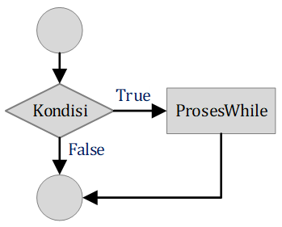

# STRUKTUR KONTROL
## Perulangan (Repetition/Looping)
### 1. Statement `for`
Statement  `for` adalah salah satu jenis perulangan dalam Python yang digunakan untuk mengulang suatu blok kode sebanyak tertentu atau untuk setiap elemen dalam suatu urutan (seperti list, tuple, atau string). Sederhananya, `for` memungkinkan kita untuk melakukan tugas yang sama berulang kali tanpa harus menulis kode yang sama berulang kali. Perulangan `for` disebut juga counted loop (perulangan yang terhitung). 
`for` dalam bahsa pemograman Python memiliki ciri khas tersendiri dibandingkan dengan bahasa pemograman yang lainnya. Tidak hanya mengulang bilangan-bilangan ekspresi aritmatika atau memberikan keleluasan dalam mendefinisikan iterasi perulangan dan menghentikan perulangan pada saat kondisi tertentu saja. 

Sintaks Dasar :
```python
for variabel in urutan:
    # Blok kode yang akan diulang
```
dimana :
* **`variabel`**: Sebuah variabel yang akan menyimpan nilai setiap elemen dalam urutan pada setiap iterasi.
* **`urutan`**: Urutan yang bisa berupa list, tuple, string, atau objek yang dapat diiterasi lainnya.
* **`Blok kode`**: Bagian kode yang akan diulang untuk setiap elemen dalam urutan.

ContohM1001.py adalah contoh penggunaan statement `for` untuk menampilkan 5 kali tulisan "Python" dan sebelum tulisan "Python" dimunculkan nilai variabel yang digunakan pada for.
##### ContohM1001.py
```python
for pencacah in [1, 2, 3, 4, 5]:
    print(pencacah, "Python")
```
Atau bisa juga menggunakan fungsi `range()` (seperti pada materi [M03](../M03/README.md) dan [M04](../M04/README.md)). Fungsi `range()` adalah fungsi bawaan di Python yang digunakan untuk menghasilkan deretan angka secara berurutan. Deretan angka ini sering digunakan sebagai indeks dalam perulangan `for` untuk mengiterasi suatu objek yang dapat diindeks seperti list, tuple, atau string. Penggunaan fungsi `range()` sama dengan slicing pada list dan tuple. `range()` menghasilkan objek yang menyimpan informasi tentang deret angka, bukan list yang berisi semua angka. Ini membuatnya lebih efisien dalam penggunaan memori, terutama untuk deret angka yang sangat panjang. `range()` memungkinkan kita untuk menghasilkan berbagai jenis deret angka dengan mudah, mulai dari deret sederhana hingga deret yang lebih kompleks.

Sintaks Dasar:
```python
range(start, stop, step)
```
dimana :
* **`start`**: Nilai awal dari deret (inklusif). Jika tidak diberikan, nilai defaultnya adalah 0.
* **`stop`**: Nilai akhir dari deret (eksklusif). Artinya, nilai akhir tidak termasuk dalam deret yang dihasilkan.
* **`step`**: Besar langkah atau interval antara setiap angka dalam deret. Jika tidak diberikan, nilai defaultnya adalah 1.

misal :
| Statement | Hasil |
|-|-|
|`range(5)`|`[0, 1, 2, 3, 4]`|
|`range(2, 8)`|`[2, 3, 4, 5, 6, 7]`|
|`range(-5, 0)`|`[-5, -4, -3, -2, -1]`|
|`range(0, 10, 2)`|`[0, 2, 4, 6, 8]`|
|`range(5, 0, -1)`|`[5, 4, 3, 2, 1]`|
|`range(-5, -10, -2)`|`[-5, -7, -9]`|

Jika kita menggunakan fungsi range, maka ContohM1001.py bisa kita ubah menjadi seperti berikut :
```python
for pencacah in range(1,6):
    print(pencacah, "Python")
```

ContohM1002.py adalah contoh penggunaan statement `for` untuk membuat Jadwal Olahraga Mingguan.
##### ContohM1002.py
```python
hari = ["Senin", "Selasa", "Rabu", "Kamis", "Jumat", "Sabtu", "Minggu"]
olahraga = ["lari", "angkat besi", "yoga", "berenang", "basket", "istirahat", "istirahat"]

for i in range(len(hari)):
    print(f"Hari {hari[i]}, saya akan {olahraga[i]}")
```

ContohM1003.py adalah contoh penggunaan statement `for` untuk menghitung Total Belanja.
##### ContohM1003.py
```python
harga_barang = [20000, 15000, 10000, 5000]
total_belanja = 0

for harga in harga_barang:
    total_belanja += harga

print(f"Total belanja Anda adalah Rp {total_belanja}")
```

ContohM1004.py adalah contoh penggunaan statement `for` untuk menghitung Faktorial.
##### ContohM1004.py
```python
angka = int(input("Masukan Bilangan :"))
faktorial = 1

for i in range(1, angka + 1):
    faktorial *= i

print(f"Faktorial dari {angka} adalah {faktorial}")
```

ContohM1005.py adalah contoh penggunaan statement `for` untuk menghitung Bilangan Fibonacci.
##### ContohM1005.py
```python
n = int(input("Masukan Bilangan :"))
fib = [0, 1]
for i in range(2, n):
    fib.append(fib[i-1] + fib[i-2])
print(fib)
```

Penggunaan `for` juga bisa dipadukan dengan Struktur Kontrol Seleksi seperti `if`, `if-else`, `if-elif-else` dan `match-case`. ContohM1006.py adalah contoh penggunaan statement `for` untuk menghitung Jumlah Huruf Vokal dalam Kalimat.
##### ContohM1006.py
```python
kalimat = input("ketikan sebuah kalimat:")
vokal = "AIUEO"
jumlah_vokal = 0

for huruf in kalimat:
    if huruf.upper() in vokal:
        jumlah_vokal += 1

print(f"Jumlah huruf vokal dalam kalimat adalah {jumlah_vokal}")
```

ContohM1007.py adalah contoh penggunaan statement `for` untuk mencari Kata Palindrom.
##### ContohM1007.py
```python
words = ["radar", "level", "python", "madam"]
for word in words:
    if word == word[::-1]:
        print(word, "adalah palindrom")
    else :
        print(word, "bukan palindrom")
```

ContohM1008.py adalah contoh penggunaan statement `for` untuk memberikan predikat yang sesuai berdasarkan rentang nilai..
##### ContohM1008.py
```python
nilai_siswa = [80, 95, 72, 65, 90]

for nilai in nilai_siswa:
    if nilai >= 90:
        predikat = "A"
    elif nilai >= 80:
        predikat = "B"
    elif nilai >= 70:
        predikat = "C"
    elif nilai >= 60:
        predikat = "D"
    else:
        predikat = "E"
    print(f"Nilai: {nilai}, Predikat: {predikat}")
```

ContohM1009.py adalah contoh penggunaan statement `for` untuk mengklasifikasikan buah-buahan ke dalam kelompok berdasarkan jenisnya.
##### ContohM1009.py
```python
fruits = ["apel", "pisang", "mangga", "jeruk", "durian"]

for buah in fruits:
    match buah:
        case "apel" | "pir":
            jenis_buah = "buah-buahan apel"
        case "pisang" | "pisang cavendish":
            jenis_buah = "buah-buahan pisang"
        case "mangga" | "mangga harum manis":
            jenis_buah = "buah-buahan mangga"
        case _:
            jenis_buah = "buah lainnya"
    print(f"{buah} termasuk dalam kategori {jenis_buah}")
```

ContohM1010.py adalah contoh penggunaan statement `for` untuk menghitung banyaknya setiap huruf vokal dalam sebuah kalimat.
##### ContohM1010.py
```python
kalimat = input("Masukkan kalimat: ")
vokal = "aiueo"
hitung_vokal = {}

for huruf in kalimat.lower():
    if huruf in vokal:
        if huruf in hitung_vokal:
            hitung_vokal[huruf] += 1
        else:
            hitung_vokal[huruf] = 1

print("Jumlah setiap huruf vokal:")
for vokal, jumlah in hitung_vokal.items():
    print(f"{vokal}: {jumlah}")
```

### 2. Statement `while`
`while` adalah sebuah struktur kontrol dalam Python yang digunakan untuk menjalankan blok kode secara berulang selama suatu kondisi tertentu masih bernilai `True`. Sederhananya, `while` akan terus mengulang kode di dalamnya sampai kondisi tersebut menjadi `False`. Gambar 1 adalah Diagram Alir yang menggambarkan proses perulangan `while`. Pertama, program akan mengecek apakah nilai dari `Kondisi`, jika kondisi bernilai `True`, maka `prosesWhile` akan dieksekusi. Kemudian program akan mengecek kembali nilai dari `Kondisi`, jika kondisi bernilai `True`, maka akan mengeksekusi `prosesWhile` kembali, tetapi jika `Kondisi` bernilai `False`, maka program akan mengeksekusi bagian lainnya.

<br>Gambar 1. Diagram Alir yang menggambarkan proses perulangan `while`.

Sintaks Dasar:
```python
while kondisi:
    # Blok kode yang akan diulang
```

ContohM1011.py adalah contoh penggunaan statement `while` untuk menampilkan Bilangan Genap Sampai Angka Tertentu
##### ContohM1011.py
```python
batas = int(input("Masukkan batas akhir: "))
angka = 2
while angka <= batas:
    print(angka)
    angka += 2
```

ContohM1012.py adalah contoh penggunaan statement `while` untuk menampilkan Tabel Perkalian
##### ContohM1012.py
```python
angka = int(input("Masukkan angka: "))
i = 1
while i <= 10:
    print(angka, "x", i, "=", angka*i)
    i += 1
```

ContohM1013.py adalah contoh penggunaan statement `while` untuk menghitung Jumlah Digit Angka
##### ContohM1013.py
```python
angka = int(input("Masukkan angka: "))
jumlah_digit = 0
while angka > 0:
    angka //= 10
    jumlah_digit += 1
print("Jumlah digit:", jumlah_digit)
```

ContohM1014.py adalah contoh penggunaan statement `while` untuk mencari Bilangan Fibonacci
##### ContohM1014.py
```python
n = int(input("Masukkan jumlah bilangan Fibonacci: "))
a, b = 0, 1
count = 0
while count < n:
    print(a, end=' ')
    a, b = b, a+b
    count += 1
```

ContohM1015.py adalah contoh penggunaan statement `while` untuk menampilkan Segitiga Bintang
##### ContohM1015.py
```python
baris = int(input("Masukkan jumlah baris: "))
i = 1
while i <= baris:
    print("*" * i)
    i += 1
```

Sama seperti `for`, `while` juga dapat dipadukan dengan struktur kontrol seleksi. ContohM1016.py adalah contoh penggunaan statement `while` dan `if` untuk memeriksa apakah suatu angka termasuk Bilangan Prima.
##### ContohM1016.py
```python
angka = int(input("Masukkan angka: "))
pembagi = 2
prima = True

while pembagi <= angka/2 and prima:
    if angka % pembagi == 0:
        prima = False
    pembagi += 1

if prima:
    print(angka, "adalah bilangan prima")
else:
    print(angka, "bukan bilangan prima")
```

ContohM1017.py adalah contoh penggunaan statement `while` untuk menjumlahkan beberapa angka
##### ContohM1017.py
```python
data = []
lagi = True

while lagi:
    angka = int(input("Masukkan Angka Positif (Nol/0 untuk keluar):"))
    if angka > 0:
        data.append(angka)
    else:
        lagi = False
        print('Proses input data selesai')
        
print('data:',data)
print('Total semua data:',sum(data))
```

ContohM1018.py adalah contoh penggunaan statement `while` dan `if-elif-else` untuk menebak angka yang dipilih komputer.
##### ContohM1018.py
```python
import random
angka_rahasia = random.randint(1, 100)
tebakan = 0

print("Selamat datang di permainan tebak angka!")
print("Saya telah memilih angka antara 1 sampai 100.")

while tebakan != angka_rahasia:
    tebakan = int(input("Tebakan Anda: "))

    if tebakan < angka_rahasia:
        print("Terlalu rendah!")
    elif tebakan > angka_rahasia:
        print("Terlalu tinggi!")
    else:
        print("Selamat! Anda berhasil menebak angka rahasia.")
```
Pada baris ke-1 terdapat perintah `import random`, pernyataan ini dalam bahasa Python yang digunakan untuk mengimpor modul random. Modul ini menyediakan berbagai fungsi untuk menghasilkan angka-angka acak. Kemudian pada baris ke-2 terdapat perintah `random.randint(1, 100)`, perintah ini menghasilkan bilangan bulat acak antara 1 dan 100 (inklusif).

ContohM1019.py adalah contoh penggunaan statement `while` dan `if-elif-else` untuk menyimulasikan mobil yang bergerak secara acak di lapangan 5x5.
##### ContohM1019.py
```python
import random

posisi_x, posisi_y = 0, 0
print(f"Awal posisi mobil: ({posisi_x}, {posisi_y})")

while posisi_x != 5 or posisi_y != 5:
    opsi_gerak = random.randint(1, 4)
    ubahX, ubahY = 0, 0
    if opsi_gerak == 1 and (posisi_y < 5):
        arah = "Utara"
        ubahY = 1
    elif opsi_gerak == 2 and (posisi_x < 5):
        arah = "Timur"
        ubahX = 1
    elif opsi_gerak == 3 and (posisi_y > 0):
        arah = "Selatan"
        ubahY = -1
    elif opsi_gerak == 4  and (posisi_x > 0):
        arah = "Barat"
        ubahX = -1
    
    if (ubahX > 0 or ubahY > 0) :
        posisi_x += ubahX
        posisi_y += ubahY
        print(f"Mobil bergerak ke {arah}, Posisi mobil sekarang: ({posisi_x}, {posisi_y})")

print("Mobil telah mencapai tujuan!")
```

ContohM1020.py adalah contoh penggunaan statement `while` dan `match-case` untuk membuat kalkulator aritmatika sederhana.
##### ContohM1020.py
```python
jumlah = None
opsi = 1
while opsi != '0' :
    if jumlah == None :
        jumlah = int(input("Masukan nilai awal:"))
    else :
        print('Jumlah sementara:',jumlah)
        opsi = input("Masukan operator (+, -, x, /, 0 untuk selesai):")
        match opsi :
            case '+':
                angka = int(input("Masukan angka :"))
                jumlah += angka
            case '-':
                angka = int(input("Masukan angka :"))
                jumlah -= angka
            case 'x':
                angka = int(input("Masukan angka :"))
                jumlah *= angka
            case '/':
                angka = int(input("Masukan angka :"))
                jumlah /= angka
            case '0':
                print("Selesai.")
            case _ :
                print("Operator tidak dikenal.")
print('Jumlah akhir:',jumlah)
```
### 3. Nested Loop
Nested loop, atau loop bersarang (*loop = perulangan*), adalah konsep di mana sebuah loop berada di dalam loop lainnya. Bayangkan seperti kotak-kotak yang saling bersusun. Setiap kali loop luar melakukan satu iterasi, loop dalam akan menjalankan semua iterasinya. Ini memungkinkan kita untuk melakukan iterasi pada data multi-dimensi atau struktur data yang lebih kompleks. Saat membuat nested loop, pastikan indentasi kode Anda benar agar Python dapat memahami struktur loop dengan baik. Hindari nested loop yang terlalu dalam, karena dapat membuat program berjalan lebih lambat. Pertimbangkan untuk menggunakan list comprehensions atau fungsi bawaan Python untuk operasi yang lebih sederhana.

Cara Kerja Nested Loop
* Loop Luar: Loop luar dimulai dengan nilai awal dan akan terus berjalan sampai kondisi tertentu terpenuhi.
* Loop Dalam: Setiap kali loop luar melakukan satu iterasi, loop dalam akan dimulai dari awal dan menjalankan semua iterasinya.
* Kode di Dalam Loop Dalam: Kode yang berada di dalam loop dalam akan dijalankan pada setiap iterasi loop dalam.
* Kembali ke Loop Luar: Setelah loop dalam selesai, program akan kembali ke loop luar dan melanjutkan ke iterasi berikutnya.

ContohM1021.py adalah contoh penggunaan nested loop untuk mencetak Segitiga Pascal.
##### ContohM1021.py
```python
baris = int(input("Tinggi:"))
for i in range(baris):
    C = 1
    for j in range(i+1):
        print(f'{C:>3}', end=" ")
        C = C * (i - j) // (j + 1)
    print()
```

ContohM1022.py adalah contoh penggunaan nested loop untuk mencetak semua kemungkinan kombinasi dari dua list.
##### ContohM1022.py
```python
list1 = ['b','c','d']
list2 = ['a','i','u','e','o']

for i in list1:
    for j in list2:
        print(i, j)
```

ContohM1023.py adalah contoh penggunaan nested loop untuk mencetak pola bintang berbentuk diamond.
##### ContohM1023.py
```python
ukuran = int(input("Masukkan ukuran diamond: "))

# Bagian atas diamond
for i in range(ukuran):
    for j in range(ukuran - i - 1):
        print(" ", end="")
    for k in range(2 * i + 1):
        print("*", end="")
    print()

# Bagian bawah diamond
for i in range(ukuran - 1, 0, -1):
    for j in range(ukuran - i):
        print(" ", end="")
    for k in range(2 * i - 1):
        print("*", end="")
    print()
```

ContohM1024.py adalah contoh penggunaan nested loop untuk menjumlahkan 2 matriks acak ukuran 3 x 4.
##### ContohM1024.py
```python
import random

matriks1, matriks2= [], []

for row in range(3):
    tmp1, tmp2 = [], []
    for col in range(4):
        tmp1.append(random.randint(1, 20))
        tmp2.append(random.randint(1, 20))
    matriks1.append(tmp1)
    matriks2.append(tmp2)

# Menampilkan matriks 1
print("Matriks 1:")
for baris in matriks1:
    for kolom in baris:
        print(f'{kolom:>2}', end="  ")
    print()

# Menampilkan matriks 2
print("\nMatriks 2:")
for baris in matriks2:
    for kolom in baris:
        print(f'{kolom:>2}', end="  ")
    print()

# Menjumlahkan kedua matriks
hasil = []
for i in range(3):
    tmp = []
    for j in range(4):
        tmp.append(matriks1[i][j] + matriks2[i][j])
    hasil.append(tmp)

# Menampilkan hasil penjumlahan
print("\nHasil Penjumlahan:")
for baris in hasil:
    for kolom in baris:
        print(f'{kolom:>2}', end="  ")
    print()
```

ContohM1025.py adalah contoh penggunaan nested loop untuk mencetak matriks spiral.
##### ContohM1025.py
```python
n = int(input("Masukkan ukuran matriks: "))

matriks = []
for row in range(n):
    tmp = []
    for col in range(n):
        tmp.append(0)
    matriks.append(tmp)

top = left = 0
bottom = right = n-1
num = 1

while top <= bottom and left <= right:
    for i in range(left, right+1):
        matriks[top][i] = num
        num += 1
    top += 1

    for i in range(top, bottom+1):
        matriks[i][right] = num
        num += 1
    right -= 1

    if top <= bottom:
        for i in range(right, left-1, -1):
            matriks[bottom][i] = num
            num += 1
        bottom -= 1

    if left <= right:
        for i in range(bottom, top-1, -1):
            matriks[i][left] = num
            num += 1
        left += 1

for i in range(n):
    for j in range(n):
        print(f'{matriks[i][j]:>3}', end=" ")
    print()
```

### 4. List Comprehensions
List Comprehensions adalah cara yang elegan dan efisien untuk membuat daftar (list) baru dalam Python. Mereka memberikan sintaks yang lebih ringkas dan mudah dibaca dibandingkan dengan penggunaan loop tradisional. List comprehensions seringkali lebih efisien daripada menggunakan loop tradisional, terutama untuk operasi sederhana dan memungkinkan Anda menulis kode yang lebih ekspresif dan mudah dipahami.

Sintaks Dasar:
```python
new_list = [expression for item in iterable if condition]
```

dimana :
* **expression**: Ekspresi yang akan dievaluasi untuk setiap item dalam iterable.
* **item**: Variabel yang akan digunakan untuk mewakili setiap item dalam iterable.
* **iterable**: Objek yang dapat diiterasi, seperti list, tuple, string, atau objek yang mendukung iterasi.
* **if condition**: (Opsional) Kondisi yang harus dipenuhi agar item diproses.

Misal, terdapat list kita ingin membuat sebuah list `angka = [1, 1, 1, 1, 1, 1, 1]` kita dapat menuliskan perintah `angka = [1 for _ in range(7)]`. Atau

Contoh penggunaan List Comprehensions :
|List Comprehensions|Hasil|
|-|-|
|`[1 for _ in range(7)]`|`[1, 1, 1, 1, 1, 1, 1]`|
|`[i for i in range(1, 8)]`|`[1, 2, 3, 4, 5, 6, 7]`|
|`[x for x in range(2, 21) if x % 2 != 0]`|`[3, 5, 7, 9, 11, 13, 15, 17, 19]`|
|`[x**2 for x in range(1, 6)]`|`[1, 4, 9, 16, 25]`|
|`[(x, x**2) for x in range(1, 6)]`|`[(1, 1), (2, 4), (3, 9), (4, 16), (5, 25)]`|
|`[[j for j in range(1, 3)] for i in range(3)]`|`[[1, 2], [1, 2], [1, 2]]`|

Pada contoh pertama terdapat simbol Undescore `_`, Kita bisa menggunakan underscore jika kita ingin menggunakan angka tertentu secara konstan.

ContohM1026.py adalah contoh penggunaan List Comprehensions untuk membuat List Bilangan Kuadrat.
##### ContohM1026.py
```python
bilangan = [i+1 for i in range(5)]
kuadrat = [x**2 for x in bilangan]
print(bilangan)
print(kuadrat)
```

Dalam perintah List Comprehensions juga bisa menggunakan seleksi, ContohM1027.py adalah contoh penggunaan List Comprehensions dan seleksi untuk memfilter Huruf Vokal dari Sebuah Kalimat.
##### ContohM1027.py
```python
kalimat = "Belajar Python sangat menyenangkan"
huruf_vokal = 'aiueoAIUEO'
vokal = [huruf for huruf in kalimat if huruf in huruf_vokal]
print(vokal)
```

ContohM1028.py adalah contoh penggunaan List Comprehensions dan seleksi untuk mengubah Semua Huruf dalam List Kata Menjadi Huruf Besar.
##### ContohM1028.py
```python
kata = ["universitas", "nusantara", "pgri", "kediri"]
kata_besar = [kata.upper() for kata in kata]
print(kata_besar)
```

ContohM1029.py adalah contoh penggunaan List Comprehensions untuk membuat Matriks Identitas.
##### ContohM1029.py
```python
ukuran = 4
identitas = [[1 if i == j else 0 for j in range(ukuran)] for i in range(ukuran)]
print(identitas)
```

List Comprehensions juga dapat digunakan untuk membuat Dictionary. ContohM1030.py adalah contoh penggunaan List Comprehensions untuk membuat sebuah Dictionary.
##### ContohM1030.py
```python
my_dict = {i+1:(i+1)**2 for i in range(5)}
print(my_dict)
```

List Comprehensions juga dapat digunakan untuk membuat Dictionary. ContohM1031.py adalah contoh penggunaan List Comprehensions untuk membuat List berisi Tuple.
##### ContohM1031.py
```python
koordinat1 = [(x, y) for x in range(4) for y in range(5)]
koordinat2 = [(x, y) for x in range(8) if x % 2 == 0 for y in range(10) if y % 2 == 1]
garis = [(x, 2*x + 1) for x in range(5)]
print('koordinat1:')
print(koordinat1)
print('koordinat2:')
print(koordinat2)
print('garis:')
print(garis)
```

ContohM1032.py adalah contoh penggunaan List Comprehensions untuk melakukan perkalian matriks 3x3.
##### ContohM1032.py
```python
import random

baris = 3

matriks1 = [[random.randint(1, 10) for _ in range(baris)] for _ in range(baris)]
matriks2 = [[random.randint(1, 10) for _ in range(baris)] for _ in range(baris)]

# Perkalian matriks menggunakan list comprehension dan indeks
hasil1 = [[sum(matriks1[i][k] * matriks2[k][j] for k in range(baris)) 
          for j in range(baris)] 
         for i in range(baris)]

# Perkalian matriks menggunakan nested loop
hasil2 = [[0 for _ in range(baris)] for _ in range(baris)]
for i in range(baris):
    for j in range(baris):
        for k in range(baris):
            hasil2[i][j] += matriks1[i][k] * matriks2[k][j]
            
print("Matriks 1:")
for baris in matriks1:
    print(baris)

print("\nMatriks 2:")
for baris in matriks2:
    print(baris)

print("\nHasil Perkalian (List Comprehension):")
for baris in hasil1:
    print(baris)
    
print("\nHasil Perkalian (Nested Loop):")
for baris in hasil2:
    print(baris)
```

### 5. Statement `break`
`break` adalah sebuah pernyataan (statement) yang digunakan dalam pemrograman untuk menghentikan secara paksa eksekusi suatu loop (perulangan) atau suatu blok kode tertentu. Ketika program mencapai pernyataan `break`, ia akan langsung keluar dari loop atau blok tersebut dan melanjutkan eksekusi ke baris kode setelah blok tersebut. Misalnya, ketika kita sudah menemukan nilai yang dicari dalam sebuah list, tidak perlu lagi melanjutkan pencarian. Misalnya :
```python
for bilangan in range(1, 11):
    if bilangan == 4:
        break
    print(bilangan)
```
Pernyataan `break` digunakan untuk mengakhiri `for` saat bilangan bernilai 4. Sehingga pada output hanya tampil angka 1 2 3 saja.

Gambar 2 adalah Diagram Alir yang menggambarkan cara kerja statement `break`.

<br>Gambar 2. Diagram alir statement `break`.

ContohM1033.py adalah modifikasi dari ContohM1017.py, dengan penggunaan statement `break`.
##### ContohM1033.py
```python
data = []

while True:
    angka = int(input("Masukkan Angka Positif (Nol/0 untuk keluar):"))
    if angka > 0:
        data.append(angka)
    else:
        print('Proses input data selesai')
        break
print('data:',data)
print('Total semua data:',sum(data))
```

ContohM1034.py adalah modifikasi dari ContohM1018.py, dengan penambahan statement `break`.
##### ContohM1034.py
```python
import random
angka_rahasia = random.randint(1, 100)
tebakan = 0
kesempatan = 1

print("Selamat datang di permainan tebak angka!")
print("Saya telah memilih angka antara 1 sampai 100.")

while tebakan != angka_rahasia:
    tebakan = int(input(f"Tebakan Anda ke-{kesempatan} (maksimal 5x): "))

    if tebakan < angka_rahasia:
        print("Terlalu rendah!")
        kesempatan += 1
    elif tebakan > angka_rahasia:
        print("Terlalu tinggi!")
        kesempatan += 1
    else:
        print("Selamat! Anda berhasil menebak angka rahasia.")
    
    if tebakan != angka_rahasia and kesempatan == 6 :
        print("Kesempatan Anda sudah habis")
        break
```

ContohM1035.py adalah contoh penggunaan statement `break` untuk memeriksa apakah suatu angka termasuk elemen dari suatu matriks.
##### ContohM1035.py
```python
import random

matriks = [[random.randint(1, 100) for _ in range(4)] for _ in range(4)]

print("Matriks:")
for baris in matriks:
    print(baris)

cari_angka = int(input("Masukkan angka yang ingin dicari: "))

found = False
for i in range(4):
    for j in range(4):
        if matriks[i][j] == cari_angka:
            print(f"Angka ditemukan pada elemen: baris ke-{i+1} kolom ke-{j+1}")
            found = True
            break
    if found:
        break

if not found:
    print("Angka tidak ditemukan dalam matriks.")
```

ContohM1036.py adalah contoh penggunaan statement `break` untuk memeriksa apakah suatu angka termasuk bilangan prima.
##### ContohM1036.py
```python
angka = int(input("Masukkan angka: "))
if angka > 1:
   for i in range(2, int(angka/2)+1):
       if (angka % i) == 0:
           print(angka, "bukan bilangan prima")
           break
   else:
       print(angka, "adalah bilangan prima")
else:
   print(angka, "bukan bilangan prima")
```

ContohM1037.py adalah contoh penggunaan statement `break` untuk simulasi Mesin ATM Sederhana.
##### ContohM1037.py
```python
saldo = 2000000
while True:
    print("Menu:")
    print("1. Tarik Tunai")
    print("2. Cek Saldo")
    print("3. Keluar")
    pilihan = int(input("Pilih menu: "))
    
    match pilihan :
        case 1:
            jumlah = int(input("Masukkan jumlah yang ingin ditarik: "))
            if jumlah <= saldo:
                saldo -= jumlah
                print(f"Saldo Anda sekarang: {saldo}")
            else:
                print("Saldo tidak cukup")
        case 2:
            print(f"Saldo Anda: {saldo}")
        case 3:
            break
        case _:
            print("Pilihan tidak valid")
```

### 6. Statement `continue`
`continue` adalah sebuah pernyataan (statement) yang digunakan untuk melompati iterasi saat ini dalam sebuah loop (perulangan) dan melanjutkan ke iterasi berikutnya. Sederhananya, ketika program menemukan `continue`, ia akan langsung "melompat" ke awal loop untuk memulai iterasi berikutnya, mengabaikan sisa kode di dalam iterasi saat itu. Pada perulangan `for`, `continue` digunakan untuk melompati iterasi saat ini dan langsung menuju iterasi berikutnya. Ini sangat umum digunakan untuk menyaring data atau melakukan operasi tertentu pada sebagian elemen dalam suatu iterasi. Sama seperti `for`, `continue` pada `while` juga melompati sisa iterasi saat ini dan melanjutkan ke kondisi pengecekan awal loop. Tetapi penggunaan `continue` yang berlebihan atau salah tempat dapat membuat kode sulit dibaca dan di-debug. Dalam beberapa kasus, penggunaan `continue` yang tidak efisien dapat mempengaruhi kinerja program. Sebaiknya sebelum menggunakan `continue`, pastikan Anda memahami dengan baik bagaimana perulangan tersebut bekerja. Gambar 3 adalah Diagram Alir yang menggambarkan cara kerja statement `continue`.

<br>Gambar 3. Diagram Alir statement `continue`

Misalnya :
```python
for bilangan in range(1, 11):
    if bilangan == 4:
        continue
    print(bilangan)
```
Pernyataan `continue` digunakan untuk melompati proses mencetak angka 4. Sehingga pada output hanya tampil angka 1 2 3 5 6 7 8 9 10, tanpa angka 4.

ContohM1038.py adalah contoh penggunaan statement `continue` untuk menghitung jumlah kata dalam sebuah kalimat, tetapi mengabaikan kata-kata yang dimulai dengan huruf vokal.
##### ContohM1038.py
```python
kalimat = """Universitas Nusantara PGRI Kediri adalah Lembaga Pendidikan Tinggi 
di bawah naungan YPPLP PT-PGRI Kediri, Jawa Timur, Indonesia, 
yang berdiri berdasarkan Surat Keputusan Menteri Pendidikan Republik Nasional Republik Indonesia"""
terms = []

for kata in kalimat.split():
    if kata.lower().startswith(("a", "i", "u", "e", "o")):
        continue  # Lewati kata yang dimulai dengan huruf vokal
    terms.append(kata)
    
print("Jumlah kata (tidak termasuk kata yang dimulai dengan vokal):", len(kata))
for term in terms :
    print(term)
```

ContohM1039.py adalah contoh penggunaan statement `continue` untuk memilah data yang merupakan kelipatan 7 dari sekumpulan data.
##### ContohM1039.py
```python
import random
data = [random.randint(100, 1000) for _ in range(20)]

print('data:\n',data)
print('Data yang merupakan kelipatan 7 adalah :')
for angka in data :
    if angka % 7 > 0 :
        continue
    print(angka)
```

ContohM1040.py adalah contoh penggunaan statement `continue` untuk mencari Kata Terpanjang dalam Kalimat.
##### ContohM1040.py
```python
kalimat = """Universitas Nusantara PGRI Kediri adalah Lembaga Pendidikan Tinggi 
di bawah naungan YPPLP PT-PGRI Kediri, Jawa Timur, Indonesia, 
yang berdiri berdasarkan Surat Keputusan Menteri Pendidikan Republik Nasional Republik Indonesia"""
kata_terpanjang = ""

for kata in kalimat.split():
    if len(kata) <= len(kata_terpanjang):
        continue
    kata_terpanjang = kata

print("Kata terpanjang:", kata_terpanjang)
```

ContohM1041.py adalah contoh penggunaan statement `continue` untuk membuat matriks identitas.
##### ContohM1041.py
```python
n = int(input("Masukan ukuran matriks:"))
matriks = []
for i in range(n):
    baris = []
    for j in range(n):
        if i != j:
            baris.append(0)
            continue
        baris.append(1)
    matriks.append(baris)
print(matriks)
```

ContohM1042.py adalah contoh penggunaan statement `continue` untuk mencari Bilangan Prima Antara Dua Batas.
##### ContohM1042.py
```python
batas_bawah = int(input("Masukan batas bawah:"))
batas_atas = int(input("Masukan batas akhir:"))
if batas_bawah > batas_atas :
    batas_bawah,batas_atas = batas_atas,batas_bawah

for angka in range(batas_bawah, batas_atas + 1):
    if angka <= 1:
        continue
    for i in range(2, int(angka**0.5) + 1):
        if angka % i == 0:
            break
    else:
        print(angka, "adalah bilangan prima")
```

### 7. Statement `while-else` & `for-else`
Pernyataan `while-else` di Python adalah sebuah konstruksi yang menggabungkan perulangan while dengan sebuah blok `else`. Blok `else` ini akan dieksekusi hanya jika perulangan `while` selesai secara alami, artinya perulangan berhenti karena kondisi dalam `while` menjadi `False`, bukan karena dihentikan paksa oleh perintah `break`. Gambar 4 adalah Diagram Alir yang menggambarkan cara kerja statement `while-else`. `while-else` sangat berguna saat kita ingin memastikan bahwa sebuah perulangan selesai tanpa gangguan. 

<br>Gambar 4. Diagram Alir statement `while-else`.

Cara kerja :
* Perulangan `while`: Perulangan akan terus berjalan selama kondisi yang diberikan bernilai `True`.
* Blok `else`: Jika perulangan selesai tanpa adanya `break`, maka blok `else` akan dieksekusi.

Sama seperti `while-else`, pernyataan `for-else` di Python menggabungkan perulangan `for` dengan sebuah blok `else.` Blok `else` ini akan dieksekusi hanya jika perulangan `for` selesai secara alami, artinya perulangan selesai karena semua elemen yang diiterasi telah diproses, bukan karena dihentikan paksa oleh perintah `break`.

ContohM1043.py adalah contoh penggunaan statement `while-else` untuk mesin Pencari Kata dalam Dokumen Teks.
##### ContohM1043.py
```python
dokumen = """Universitas Nusantara PGRI Kediri adalah Lembaga Pendidikan Tinggi 
di bawah naungan YPPLP PT-PGRI Kediri, Jawa Timur, Indonesia, 
yang berdiri berdasarkan Surat Keputusan Menteri Pendidikan Republik Nasional Republik Indonesia"""
kata_cari = "kediri"
index = 0

while index < len(dokumen):
    if dokumen[index:].lower().startswith(kata_cari):
        print(f"Kata '{kata_cari}' ditemukan pada indeks {index}")
        break
    index += 1
else:
    print(f"Kata '{kata_cari}' tidak ditemukan.")
```

ContohM1044.py adalah contoh penggunaan statement `while-else` untuk permainan tebak nama Kecamatan di Kabupaten Kediri.
##### ContohM1044.py
```python
import random
daftar = ["Gampengrejo", "Banyakan", "Grogol", "Gurah", "Kandangan", 
          "Kandat", "Kayen kidul", "Kepung", "Kras", "Mojo", "Kunjang", 
          "Ngadiluwih", "Ngancar", "Pagu", "Papar", "Plemahan", "Plosoklaten", 
          "Puncu", "Purwoasri", "Semen", "Tarokan", "Wates", "Ngasem", 
          "Badas", "Pare", "Ringinrejo"]
kunci = daftar[random.randint(0,len(daftar))]
tebakan = ""
percobaan = 1

while tebakan != kunci and percobaan < 6:
    tebakan = input("Tebak Kecamatan yang ada di Kab. Kediri (5 Kesempatan):")
    if tebakan.lower() == kunci.lower():
        print(f"Selamat! Anda berhasil menebak dalam {percobaan} percobaan.")
        break
    percobaan += 1
else:
    print("Anda kehabisan percobaan.")
    print("Jawaban:",kunci)
```

ContohM1045.py adalah contoh penggunaan statement `while-else` untuk menebak kombinasi 3 angka acak.
##### ContohM1045.py
```python
import random
password = str(random.randint(1,5))+str(random.randint(1,5))+str(random.randint(1,5))
tebakan = ""
percobaan = 1

while tebakan != password and percobaan < 10:
    tebakan = input("Tebak 3 kombinasi angka (10 kesempatan): ")
    hasil = ""
    for i in range(len(password)):
        if tebakan[i] == password[i]:
            hasil += "V"
        else :
            hasil += "X"
    print("Hasil:", hasil)
    if tebakan == password:
        print(f"Selamat! Anda berhasil menebak dalam {percobaan} percobaan.")
        break
    percobaan += 1
else:
    print("Anda kehabisan percobaan. Kata rahasianya adalah:", password)
```

ContohM1046.py adalah contoh penggunaan statement `while-else` untuk untuk menemukan Karyawan yang BMI-nya tidak ideal.
##### ContohM1046.py
```python
import random

karyawan = {"Andi":{"tinggi":175.0,"berat":75.9}, "Rani":{"tinggi":176.2,"berat":63.0},
            "Cici":{"tinggi":179.5,"berat":79.8},"Dedi":{"tinggi":175.0,"berat":74.0},
            "Oka":{"tinggi":172.2,"berat":72.7},"Putri":{"tinggi":174.1,"berat":66.7},
            "Gani":{"tinggi":161.2,"berat":63.9},"Hani":{"tinggi":169.3,"berat":71.5},
            "Kartika":{"tinggi":174.0,"berat":69.8},"Lala":{"tinggi":176.9,"berat":71.3},
            "Ika":{"tinggi":161.0,"berat":63.9},"Joko":{"tinggi":171.3,"berat":71.0},
            "Mamat":{"tinggi":167.7,"berat":61.9},"Nina":{"tinggi":163.1,"berat":64.1},
            "Eni":{"tinggi":175.8,"berat":73.8},"Fatimah":{"tinggi":172.2,"berat":67.0},
            "Qila":{"tinggi":176.0,"berat":68.7},"Budi":{"tinggi":160.2,"berat":64.6},
            "Santi":{"tinggi":176.5,"berat":66.3},"Taufik":{"tinggi":173.7,"berat":70.2}}

bmi_ideal_min, bmi_ideal_max = 18.5, 25

print(f'| {"Nama":<7} | {"Tinggi":>6} | {"Berat":>5} |')
print("-"*28)
for nama in karyawan.keys() :
    data = karyawan.get(nama)
    tb = data.get('tinggi')
    bb = data.get('berat')
    print(f'| {nama:<7} | {tb:>6} | {bb:>5} |')
print("")
i = 0
while i < len(karyawan):
    nama = list(karyawan.keys())[i]
    tinggi = karyawan[nama]["tinggi"]
    berat = karyawan[nama]["berat"]
    bmi = berat / ((tinggi/100) ** 2)

    if bmi < bmi_ideal_min or bmi > bmi_ideal_max:
        print(f"Karyawan {nama} memiliki BMI {bmi:.2f} yang tidak ideal.")
        break
    i += 1
else:
    print("Semua karyawan memiliki BMI ideal.")
```

ContohM1047.py adalah contoh penggunaan statement `for-else` untuk memeriksa apakah beberapa Mahasiswa lulus yudisium, dinyatakan lulus jika telah lulus untuk semua mata kuliah.
##### ContohM1047.py
```python
nilai_mahasiswa = {
    'mhs1':{"INF1001":"B+","UNP1003":"C+","INF1002":"B-","INF1003":"A","UNP1005":"B+","INF1004":"C+",
            "INF1101":"C+","INF1104":"B","INF1005":"A-","INF1105":"A","INF1006":"B","INF1007":"B+",
            "INF1008":"B-","INF1009":"C","INF1109":"C","UNP1001":"B-","FTK1001":"B-"},
    'mhs2':{"INF1001":"B+","UNP1003":"A","INF1002":"C","INF1003":"B+","UNP1005":"C","INF1004":"E",
            "INF1101":"C","INF1104":"B-","INF1005":"B+","INF1105":"E","INF1006":"C+","INF1007":"B-",
            "INF1008":"C","INF1009":"C","INF1109":"B+","UNP1001":"B","FTK1001":"C+"}
}

nilai_lulus = ["A", "A-", "B+", "B", "B-", "C+", "C"]

for mhs in nilai_mahasiswa.keys() :
    nama = mhs
    for nilai in nilai_mahasiswa.get(nama).values():
        if nilai not in nilai_lulus:
            print(f"Mahasiswa a.n {nama} tidak lulus karena ada nilai yang tidak memenuhi syarat.")
            break
    else:
        print(f"Mahasiswa a.n {nama} dinyatakan lulus yudisium.")
```

ContohM1048.py adalah contoh penggunaan statement `for-else` untuk memantauan Tanda Vital Pasien.
##### ContohM1048.py
```python
pasien = [
    {'nama': 'Andi', 'suhu': 37.5, 'tekanan_darah': (120, 80)},
    {'nama': 'Budi', 'suhu': 38.2, 'tekanan_darah': (130, 90)},
    {'nama': 'Cici', 'suhu': 36.8, 'tekanan_darah': (110, 70)},
    {'nama': 'Dedi', 'suhu': 37.0, 'tekanan_darah': (125, 85)},
    {'nama': 'Eni', 'suhu': 38.5, 'tekanan_darah': (140, 95)},
    {'nama': 'Fani', 'suhu': 37.0, 'tekanan_darah': (118, 85)}  # Pasien baru dengan tanda vital normal
]

batas_normal = {'suhu': (36.5, 37.5), 'tekanan_darah': (120, 80)}

for pasien_data in pasien:
    for parameter, nilai in pasien_data.items():
        if parameter == 'tekanan_darah':
            sistolik, diastolik = nilai
            if not (batas_normal[parameter][0] >= sistolik and sistolik >= batas_normal[parameter][1] and
                   batas_normal[parameter][0] >= diastolik and diastolik >= batas_normal[parameter][1]):
                print(f"Pasien {pasien_data['nama']} memiliki {parameter} yang tidak normal.")
                break
        elif parameter in batas_normal and (nilai < batas_normal[parameter][0] or nilai > batas_normal[parameter][1]):
            print(f"Pasien {pasien_data['nama']} memiliki {parameter} yang tidak normal.")
            break
    else:
        print(f"Semua tanda vital pasien {pasien_data['nama']} normal.")
```

ContohM1049.py adalah contoh penggunaan statement `for-else` untuk memeriksa Integritas File dalam beberapa Folder.
##### ContohM1049.py
```python
koleksi = {'koleksi1':[
                {'nama_file': 'config.ini', 'hash': 'abcdef123'},
                {'nama_file': 'data.db', 'hash': '456789abc'},
                {'nama_file': 'script.py', 'hash': 'def123456'},
                {'nama_file': 'log.txt', 'hash': 'fedcba987'},
                {'nama_file': 'report.csv', 'hash': '654321fed'},
                {'nama_file': 'image.jpg', 'hash': 'cba987654'},
                {'nama_file': 'audio.mp3', 'hash': '987654321'}],
             'koleksi2':[
                {'nama_file': 'config.ini', 'hash': 'abcdef123'},
                {'nama_file': 'data.db', 'hash': '456789abc'},
                {'nama_file': 'script.py', 'hash': 'def123456'},
                {'nama_file': 'log.txt', 'hash': 'fedcba987'},
                {'nama_file': 'report.csv', 'hash': '654321fed'},
                {'nama_file': 'image.jpg', 'hash': 'cba987655'},
                {'nama_file': 'audio.mp3', 'hash': '987654321'}]}

hash_asli = {'config.ini': 'abcdef123', 'data.db': '456789abc', 'script.py': 'def123456',
              'log.txt': 'fedcba987', 'report.csv': '654321fed', 'image.jpg': 'cba987655', 'audio.mp3': '987654321'}
for namaFolder, konten in koleksi.items() :
    for file in konten:
        if file['hash'] != hash_asli[file['nama_file']]:
            print(f"File {file['nama_file']} di folder {namaFolder} telah diubah.")
            break
    else:
        print(f"Semua file di folder {namaFolder} memiliki integritas yang baik.")
```

ContohM1050.py adalah contoh penggunaan statement `for-else` untuk memeriksa Kesehatan Hewan di beberapa peternakan.
##### ContohM1050.py
```python
peternakan = {
    "Peternakan A": [
        {'nama': 'Bintang', 'jenis': 'sapi', 'suhu': 38.5, 'berat': 350},
        {'nama': 'Bulan', 'jenis': 'kambing', 'suhu': 39.2, 'berat': 50},
        {'nama': 'Mentari', 'jenis': 'sapi', 'suhu': 36.0, 'berat': 320},
        {'nama': 'Bumi', 'jenis': 'kambing', 'suhu': 39.0, 'berat': 48},
        {'nama': 'Jago', 'jenis': 'ayam', 'suhu': 41.0, 'berat': 2.5},
        {'nama': 'Domba', 'jenis': 'domba', 'suhu': 39.5, 'berat': 40}
    ],
    "Peternakan B": [
        {'nama': 'Matahari', 'jenis': 'sapi', 'suhu': 37.8, 'berat': 320},
        {'nama': 'Bumi', 'jenis': 'kambing', 'suhu': 39.0, 'berat': 48},
        {'nama': 'Bintang', 'jenis': 'sapi', 'suhu': 38.2, 'berat': 310},
        {'nama': 'Bulan', 'jenis': 'kambing', 'suhu': 38.8, 'berat': 55},
        {'nama': 'AyamJantan', 'jenis': 'ayam', 'suhu': 41.2, 'berat': 2.8},
        {'nama': 'DombaBetina', 'jenis': 'domba', 'suhu': 39.8, 'berat': 42}
    ],
    "Peternakan C": [
        {'nama': 'Mega', 'jenis': 'kambing', 'suhu': 39.5, 'berat': 48},
        {'nama': 'Nala', 'jenis': 'sapi', 'suhu': 38.2, 'berat': 310},
        {'nama': 'Bara', 'jenis': 'sapi', 'suhu': 37.9, 'berat': 305},
        {'nama': 'Mutiara', 'jenis': 'kambing', 'suhu': 38.7, 'berat': 52},
        {'nama': 'Kukuruyuk', 'jenis': 'ayam', 'suhu': 43.3, 'berat': 2.6},
        {'nama': 'Dolly', 'jenis': 'domba', 'suhu': 39.6, 'berat': 41}
    ]
}

suhu_normal = {'sapi': (37.5, 38.5), 'kambing': (38, 40), 'ayam': (40.5, 42), 'domba': (39, 41)}

for namaPeternakan, datanya in peternakan.items() :
    for hewan_data in datanya:
        if hewan_data['suhu'] < suhu_normal[hewan_data['jenis']][0] or hewan_data['suhu'] > suhu_normal[hewan_data['jenis']][1]:
            print(f"Hewan {hewan_data['nama']} ({hewan_data['jenis']}) di {namaPeternakan} memiliki suhu yang tidak normal.")
            break 
    else:
        print(f"Semua hewan di {namaPeternakan} dalam kondisi sehat.")
```

|[# Awal](../README.md)<br>[# Materi Sebelumnya](../M09/README.md)<br>[# Materi Berikutnya](../M11/README.md)|
|-|