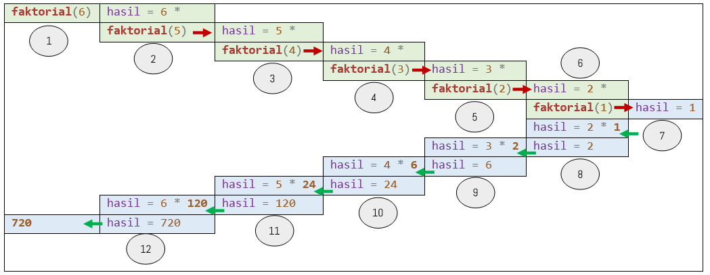

# FUNCTION
## Lambda, Fungsi Rekursif dan Standard Library Function
### 1. Lambda Function (Fungsi Tidak Bernama)
Suatu fungsi bisa didefinisikan tanpa nama dan dinamakan fungsi anonim (anonymous function) atau sering disebut Lambda Function. Jika fungsi biasa dalam Python didefinisikan menggunakan kata kunci `def` dan harus diberi nama, Lambda Function didefinisikan menggunakan kata kunci `lambda` dan tidak memerlukan nama. Alasan inilah yang menjadikannya lebih ringkas dan hemat waktu dalam penulisan kode. Dengan Format seperti berikut :
```python
lambda arg1 : ekspresi
# atau
lambda arg1, arg2 : ekspresi
```
Lambda Function sering digunakan untuk melakukan operasi yang sederhana dan cepat pada data, tanpa perlu mendefinisikan fungsi secara eksplisit. Cara kerja Lambda Function yaitu dengan membaca argumen yang diberikan, lalu melakukan operasi pada argumen tersebut dan mendapatkan hasil akhir. Lambda Function mengembalikan nilai, tetapi tidak memiliki return statement secara eksplisit. Nilai yang dikembalikan adalah hasil dari ekspresi yang diberikan. Tetapi Lambda Function hanya dapat digunakan untuk membuat satu function / expression, tidak cocok untuk fungsi yang membutuhkan banyak baris kode. Lambda Function sering digunakan sebagai argumen untuk fungsi-fungsi built-in seperti `map`, `filter`, dan `sorted`.

ContohM1201.py adalah contoh penggunaan Lambda Function dengan satu parameter, untuk operasi matematika sederhana.
#### ContohM1201.py
```python
kuadrat = lambda x: x**2
akar = lambda x: x**0.5
negate = lambda x: -x
is_odd = lambda x: x % 2 == 1
is_even = lambda x: x % 2 == 0

angka = int(input('Masukan sebuah bilangan:'))
print(f'Hasil Kuadrat: {kuadrat(angka)}')
print(f'Hasil Akar Kuadrat: {akar(angka)}')
print(f'Hasil Negasi: {negate(angka)}')
print(f'Apakah Ganjil? {'Ya' if is_odd(angka) else 'Tidak'}')
print(f'Apakah Genap? {'Ya' if is_even(angka) else 'Tidak'}')
```

ContohM1202.py adalah contoh penggunaan Lambda Function dengan dua parameter, untuk operasi matematika sederhana.
#### ContohM1202.py
```python
add = lambda x, y: x + y
subtract = lambda x, y: x - y
multiply = lambda x, y: x * y
greater_than = lambda x, y: x > y
less_than = lambda x, y: x < y

angka1 = int(input('Masukan bilangan pertama:'))
angka2 = int(input('Masukan bilangan kedua  :'))
print(f'{angka1} + {angka2} = {add(angka1, angka2)}')
print(f'{angka1} - {angka2} = {subtract(angka1, angka2)}')
print(f'{angka1} * {angka2} = {multiply(angka1, angka2)}')
print(f'{angka1} > {angka2} = {greater_than(angka1, angka2)}')
print(f'{angka1} < {angka2} = {less_than(angka1, angka2)}')
```

ContohM1203.py adalah contoh penggunaan Lambda Function untuk mengolah 2 String.
#### ContohM1203.py
```python
join_strings = lambda s1, s2, separator: s1 + separator + s2
compare_length = lambda s1, s2: s1 if len(s1) > len(s2) else s2
ejaan = lambda s1, s2 : set(s1.lower()) == set(s2.lower())
huruf_sama = lambda s1, s2: set(s1.lower()).intersection(set(s2.lower()))

kata1 = input('Masukan kata pertama:')
kata2 = input('Masukan kata kedua  :')
print(f'Gabungan: {join_strings(kata1,kata2,' & ')}')
print(f'"{kata1}" lebih panjang dari "{kata2}" = {compare_length(kata1,kata2)}')
print(f'Apakah Huruf penyusunnya yang sama? {'Ya' if huruf_sama(kata1,kata2) else 'Tidak'}')
print(f'Huruf penyusun yang sama: {huruf_sama(kata1,kata2)}')
```

ontohM1204.py adalah contoh penggunaan Lambda Function untuk mengolah sebuah List.
#### ContohM1204.py
```python
angka = list(range(1,11))

squared_numbers = list(map(lambda x: x**2, numbers))
odd_numbers = list(filter(lambda x: x % 2 == 1, numbers))
even_numbers = list(filter(lambda x: x % 2 == 0, numbers))

print('Kuadrat:',squared_numbers)
print('Ganjil:',odd_numbers)
print('Genap:',even_numbers)
```

Fungsi `map()` adalah salah satu fungsi bawaan (built-in) dalam Python yang sangat berguna untuk menerapkan suatu fungsi pada setiap elemen dari suatu iterable (seperti list, tuple, atau string) dan mengembalikan hasil sebagai objek map. Objek map ini kemudian dapat diubah menjadi list, tuple, atau tipe data iterable lainnya jika diperlukan. Fungsi `map()` memiliki 2 parameter : `function` & `iterable`. `function` adalah fungsi yang akan diterapkan pada setiap elemen iterable. `iterable` adalah Iterable (seperti list, tuple, string, dll.) yang berisi elemen-elemen yang akan diproses. Cara kerja fungsi map adalah :
1. Fungsi `map()` akan mengambil setiap elemen dari `iterable`.
2. Setiap elemen tersebut akan dijadikan argumen untuk fungsi yang diberikan.
3. Hasil dari penerapan fungsi pada setiap elemen akan disimpan dalam objek map.
4. Objek map ini dapat diubah menjadi tipe data lain yang diinginkan, seperti list atau tuple.

Fungsi `filter()` adalah fungsi bawaan (built-in) dalam Python yang digunakan untuk menyaring elemen-elemen dari suatu iterable (seperti list, tuple, atau string) berdasarkan kondisi tertentu. Fungsi ini akan mengembalikan sebuah objek filter yang berisi elemen-elemen yang memenuhi kondisi tersebut. Argumen dan cara kerjanya sama dengan fungsi `map()`.

ContohM1205.py adalah contoh penggunaan Function dengan return value dan Lambda Function untuk konversi suhu Celcius ke Fahrenheit, Reamur, dan Kelvin.
#### ContohM1205.py
```python
import random

def konversi_suhu(celsius):
    """
    Fungsi untuk mengkonversi suhu dari Celcius ke Fahrenheit, Reamur, dan Kelvin.
    Args:
        celsius: Suhu dalam Celcius.
    Returns:
        Tuple yang berisi suhu dalam Fahrenheit, Reamur, dan Kelvin.
    """
    fahrenheit = lambda c: (c * 9/5) + 32
    reamur = lambda c: (c * 4/5)
    kelvin = lambda c: c + 273.15
    return celsius, fahrenheit(celsius), reamur(celsius), kelvin(celsius)

if __name__ == "__main__":
    jumlah_data = int(input("Masukkan jumlah data yang ingin dikonversi: "))
    data_celcius = [random.random() * 100 for _ in range(jumlah_data)]
    hasil_konversi = list(map(konversi_suhu, data_celcius))

    print("-" * 42)
    print("| Celcius | Fahrenheit | Reamur | Kelvin |")
    print("-" * 42)
    for celsius, fahrenheit, reamur, kelvin in hasil_konversi:
        print(f"| {celsius:7.2f} | {fahrenheit:10.2f} | {reamur:6.2f} | {kelvin:6.2f} |")
    print("-" * 42)
```

ContohM1206.py adalah contoh pembuatan fungsi untuk 
#### ContohM1206.py
```python
data = [('Alice', 30), ('Wati', 29), ('Bob', 25), ('Charlie', 30), ('Joko', 31), ('David', 28)]

data_sorted_biasa = sorted(data)
data_sorted_lambda = sorted(data, key=lambda x: (-x[1], x[0]))

print('PENGURUTAN DATA')
print('data_sorted_biasa :',data_sorted_biasa)
print('data_sorted_lambda:',data_sorted_lambda)
```

ContohM1207.py adalah contoh penggunaan Lambda Function untuk membuat fungsi yang lebih dinamis, dimana fungsi yang menerima operator aritmatika sebagai parameter.
#### ContohM1207.py
```python
def apply_operation(x, y, operator):
    """
    Menerapkan operasi aritmatika pada dua bilangan.
    Args:
        x: Bilangan pertama.
        y: Bilangan kedua.
        operator: Operator aritmatika (+, -, *, /).
    Returns:
        Hasil operasi.
    Raises:
        ValueError: Jika operator tidak valid.
    """
    operations = {
        '+': lambda x, y: x + y,
        '-': lambda x, y: x - y,
        '*': lambda x, y: x * y,
        '/': lambda x, y: x / y
    }
    if operator not in operations:
        raise ValueError("Operator tidak valid")

    return operations[operator](x, y)

print('OPERASI ARITMATIKA')
print('apply_operation(5, 3, "+") =',apply_operation(5, 3, '+'))
print('apply_operation(17, 8, "-")=',apply_operation(17, 8, '-'))
print('apply_operation(10, 2, "/")=',apply_operation(10, 2, '/'))
print('apply_operation(7, 4, "*") =',apply_operation(7, 4, '*'))

print('apply_operation(2, 3, "^") =',end=' ')
try:
  print(apply_operation(2, 3, '^'))
except ValueError as e:
  print(e)
```
Pada baris ke-20 terdapat keyword `raise`, Keyword `raise` dalam Python digunakan untuk secara sengaja memunculkan sebuah pengecualian (exception). Pengecualian adalah suatu peristiwa yang mengganggu aliran normal eksekusi program. Ketika sebuah pengecualian terjadi, Python akan mencari blok try...except yang sesuai untuk menangani pengecualian tersebut. Jika tidak ditemukan, program akan berhenti dengan pesan kesalahan. (Lihat kembali [M02](../M02/README.md) bagian ContohM0207.py). Keyword `raise` biasa digunakan untuk:
* Menandai Kondisi Error: Ketika suatu kondisi yang tidak diharapkan terjadi, kita bisa menggunakan `raise` untuk menandainya sebagai sebuah error.
* Membuat Fungsi yang Lebih Robust: Dengan menggunakan `raise`, kita dapat membuat fungsi yang lebih aman dengan cara membatasi input yang valid dan memunculkan pengecualian jika input tidak sesuai.
* Mengontrol Aliran Program: Kita bisa menggunakan `raise` untuk mengontrol aliran program secara eksplisit, misalnya untuk keluar dari sebuah loop atau fungsi ketika kondisi tertentu terpenuhi.

Sintaks umum :
```python
raise ExceptionType("Pesan error")
```
dimana :
* `ExceptionType`: Jenis pengecualian yang ingin dibangkitkan. Ini bisa berupa pengecualian bawaan Python seperti ValueError, TypeError, IndexError, atau pengecualian yang kita definisikan sendiri.
* `"Pesan error"`: Pesan yang akan ditampilkan ketika pengecualian terjadi. Pesan ini akan membantu kita dalam men-debug program.

Misal pada ContohM1207 baris ke-7, fungsi `apply_operation` akan memunculkan pengecualian `ValueError` jika karakter `operator` selain `+`, `-`, `*` dan `/`. Blok try...except (baris ke-31 s.d 34) digunakan untuk menangkap pengecualian yang mungkin terjadi. Jika terjadi `ValueError`, pesan error yang kita definisikan akan ditampilkan.

ContohM1208.py adalah contoh penggunaan Lambda Function untuk menghitung Permutasi dan Kombinasi (modifikasi dari ContohM1112.py)
#### ContohM1208.py
```python
def faktorial(n):
    """
    Fungsi untuk menghitung nilai faktorial dari bilangan bulat non-negatif.
    Args:
        n (int): Bilangan bulat non-negatif.
    Returns:
        Nilai faktorial dari n.
    """

    if n < 0:
        return "Faktorial tidak terdefinisi untuk bilangan negatif"
    elif n == 0 or n == 1:
        return 1
    else:
        hasil = 1
        for i in range(2, n+1):
            hasil *= i
        return hasil

permutasi = lambda n, r:faktorial(n)/faktorial(n-r)
kombinasi = lambda n, r:faktorial(n)/(faktorial(r)*faktorial(n-r))

print('HITUNG NILAI PERMUTASI DAN KOMBINASI')
n = int(input('Total Elemen:'))
r = int(input('Banyak Elemen yang dipilih:'))

hasil_permutasi = permutasi(n, r)
hasil_kombinasi = kombinasi(n, r)

print("Permutasi P(", n, ",", r, ") = ", hasil_permutasi)
print("Kombinasi C(", n, ",", r, ") = ", hasil_kombinasi)
```

ContohM1209.py adalah contoh penggunaan Lambda Function untuk menghitung jarak 2 titik koordinat, dan penerapannya untuk mencari pasangan titik yang mempunyai jarak paling dekat.
#### ContohM1209.py
```python
import random
import math

def buat_titik_acak(N):
    """
    Membuat N titik koordinat kartesius secara acak dalam rentang 0 hingga 10.
    Hasil dikembalikan dalam bentuk dictionary, dengan key berupa huruf alfabet dan
    value berupa tuple koordinat.
    Args:
        N (int): Jumlah titik yang akan dibuat.
    Returns:
        dict: Dictionary yang berisi titik-titik dengan nama dan koordinatnya.
    """
    titik = {}
    huruf = [chr(i) for i in range(ord('A'), ord('Z')+1)]
    for i in range(N):
        if i < 26:
            nama_titik = huruf[i]
        else:
            index_utama = (i - 26) // 26
            index_tambahan = (i - 26) % 26
            nama_titik = huruf[index_utama] + huruf[index_tambahan]
        koordinat = (random.randint(0, 100), random.randint(0, 100))
        titik[nama_titik] = koordinat
    return titik

def buat_matriks_adjacency(titik):
    """
    Membuat matriks adjacency dari dictionary titik.
    Args:
        titik (dict): Dictionary yang berisi titik-titik dengan nama dan koordinatnya.
    Returns:
        list: Matriks adjacency di mana elemennya adalah jarak antara dua titik.
    """
    N = len(titik)
    matriks = [[0] * N for _ in range(N)]
    jarak_titik = lambda titik1, titik2: math.sqrt((titik2[0] - titik1[0])**2 + (titik2[1] - titik1[1])**2)
    for i, nama_i in enumerate(titik):
        for j, nama_j in enumerate(titik):
            if i < j:
                matriks[i][j] = matriks[j][i] = round(jarak_titik(titik[nama_i], titik[nama_j]),3)
    return matriks

def cari_pasangan_terdekat(matriks):
    """
    Mencari pasangan titik terdekat dalam matriks adjacency.
    Args:
        matriks (list): Matriks adjacency.
    Returns:
        tuple: Tuple berisi indeks baris dan kolom pasangan titik terdekat serta jaraknya.
    """
    N = len(matriks)
    jarak_min = float('inf')
    for i in range(N):
        for j in range(i+1, N):
            if 0 < matriks[i][j] < jarak_min:
                jarak_min = matriks[i][j]
                indeks_min = (i, j)
    return indeks_min, jarak_min

def cetak_titik(titik):
    """
    Mencetak semua titik dalam format (nama, x, y).
    Args:
        titik (dict): Dictionary yang berisi titik-titik dengan nama dan koordinatnya.
    """
    for nama, koordinat in titik.items():
        print(f"Titik {nama}: {koordinat}")

if __name__ == "__main__":
    N = int(input("Masukkan jumlah titik: "))
    titik = buat_titik_acak(N)
    print("Semua titik:")
    cetak_titik(titik)
    matriks = buat_matriks_adjacency(titik)
    indeks, jarak = cari_pasangan_terdekat(matriks)
    nama_titik1 = list(titik.keys())[indeks[0]]
    nama_titik2 = list(titik.keys())[indeks[1]]
    print(f"Pasangan titik terdekat: {nama_titik1} {titik[nama_titik1]} dan {nama_titik2} {titik[nama_titik2]}")
    print("Jarak terdekat:", jarak)
```

ContohM1210.py adalah contoh penggunaan Lambda Function untuk penjumlahan dan pengurangan 2 matriks.
#### ContohM1210.py
```python
import random

def generate_matrix(rows, cols):
    """Membuat matriks dengan ukuran rows x cols dengan elemen acak"""
    return [[random.randint(-10, 10) for _ in range(cols)] for _ in range(rows)]

def tambah_matriks(matriks1, matriks2):
    """Menjumlahkan dua matriks menggunakan fungsi lambda"""
    return list(map(lambda baris1, baris2: list(map(lambda x, y: x+y, baris1, baris2)), matriks1, matriks2))

def kurang_matriks(matriks1, matriks2):
    """Mengurangi dua matriks menggunakan fungsi lambda"""
    return list(map(lambda baris1, baris2: list(map(lambda x, y: x-y, baris1, baris2)), matriks1, matriks2))

def cetak(nama, matriks):
    print(nama)
    for row in matriks:
        for col in row:
            print(f'{col:>3}',end=' ')
        print()
    print()

if __name__ == "__main__":
    rows = int(input("Masukkan jumlah baris: "))
    cols = int(input("Masukkan jumlah kolom: "))

    matrixA = generate_matrix(rows, cols)
    matrixB = generate_matrix(rows, cols)
    hasil_tambah = tambah_matriks(matrixA, matrixB)
    hasil_kurang = kurang_matriks(matrixA, matrixB)

    cetak("Matriks A:",matrixA)
    cetak("Matriks B:",matrixB)
    cetak("Hasil penjumlahan:",hasil_tambah)
    cetak("Hasil pengurangan:",hasil_kurang)
```

### 2. Fungsi Rekursif
Fungsi rekursif adalah fungsi yang di dalam tubuhnya terdapat pemanggilan dirinya sendiri. Fungsi seperti seringkali digunakan pada penanganan struktur data. Namun, persoalan tertentu kadang-kadang bisa dipecahkan menggunakan fungsi rekursif. Sebenarnya fungsi rekursif hanyalah sebuah fungsi biasa seperti fungsi def pada umumnya. Dia bisa dipanggil, bisa menerima parameter, bisa mengembalikan nilai, dan lain sebagainya. Tetapi fungsi ini memanggil dirinya sendiri sehingga menimbulkan efek perulangan. Perulangan ini bisa berhenti ketika kondisi tertentu tercapai, atau bisa juga bersifat tak terbatas, atau mungkin bahkan bisa menimbulkan error karena pemanggilan fungsi yang tak ada habisnya. Pada Python jika perulangan rekursif sudah dipanggil terlalu banyak dan tidak ada tanda-tanda akan berhenti, maka sistem langsung memberhentikannya secara paksa, karena Interpreter Python telah membatasi jumlah kedalaman rekursif.

ContohM1211.py adalah contoh pembuatan dan pemanggilan fungsi rekursif untuk mendapatkan nilai faktorial dari suatu bilangan.
#### ContohM1211.py
```python
def faktorial(angka) :
    """
    Fungsi ini menghitung faktorial dari sebuah bilangan bulat non-negatif.
    Args:
        angka: Bilangan bulat non-negatif yang akan dihitung faktorialnya.
    Returns:
        Hasil perhitungan faktorial.
    """
    if angka == 1: 
        hasil = 1
    else:
        hasil = angka * faktorial(angka-1)
    return hasil

def hitungFaktorial(bil) :
    """
    Fungsi ini menghitung faktorial dari sebuah bilangan bulat dan mencetak hasilnya.
    Args:
        bil: Bilangan bulat non-negatif yang akan dihitung faktorialnya.
    """
    hasil = faktorial(bil)
    print(bil,'! =',hasil)
    
print('HITUNG FAKTORIAL SECARA REKURSIF')
bilangan = int(input('Bilangan = '))
hitungFaktorial(bilangan)
```
<br>Gambar 1. Ilustrasi pemanggilan fungsi rekursif.

Gambar 1 adalah Ilustrasi pemanggilan fungsi `faktorial` secara rekursif. Dengan langkah urutan :
1. Program memanggil fungsi `faktorial` dengan argumen bernilai 6
2. Fungsi `faktorial` memanggil fungsi `faktorial` dengan argumen bernilai 5
3. Fungsi `faktorial` memanggil fungsi `faktorial` dengan argumen bernilai 4
4. Fungsi `faktorial` memanggil fungsi `faktorial` dengan argumen bernilai 3
5. Fungsi `faktorial` memanggil fungsi `faktorial` dengan argumen bernilai 2
6. Fungsi `faktorial` memanggil fungsi `faktorial` dengan argumen bernilai 1
7. `faktorial(1)` mengembalikan nilai 1.
8. `faktorial(2)` mengembalikan nilai 2.
9. `faktorial(3)` mengembalikan nilai 6.
10. `faktorial(4)` mengembalikan nilai 24.
11. `faktorial(5)` mengembalikan nilai 120.
12. `faktorial(6)` mengembalikan nilai 720. Program menerima nilai 720.

Fungsi rekursif bisa juga dibuat menggunakan Lambda Function. ContohM1212.py adalah modifikasi ContohM1211.py, dimana fungsi `faktorial` diubah menjadi Lambda Function. 
#### ContohM1212.py
```python
faktorial = lambda angka : 1 if angka == 1 else angka * faktorial(angka-1)

def hitungFaktorial(bil) :
    """
    Fungsi ini menghitung faktorial dari sebuah bilangan bulat dan mencetak hasilnya.
    Args:
        bil: Bilangan bulat non-negatif yang akan dihitung faktorialnya.
    """
    hasil = faktorial(bil)
    print(bil,'! =',hasil)
    
print('HITUNG FAKTORIAL SECARA REKURSIF')
bilangan = int(input('Bilangan = '))
hitungFaktorial(bilangan)
```

ContohM1213.py adalah contoh pembuatan dan pemanggilan fungsi rekursif untuk mencetak bilangan Fibonacci ke-n. 
#### ContohM1213.py
```python
def fibonacci(n):
    """
    Fungsi rekursif untuk menghitung bilangan Fibonacci ke-n.
    Args:
        n: Indeks bilangan Fibonacci yang ingin dihitung.
    Returns:
        Bilangan Fibonacci ke-n.
    """
    if n <= 1:
        return n
    else:
        return fibonacci(n-1) + fibonacci(n-2)

print('CETAK BILANGAN FIBONACCI KE-N')
print('1 1 2 3 5 8 13...')
N = int(input('N='))
print(fibonacci(N))
```

ContohM1214.py adalah contoh pembuatan dan pemanggilan fungsi rekursif untuk mencari faktor dari suatu bilangan.
#### ContohM1214.py
```python
def faktor(n, i=2):
    """
    Fungsi rekursif untuk mencari faktor dari sebuah bilangan.
    Args:
        n: Bilangan yang akan dicari faktornya.
        i: Bilangan pembagi awal (default 2).
    Returns:
        List berisi faktor-faktor dari bilangan n.
    """
    if i > n:
        return []
    elif n % i == 0:
        return [i] + faktor(n//i, i)
    else:
        return faktor(n, i+1)

print('FAKTOR SUATU BILANGAN')
bilangan = int(input('Bilangan ='))
print(f'faktor dari {bilangan} adalah {faktor(bilangan)}')
```

ContohM1215.py adalah contoh pembuatan dan pemanggilan fungsi rekursif untuk penyelesaian Menara Hanoi ([Ilustrasi](https://www.mathsisfun.com/games/towerofhanoi.html)). Menara Hanoi adalah sebuah teka-teki matematika yang melibatkan tiga batang dan sejumlah cakram dengan ukuran berbeda. Cakram-cakram ini ditumpuk pada satu batang dengan urutan ukuran yang semakin besar di bawah. Tujuannya adalah memindahkan semua cakram ke batang lain dengan mengikuti aturan:
- Hanya boleh memindahkan satu cakram dalam satu langkah.
- Cakram yang lebih besar tidak boleh diletakkan di atas cakram yang lebih kecil.
#### ContohM1215.py
```python
def hanoi(n, asal, bantu, tujuan):
  """
  Fungsi rekursif untuk menyelesaikan masalah Menara Hanoi

  Args:
    n: Jumlah cakram
    asal: Batang asal
    bantu: Batang bantu
    tujuan: Batang tujuan
  """

  if n == 1:
    print("Pindahkan cakram 1 dari", asal, "ke", tujuan)
  else:
    hanoi(n-1, asal, tujuan, bantu)
    print("Pindahkan cakram", n, "dari", asal, "ke", tujuan)
    hanoi(n-1, bantu, asal, tujuan)

print('PENYELESAIAN MENARA HANOI')
cakram = int(input('Banyak Cakram:'))
hanoi(cakram, 'A', 'B', 'C')
```

ContohM1216.py adalah contoh pembuatan dan pemanggilan fungsi rekursif untuk mencari rute perjalanan terdekat.
#### ContohM1216.py
```python
def shortest_path_recursive(graph, start, end, visited, path):
    """Mencari jarak terpendek dan rute antara dua simpul dalam graf menggunakan rekursif.
    Args:
        graph: Matriks adjacency yang merepresentasikan graf.
        start: Indeks simpul awal.
        end: Indeks simpul tujuan.
        visited: List untuk menandai simpul yang sudah dikunjungi.
        path: List untuk menyimpan urutan simpul dalam rute.
    Returns:
        Tuple berisi jarak terpendek dan rute.
    """

    n = len(graph)
    if start == end:
        path.append(end)
        return 0, path

    visited[start] = True
    min_distance = float('inf')
    best_path = None
    for i in range(n):
        if graph[start][i] != 0 and not visited[i]:
            distance, new_path = shortest_path_recursive(graph, i, end, visited, path.copy())
            if distance + graph[start][i] < min_distance:
                min_distance = distance + graph[start][i]
                best_path = new_path.copy()
                best_path.insert(0, start)
    visited[start] = False
    return min_distance, best_path

print('MENCARI RUTE PERJALANAN DENGAN JARAK TERPENDEK')
graph = [
    [0, 2, 4, 1, 5, 0, 0, 0, 0, 0],
    [2, 0, 3, 0, 0, 0, 0, 0, 0, 0],
    [4, 3, 0, 2, 1, 0, 0, 0, 0, 0],
    [1, 0, 2, 0, 0, 3, 0, 0, 0, 0],
    [5, 0, 1, 0, 0, 0, 2, 0, 0, 0],
    [0, 0, 0, 3, 0, 0, 0, 1, 4, 0],
    [0, 0, 0, 0, 2, 0, 0, 5, 0, 3],
    [0, 0, 0, 0, 0, 1, 5, 0, 2, 0],
    [0, 0, 0, 0, 0, 4, 0, 2, 0, 1],
    [0, 0, 0, 0, 0, 0, 3, 0, 1, 0]
]

start = int(input('Node Asal (0 - 9)  :'))
end = int(input('Node Tujuan (0 - 9):'))
visited = [False] * len(graph)
path = []

distance, route = shortest_path_recursive(graph, start, end, visited, path)
print("Jarak terpendek (rekursif):", distance)
print("Rute:", route)
```

ContohM1217.py adalah contoh pembuatan fungsi untuk 
#### ContohM1217.py
```python
def dfs(graph, start, visited=None, path=[]):
    """
    Fungsi untuk melakukan Depth-First Search secara rekursif.
    Args:
        graph: Representasi graf dalam bentuk dictionary.
        start: Node awal untuk memulai pencarian.
        visited: Set untuk menyimpan node yang sudah dikunjungi.
        path: List untuk menyimpan jalur yang telah dilalui.
    Returns:
        None (modifikasi set visited dan list path secara in-place)
    """
    if visited is None:
        visited = set()

    visited.add(start)
    path.append(start)

    print(f"Visiting node: {start}")

    for neighbor in graph.get(start, []):
        if neighbor not in visited:
            dfs(graph, neighbor, visited, path)

    path.pop()

graph = {
    'A': ['B', 'C', 'D', 'E'],
    'B': ['F', 'G', 'H'],
    'C': ['I', 'J'],
    'D': ['K', 'L', 'M'],
    'E': ['N', 'O', 'P'],
    'F': ['Q', 'R'],
    'G': ['S', 'T'],
    'H': ['U', 'V', 'W']
}
print('PENELUSURAN DEPTH-FIRST SEARCH PADA SEBUAH TREE')
dfs(graph, 'A')
```

ContohM1218.py adalah contoh pembuatan dan pemanggilan fungsi rekursif untuk menyelesaikan kasus Knapsack Problem. Knapsack Problem adalah sebuah masalah optimasi klasik dalam ilmu komputer. Bayangkan Anda memiliki sebuah ransel (knapsack) dengan kapasitas tertentu, dan Anda memiliki beberapa barang dengan bobot dan nilai masing-masing. Tujuannya adalah memilih barang-barang yang akan dimasukkan ke dalam ransel sehingga total nilai barang yang dibawa maksimal, tetapi total bobotnya tidak melebihi kapasitas ransel. Misal : Anda memiliki sebuah ransel dengan kapasitas maksimal 50 kg. Anda memiliki 5 barang dengan bobot dan nilai sebagai berikut:
- Barang ke-1 : bobot 30 Kg , Nilai : 120
- Barang ke-2 : bobot 50 Kg , Nilai : 150
- Barang ke-3 : bobot 40 Kg , Nilai : 80
- Barang ke-4 : bobot 10 Kg , Nilai : 60
- Barang ke-5 : bobot 20 Kg , Nilai : 100
Anda memilih barang-barang yang akan dimasukkan ke dalam ransel sehingga total nilai barang yang dibawa maksimal, tetapi total bobotnya tidak melebihi 50 kg.
#### ContohM1218.py
```python
def knapSack(W, wt, val, n):
    """
    Fungsi untuk menyelesaikan masalah Knapsack Problem menggunakan pendekatan rekursif dengan memoization.
    Args:
        W (int): Kapasitas maksimal ransel.
        wt (list): List berisi bobot masing-masing barang.
        val (list): List berisi nilai masing-masing barang.
        n (int): Jumlah barang.
    Returns:
        int: Nilai maksimum yang dapat dicapai.
        list: List berisi indeks barang yang dipilih.
    """
    if n == 0 or W == 0:
        return 0, []
    if (n, W) not in memo:
        if wt[n-1] > W:
            result, selected = knapSack(W, wt, val, n-1)
        else:
            val1, selected1 = knapSack(W-wt[n-1], wt, val, n-1)
            val2, selected2 = knapSack(W, wt, val, n-1)
            if val1 + val[n-1] > val2:
                result = val1 + val[n-1]
                selected = selected1 + [n-1]
            else:
                result = val2
                selected = selected2
        memo[(n, W)] = (result, selected)
    return memo[(n, W)]

nama_barang = ['ABC','DEF','GHI','JKL','MNO']
item_values = [120, 80, 60, 150, 100]
item_weights = [30, 40, 10, 50, 20]
knapsack_capacity = 50
num_items = len(item_values)
memo = {}

max_val, selected_items = knapSack(knapsack_capacity, item_weights, item_values, num_items)

print("Nilai maksimum:", max_val)
print("Barang yang dipilih :")
for idx in selected_items:
    print(nama_barang[idx])
```

ContohM1219.py adalah contoh pembuatan dan pemanggilan fungsi rekursif untuk membuat pohon (tree) biner ekspresi aritmatika dan penelusuran Postorder, Inorder dan Preorder. 
#### ContohM1219.py
```python
def build_tree(expression):
    """Membangun pohon ekspresi biner dari ekspresi infix.
    Args:
        expression: Ekspresi infix yang akan dikonversi menjadi pohon.
    Returns:
        Akar pohon ekspresi.
    """
    stack = []
    postfix = infix_to_postfix(expression)

    for char in postfix:
        if char.isalnum():
            stack.append(char)
        else:
            right = stack.pop()
            left = stack.pop()
            stack.append((char, left, right))

    return stack[0]

def infix_to_postfix(expression):
    """Mengkonversi ekspresi infix menjadi postfix.
    Args:
        expression: Ekspresi infix yang akan dikonversi.
    Returns:
        Ekspresi postfix yang setara.
    """
    precedence = {'+': 1, '-': 1, '*': 2, '/': 2}
    output = []
    stack = []

    for char in expression:
        if char.isalnum():
            output.append(char)
        elif char in precedence:
            while (stack and stack[-1] != '(' and
                   precedence[char] <= precedence[stack[-1]]):
                output.append(stack.pop())
            stack.append(char)
        elif char == '(':
            stack.append(char)
        elif char == ')':
            while stack and stack[-1] != '(':
                output.append(stack.pop())
            stack.pop()

    while stack:
        output.append(stack.pop())

    return ''.join(output)

def postorder(node):
    """Penelusuran postorder pada pohon biner.
    Args:
        node: Node pohon yang akan dijelajahi.
    """
    if isinstance(node, tuple):
        postorder(node[1])
        postorder(node[2])
        print(node[0], end=' ')
    else:
        print(node, end=' ')

def inorder(node):
    """Penelusuran inorder pada pohon biner.

    Args:
        node: Node pohon yang akan dijelajahi.
    """
    if isinstance(node, tuple):
        inorder(node[1])
        print(node[0], end=' ')
        inorder(node[2])
    else:
        print(node, end=' ')

def preorder(node):
    """Penelusuran preorder pada pohon biner.
    Args:
        node: Node pohon yang akan dijelajahi.
    """
    if isinstance(node, tuple):
        print(node[0], end=' ')
        preorder(node[1])
        preorder(node[2])
    else:
        print(node, end=' ')
        

print('MEMBUAT DAN MENELUSURI POHON BINER EKSPRESI ARITMATIKA')
print('Misal : (A + B) + (C / (D - E))')
expression = input("Ekspresi :")
tree = build_tree(expression)

print("Postorder Traversal:")
postorder(tree)
print("\nInorder Traversal:")
inorder(tree)
print("\nPreorder Traversal:")
preorder(tree)
```

### 3. Standard Library Function (Built-in Function)
Fungsi bawaan (built-in function) dalam Python adalah sekumpulan alat yang sangat berguna untuk melakukan berbagai macam tugas pemrograman tanpa perlu menulis kode dari awal. Fungsi-fungsi ini sudah terintegrasi dalam bahasa Python dan siap digunakan kapan saja. Fungsi bawaan sudah dioptimasi untuk kinerja yang baik, sehingga kita tidak perlu khawatir tentang implementasi detailnya, memiliki perilaku yang konsisten di seluruh lingkungan Python, sehingga memudahkan kolaborasi dan pemeliharaan kode, dan dirancang dengan sintaks yang sederhana dan mudah diingat. Daftar built-in function pada pemrograman Python selengkapnya bisa dilihat di situs https://docs.python.org/3/library/functions.html. Sesuaikan dengan versi Python yang Anda gunakan.

Library di Python adalah kumpulan kode yang telah ditulis sebelumnya dan dapat digunakan kembali dalam program Python Anda. Bayangkan seperti sebuah perpustakaan buku, di mana Anda bisa meminjam buku (atau kode) yang sudah ditulis oleh orang lain untuk menyelesaikan masalah tertentu, tanpa harus menulis ulang semuanya dari awal.

#### A. Library `math`
Library `math` di Python adalah modul bawaan yang menyediakan berbagai fungsi matematika untuk melakukan perhitungan numerik. Fungsi-fungsi ini sangat berguna dalam berbagai bidang seperti fisika, statistika, teknik, dan ilmu komputer. Dengan `math`, kita dapat dengan mudah melakukan operasi matematika yang kompleks tanpa perlu mengimplementasikannya sendiri. Sebelum menggunakan fungsi-fungsi dalam math, kita perlu mengimpor modul tersebut terlebih dahulu.

Fungsi-Fungsi Utama dalam math :
* Trigonometri:
    - `sin(x)`: Menghitung sinus dari sudut x (sudut dalam radian).
    - `cos(x)`: Menghitung kosinus dari sudut x (sudut dalam radian).
    - `tan(x)`: Menghitung tangen dari sudut x (sudut dalam radian).
    - `asin(x)`: Menghitung sinus invers dari x. (hasil dalam radian)
    - `acos(x)`: Menghitung kosinus invers dari x. (hasil dalam radian)
    - `atan(x)`: Menghitung tangen invers dari x. (hasil dalam radian)
* Eksponensial dan Logaritma:
    - `exp(x)`: Menghitung e pangkat x (e adalah bilangan Euler).
    - `log(x)`: Menghitung logaritma natural (basis e) dari x.
    - `log10(x)`: Menghitung logaritma berbasis 10 dari x.
* Akar dan Pangkat:
    - `sqrt(x)`: Menghitung akar kuadrat dari x.
    - `pow(x, y)`: Menghitung x pangkat y.
* Pembulatan:
    - `ceil(x)`: Membulatkan x ke atas menjadi bilangan bulat terdekat.
    - `floor(x)`: Membulatkan x ke bawah menjadi bilangan bulat terdekat.
* Konstanta Matematika:
    - `pi`: Nilai pi (π).
    - `e`: Bilangan Euler (e).
    - `inf`: Representasi tak hingga.
    - `nan`: Not a Number (nilai tidak valid).
    - `tau`: Presentasi nilai tau (τ), yaitu sekitar 6.283185. Tau adalah perbandingan antara keliling lingkaran dengan jari-jarinya
* Lainnya:
    - `comb(n, k)`: Kembalikan kombinasi atau jumlah cara untuk memilih k item dari n item tanpa pengulangan dan tanpa urutan.
    - `copysign(x, y)`: memanipulasi tanda (positif atau negatif) dari bilangan floating-point.
    - `fabs(x)`: Mengembalikan nilai absolut x .
    - `factorial(n)`: Mengembalikan n faktorial sebagai bilangan bulat
    - `fmod(x, y)`: menghitung sisa pembagian dari dua bilangan floating-point (bilangan desimal). Hasil yang dikembalikan adalah sisa pembagian yang memiliki tanda yang sama dengan bilangan pertama (dividend).
    - `frexp(x)`: Mengembalikan mantissa dan eksponen x sebagai pasangan . m adalah float dan e adalah bilangan bulat yang persis seperti itu.
    - `fsum(iterable)`: Mengembalikan jumlah floating-point yang akurat dari nilai-nilai dalam iterable. Menghindari hilangnya presisi dengan melacak beberapa jumlah parsial antara.
    - `gcd(*integers)`: Mengembalikan pembagi persekutuan terbesar dari argumen integer yang ditentukan. Jika salah satu argumen bukan nol, maka nilai yang dikembalikan adalah integer positif terbesar yang merupakan pembagi dari semua argumen. Jika semua argumen adalah nol, maka nilai yang dikembalikan adalah 0. gcd()tanpa argumen mengembalikan 0.
    - `isfinite(x)`: Kembalikan `True` jika x bukan tak terhingga maupun NaN, dan `False` sebaliknya.
    - `isinf(x)`: Kembalikan `True` jika x positif atau negatif tak terhingga, dan `False` sebaliknya.
    - `isnan(x)`: Kembalikan `True` jika x adalah NaN (bukan angka), dan `False` sebaliknya.
    - `isqrt(n)`: Mengembalikan akar kuadrat integer dari integer nonnegatif n . Ini adalah dasar dari akar kuadrat eksak n , atau yang setara dengan integer terbesar a sehingga a ² ≤  n .
    - `lcm(*integers)`: Mengembalikan kelipatan persekutuan terkecil dari argumen integer yang ditentukan. Jika semua argumen bukan nol, maka nilai yang dikembalikan adalah integer positif terkecil yang merupakan kelipatan dari semua argumen. Jika salah satu argumen adalah nol, maka nilai yang dikembalikan adalah 0. lcm()tanpa argumen mengembalikan 1.
    - `modf(x)`: Mengembalikan bagian pecahan dan bilangan bulat dari x . Kedua hasil memiliki tanda x dan merupakan bilangan bulat.
    - `perm(n, k=None)`: Kembalikan permutasi atau jumlah cara untuk memilih k item dari n item tanpa pengulangan dan dengan urutan.
Selengkapnya bisa Anda pelajari di : https://docs.python.org/id/3.12/library/math.html#module-math

ContohM1220.py adalah contoh penggunaan fungsi di library math untuk kategori trigonometri. Selalu ingat bahwa dalam kebanyakan fungsi trigonometri di Python, sudut diukur dalam radian, bukan derajat. Jika memerlukan untuk konversi, gunakan `math.radians(derajat)` atau `math.degrees(radian)`.
#### ContohM1220.py
```python
import math

derajat = 45
radian = math.radians(derajat)
sinus = math.sin(radian)
cosinus = math.cos(radian)
tangen = math.tan(radian)
arcsin = math.asin(0.5)
arccos = math.acos(0.5)
arctan = math.atan(1)

print("Sudut:", derajat)
print("Radian:", radian)
print("Sinus:", sinus)
print("Cosinus:", cosinus)
print("Tangen:", tangen)
print("Arcsin:", arcsin, "=", math.degrees(arcsin))
print("Arccos:", arccos, "=", math.degrees(arccos))
print("Arctan:", arctan, "=", math.degrees(arctan))

sisi_alas = 3
sisi_tegak = 4
hipotenusa = math.hypot(sisi_alas, sisi_tegak)
print("Hipotenusa:", hipotenusa)
```

ContohM1221.py adalah contoh penggunaan fungsi di library math untuk Logaritma dan Pembulatan
#### ContohM1221.py
```python
import math

x = 10
log_natural = math.log(x)
log_basis_2 = math.log2(x)
log_basis_10 = math.log10(x)

print("Log natural:", log_natural)
print("Log basis 2:", log_basis_2)
print("Log basis 10:", log_basis_10)
```

ContohM1222.py adalah contoh penggunaan fungsi di library math untuk Eksponensial dan Akar
#### ContohM1222.py
```python
import math

x = 2
exp = math.exp(x)
akar_kuadrat = math.sqrt(16)
akar_kubik = math.pow(8, 1/3)

print("e pangkat x:", exp)
print("Akar kuadrat:", akar_kuadrat)
print("Akar kubik:", akar_kubik)
```

ContohM1223.py adalah contoh penggunaan fungsi di library math untuk Konstanta Matematika
#### ContohM1223.py
```python
import math

keliling_lingkaran = 2 * math.pi * 5
nilai_e = math.e
nilai_tau = math.tau

print("Keliling lingkaran:", keliling_lingkaran)
print("Nilai e:", nilai_e)
print("Nilai tau:", nilai_tau)
```

ContohM1224.py adalah contoh penggunaan fungsi di library math lainnya 
#### ContohM1224.py
```python
import math

angka1 = int(input("Masukkan angka pertama: "))
angka2 = int(input("Masukkan angka kedua: "))

faktorial_angka1 = math.factorial(angka1)
print(f"Faktorial dari {angka1} adalah: {faktorial_angka1}")

perm = math.perm(angka1, angka2)
comb = math.comb(angka1, angka2)
print(f"Permutasi {angka1} pilih {angka2} adalah: {perm}")
print(f"Kombinasi {angka1} pilih {angka2} adalah: {comb}")

fmod_hasil = math.fmod(angka1, angka2)
print(f"Fmod dari {angka1} dan {angka2} adalah: {fmod_hasil}")

bilangan_desimal = 3.14
bulat, desimal = math.modf(bilangan_desimal)
print(f"Bagian bulat dari {bilangan_desimal} adalah: {bulat}")
print(f"Bagian desimal dari {bilangan_desimal} adalah: {desimal}")

gcd_hasil = math.gcd(angka1, angka2)
lcm_hasil = math.lcm(angka1, angka2)
print(f"GCD dari {angka1} dan {angka2} adalah: {gcd_hasil}")
print(f"LCM dari {angka1} dan {angka2} adalah: {lcm_hasil}")

list_angka = [2, 3, 4, 5]
prod_hasil = math.prod(list_angka)  # Python 3.8+
sumprod_hasil = sum(list_angka) * math.prod(list_angka)
print(f"Hasil perkalian semua elemen dalam list: {prod_hasil}")
print(f"Hasil perkalian jumlah dan hasil kali semua elemen: {sumprod_hasil}")
```

#### B. Library `datetime`
Library `datetime` di Python adalah alat yang sangat berguna untuk memanipulasi tanggal dan waktu. Dalam dunia pemrograman, pemahaman yang baik tentang waktu sangat krusial, terutama dalam aplikasi yang berhubungan dengan data time series, penjadwalan, dan analisis data historis. Fitur utama library datetime:
* Kelas utama
    - `date`: Merepresentasikan tanggal (tahun, bulan, hari) dalam kalender Gregorian.
    - `time`: Merepresentasikan waktu (jam, menit, detik, mikrodetik).
    - `datetime`: Kombinasi date dan time, merepresentasikan titik waktu yang spesifik.
    - `timedelta`: Merepresentasikan selisih waktu antara dua objek datetime atau date.
* Fungsi utama :
    - `now()`: Mengembalikan objek datetime yang merepresentasikan waktu saat ini.
    - `today()`: Mengembalikan objek date yang merepresentasikan tanggal hari ini.
* Konstanta :
    - `MINYEAR`: Tahun terkecil yang dapat direpresentasikan oleh objek date atau datetime.
    - `MAXYEAR`: Tahun terbesar yang dapat direpresentasikan oleh objek date atau datetime.
    - `UTC`: Merepresentasikan waktu yang tidak dipengaruhi oleh zona waktu. UTC adalah Coordinated Universal Time.
* Formating Tanggal dan Waktu
    - `strftime()`: Mengubah objek `datetime` menjadi string dengan format yang ditentukan.
    - `strptime()`: Mengubah string yang merepresentasikan tanggal dan waktu menjadi objek `datetime`.
    
    Format yang dapat digunakan adalah sebagai berikut :
    - Tahun:
        * %Y: Tahun dalam bentuk angka empat digit (contoh: 2023)
        * %y: Tahun dalam bentuk angka dua digit (contoh: 23)
    - Bulan:
        * %m: Nomor bulan dalam bentuk angka dua digit (01-12)
        * %B: Nama bulan dalam bentuk teks penuh (Januari, Februari, ...)
        * %b atau %h: Nama bulan dalam bentuk singkat (Jan, Feb, ...)
    - Hari:
        * %d: Hari dalam bulan dalam bentuk angka dua digit (01-31)
        * %A: Nama hari dalam bentuk teks penuh (Senin, Selasa, ...)
        * %a: Nama hari dalam bentuk singkat (Sen, Sel, ...)
    - Waktu:
        * %H: Jam dalam format 24 jam (00-23)
        * %I: Jam dalam format 12 jam (01-12)
        * %M: Menit (00-59)
        * %S: Detik (00-59)
        * %p: AM atau PM
    - Informasi Tambahan:
        * %z: Zona waktu dengan tanda plus atau minus
        * %Z: Nama zona waktu
        * %w: Hari dalam seminggu sebagai angka (0-6, Minggu=0)
        * %c: Representasi tanggal dan waktu yang sesuai dengan locale
        * %x: Representasi tanggal yang sesuai dengan locale
        * %X: Representasi waktu yang sesuai dengan locale
* Fungsi lainnya :
    - `replace()`: Mengganti komponen tertentu dari objek datetime atau date.
    - `timetuple()`: Mengembalikan tuple yang berisi informasi tentang tahun, bulan, hari, jam, menit, detik, hari dalam minggu, hari dalam tahun, dan zona waktu.
    - `toordinal()`: Mengembalikan nomor ordinal dari tanggal, yaitu jumlah hari sejak 1 Januari 1.
    - `weekday()`: Mengembalikan hari dalam minggu sebagai bilangan bulat (0 untuk Senin, 6 untuk Minggu).
    - `fromtimestamp()`: Membuat objek datetime dari timestamp Unix (jumlah detik sejak 1 Januari 1970).
    - `fromordinal()`: Membuat objek date dari nomor ordinal.
    - `combine()`: Menggabungkan objek date dan time menjadi objek datetime.
    - `timetuple()`: Mengubah objek datetime menjadi sebuah tuple yang berisi informasi terperinci tentang waktu tersebut, mengikuti struktur waktu yang umum digunakan dalam sistem operasi dan banyak aplikasi lainnya.
    - `isoweekday()`: Mengembalikan hari dalam minggu sebagai bilangan bulat (1 untuk Senin, 7 untuk Minggu), sesuai dengan standar ISO 8601.
    - `isoformat()`: Mengembalikan representasi string dari objek datetime dalam format ISO 8601.

Selengkapnya bisa Anda pelajari di : https://docs.python.org/id/3.12/library/datetime.html#module-datetime

ContohM1225.py adalah contoh penggunaan fungsi di library datetime untuk Menghitung Usia Seseorang
#### ContohM1225.py
```python
from datetime import datetime

def hitung_usia(tanggal_lahir):
    """Hitung usia seseorang berdasarkan tanggal lahir.
    Args:
        tanggal_lahir: Tanggal lahir dalam format datetime.
    Returns:
        Usia dalam tahun.
    """
    today = datetime.today()
    umur = today.year - tanggal_lahir.year - ((today.month, today.day) < (tanggal_lahir.month, tanggal_lahir.day))
    return umur

tanggal_lahir = datetime(1995, 3, 15)
usia = hitung_usia(tanggal_lahir)
print(f"Usia Anda adalah: {usia} tahun")
```

ContohM1226.py adalah contoh penggunaan fungsi di library datetime untuk Membuat Kalender Sederhana
#### ContohM1226.py
```python
from datetime import datetime, timedelta

def buat_kalender(tahun, bulan):
    """Membuat kalender bulanan sederhana.
    Args:
        tahun: Tahun.
        bulan: Bulan (1-12).
    """
    bulan_ini = datetime(tahun, bulan, 1)
    bulan_depan = bulan_ini.replace(month=bulan_ini.month+1, day=1)
    jumlah_hari = (bulan_depan - bulan_ini).days

    print("MIN SEN SEL RAB KAM JUM SAB")

    hari_awal = bulan_ini.weekday()
    for i in range(hari_awal):
        print("    ", end="")
    for i in range(1, jumlah_hari+1):
        print(f"{i:3d}", end=" ")
        if (i+hari_awal) % 7 == 0:
            print()

print('KALENDER 2024\nBULAN NOVEMBER\n')
buat_kalender(2024, 11)
```

ContohM1227.py adalah contoh penggunaan fungsi di library datetime untuk Manipulasi Tanggal dan Waktu serta Konversi dan Ekstraksi
#### ContohM1227.py
```python
from datetime import datetime, timedelta

now = datetime.now()
one_week_later = now + timedelta(weeks=1)
print(one_week_later)

new_date = now.replace(year=2024, month=2)
print(new_date)

start_time = datetime(2023, 11, 1, 10, 0)
end_time = datetime(2023, 11, 1, 12, 30)
time_difference = end_time - start_time
print(time_difference)

today = datetime.today()
date_only = today.date()
print(date_only)

year = today.year
month = today.month
day = today.day
print(f"Hari ini adalah tanggal {day} bulan {month} tahun {year}")
```

ContohM1228.py adalah contoh penggunaan fungsi di library datetime untuk Mencari Tanggal Terdekat dari Hari Ini
#### ContohM1228.py
```python
from datetime import datetime, date

tanggal_list = ["2023-12-25", "2024-01-01", "2023-11-30", "2024-12-12", "2024-11-11"]
tanggal_list = [datetime.strptime(tanggal, "%Y-%m-%d").date() for tanggal in tanggal_list]

hari_ini = date.today()
terdekat = min(tanggal_list, key=lambda x: abs(x - hari_ini))
print(f"Tanggal terdekat adalah: {terdekat}")
```

ContohM1229.py adalah contoh penggunaan fungsi di library datetime untuk Menghitung Jumlah Hari Kerja dalam Suatu Rentang Waktu
#### ContohM1229.py
```python
from datetime import datetime, timedelta

def hitung_hari_kerja(start_date, end_date):
    """
    Menghitung jumlah hari kerja antara dua tanggal.
    Asumsi: hari kerja adalah Senin-Jumat.
    """
    hari_kerja = 0
    tanggal = start_date
    while tanggal <= end_date:
        if tanggal.weekday() < 5:
            hari_kerja += 1
        tanggal += timedelta(days=1)
    return hari_kerja

print('HITUNG HARI KERJA')
start = datetime(2023, 11, 1)
end = datetime(2023, 11, 30)
jumlah_hari_kerja = hitung_hari_kerja(start, end)
print(f"Jumlah hari kerja antara {start:%d %B %Y} dan {end:%d %B %Y} adalah {jumlah_hari_kerja} hari")
```

#### C. Library `calendar`
Library `calendar` di Python adalah sebuah modul bawaan yang menyediakan berbagai fungsi untuk memanipulasi dan menampilkan informasi terkait kalender. Dengan menggunakan library ini, Anda dapat membuat kalender, menghitung hari dalam seminggu, bulan, atau tahun, serta melakukan berbagai operasi kalender lainnya. Library ini ideal untuk membuat jadwal, merencanakan acara, atau menampilkan informasi kalender dalam bentuk yang mudah dibaca. `datetime` hanya berorientasi pada objek tanggal dan waktu secara individual, serta manipulasi waktu yang lebih detail, sementara `calendar` berorientasi pada tampilan dan manipulasi kalender secara keseluruhan. Fungsi-fungsi Utama:
* `month(year, month)`: Menampilkan kalender bulanan dalam bentuk teks.
* `prcal(year)`: Menampilkan kalender tahunan dalam bentuk teks.
* `weekday(year, month, day)`: Mengetahui hari dalam seminggu dari tanggal tertentu.
* `isleap(year)`: Memeriksa apakah suatu tahun adalah tahun kabisat.
* `monthrange(year, month)`: Mengetahui jumlah hari dalam suatu bulan dan hari pertama dalam bulan tersebut.
* `setfirstweekday(weekday)`: Mengatur hari pertama dalam seminggu. Secara default, hari pertama adalah Senin (0).
* `leapdays(y1, y2)`: Menghitung jumlah tahun kabisat antara tahun y1 (inklusif) dan y2 (eksklusif).
* `timegm(tuple)`: Mengubah tuple waktu (seperti yang dikembalikan oleh time.gmtime()) menjadi timestamp Unix.
* `monthcalendar(year, month)`: Mengembalikan daftar minggu dalam bentuk list of lists, di mana setiap sublist mewakili satu minggu dan berisi angka-angka yang merepresentasikan hari dalam bulan (0 untuk hari yang tidak termasuk dalam bulan tersebut).
* `monthcalendar()`: Menghasilkan daftar minggu dalam bentuk list of lists, di mana setiap sublist mewakili satu minggu dan berisi angka-angka yang merepresentasikan hari dalam bulan. Ini berguna untuk melakukan perhitungan atau manipulasi lebih lanjut pada data kalender.

Selengkapnya bisa Anda pelajari di : https://docs.python.org/id/3.12/library/calendar.html#module-calendar

ContohM1230.py adalah contoh penggunaan fungsi di library calendar untuk Menampilkan Kalender
#### ContohM1230.py
```python
import calendar

year = 2024
month = 11
tc = calendar.TextCalendar(firstweekday=calendar.SUNDAY)

print(calendar.month(year, month))
print()
print(tc.formatmonth(year, month, w=3, l=1))
```

ContohM1231.py adalah contoh penggunaan fungsi di library calendar untuk Menghitung Hari dan Tahun Kabisat
#### ContohM1231.py
```python
import calendar

day_of_week = calendar.weekday(1945, 8, 17)
print("Tanggal 17 Agustus 2023 jatuh pada hari:", calendar.day_name[day_of_week])

if calendar.isleap(2024):
    print("Tahun 2024 adalah tahun kabisat")
else:
    print("Tahun 2024 bukan tahun kabisat")

leap_years = calendar.leapdays(1900, 2100)
print("Jumlah tahun kabisat:", leap_years)
```

ContohM1232.py adalah contoh penggunaan fungsi di library calendar untuk Membuat Kalender dengan Tampilan yang Disesuaikan
#### ContohM1232.py
```python
import calendar

year = 2024
tc = calendar.TextCalendar(firstweekday=calendar.SUNDAY)
print(calendar.prcal(year))
print()
print(tc.formatyear(year, w=3, l=1))
```

#### D. Library `time`
Library `time` di Python menyediakan berbagai fungsi yang memungkinkan kita untuk bekerja dengan waktu secara lebih fleksibel dan akurat. Fungsi-fungsi ini sangat berguna dalam berbagai aplikasi, mulai dari mengukur kinerja program hingga membuat penundaan (delay) dalam eksekusi program. Library `time` menyediakan fungsi-fungsi dasar untuk bekerja dengan waktu, sedangkan library `datetime` menawarkan objek dan metode yang lebih kaya untuk memanipulasi tanggal dan waktu. Jika Anda membutuhkan operasi yang lebih kompleks pada tanggal dan waktu, seperti melakukan perhitungan selisih waktu atau memformat tanggal secara lebih fleksibel, maka library `datetime` adalah pilihan yang lebih baik. Fungsi-fungsi Utama:
* `time()`: Mengembalikan waktu saat ini sebagai jumlah detik sejak Epoch (1 Januari 1970, 00:00:00 UTC). Ini adalah representasi waktu yang umum digunakan dalam pemrograman.
* `sleep(secs)`: Menunda eksekusi program selama secs detik. Fungsi ini berguna untuk membuat jeda atau delay dalam program.
* `localtime([secs])`: Mengubah waktu dalam bentuk detik sejak Epoch menjadi struktur waktu dalam bentuk tuple yang mewakili waktu lokal.
* `gmtime([secs])`: Mengubah waktu dalam bentuk detik sejak Epoch menjadi struktur waktu dalam bentuk tuple yang mewakili waktu UTC.
* `asctime([t])`: Mengubah struktur waktu menjadi string yang dapat dibaca dengan mudah.
* `strftime(format, timetuple)`: Memformat waktu menjadi string sesuai dengan format yang ditentukan. Format ini menggunakan kode-kode khusus untuk merepresentasikan tahun, bulan, hari, jam, menit, dan detik.
* `perf_counter()`: Mengukur waktu yang telah berlalu dalam proses saat ini, dengan resolusi yang lebih tinggi dibandingkan time.time(). Ini sangat berguna untuk mengukur kinerja kode secara lebih akurat.
* `process_time()`: Mengukur waktu CPU yang digunakan oleh proses saat ini. Ini berguna untuk mengukur waktu komputasi yang sebenarnya, tanpa terpengaruh oleh faktor eksternal seperti I/O.
* `ctime([secs])`: Mirip dengan time.asctime(), tetapi biasanya mengembalikan string yang lebih ringkas.
* `mktime(time_tuple)`: Mengubah struktur waktu dalam bentuk tuple menjadi jumlah detik sejak Epoch. Ini adalah kebalikan dari time.localtime().
* `tzset()`: Memperbarui zona waktu berdasarkan variabel lingkungan TZ.

Selengkapnya bisa Anda pelajari di : https://docs.python.org/id/3.12/library/time.html#module-time

ContohM1233.py adalah contoh penggunaan fungsi di library time untuk membuat Stopwatch Sederhana
#### ContohM1233.py
```python
import time

def stopwatch():
    """
    Membuat stopwatch sederhana.
    """
    start_time = time.perf_counter()
    input("Tekan Enter untuk memulai... ")
    end_time = time.perf_counter()
    elapsed_time = end_time - start_time
    print(f"Waktu yang terlewati: {elapsed_time:.2f} detik")

stopwatch()
```

ContohM1234.py adalah contoh penggunaan fungsi di library time untuk mengukur Waktu Eksekusi Fungsi
#### ContohM1234.py
```python
import time

def waktu_eksekusi(fungsi):
    """
    Mengukur waktu eksekusi suatu fungsi.

    Args:
        fungsi: Fungsi yang akan diukur waktu eksekusinya.
    """
    start_time = time.perf_counter()
    fungsi()
    end_time = time.perf_counter()
    print(f"Waktu eksekusi: {end_time - start_time:.4f} detik")

def tugas_berat1():
    for _ in range(1000000):
        pass # Tidak melakukan apapun

def tugas_berat2():
    for _ in range(10000):
        for _ in range(10000):
            pass # Tidak melakukan apapun

print("Waktu tugas ke-1:")
waktu_eksekusi(tugas_berat1)
print("Waktu tugas ke-2:")
waktu_eksekusi(tugas_berat2)
```

ContohM1235.py adalah contoh penggunaan fungsi di library time untuk membuat Program berjalan setiap interval waktu tertentu.
#### ContohM1235.py
```python
import time

def tugas_berkala():
    """
    Melakukan tugas secara berkala setiap 5 detik.
    """
    for _ in range(10):
        print("Tugas dijalankan pada:", time.strftime("%Y-%m-%d %H:%M:%S"))
        time.sleep(5)

tugas_berkala()
```

ContohM1236.py adalah contoh penggunaan fungsi di library time untuk Membuat Countdown Sederhana
#### ContohM1236.py
```python
import time

def countdown(seconds):
    """
    Fungsi untuk membuat countdown.
    Args:
        seconds: Jumlah detik untuk countdown.
    """
    while seconds > 0:
        print(seconds)
        time.sleep(1)
        seconds -= 1
    print("Waktu habis!")

print("COUNTDOWN FROM 10 TO 1")
countdown(10)
```

#### E. Library `os` dan `shutil`
Library `os` adalah modul bawaan Python yang menyediakan berbagai fungsi untuk berinteraksi langsung dengan sistem operasi. Modul ini memungkinkan kita untuk :
1. Mengelola direktori dan file:
    * Membuat, menghapus, dan mengganti nama direktori dan file.
    * Mendapatkan informasi tentang file seperti ukuran, waktu modifikasi, dan izin akses.
    * Menyalin, memindahkan, dan mencari file.
2. Berinteraksi dengan sistem:
    * Mendapatkan informasi tentang sistem operasi yang sedang berjalan.
    * Mengatur variabel lingkungan.
    * Menjalankan perintah sistem.
    * Mendapatkan informasi tentang proses yang sedang berjalan.
3. Mengatur direktori kerja:
    * Mengubah direktori kerja saat ini.
    * Mendapatkan path dari direktori kerja saat ini.

Fungsi-fungsi utama dalam os:
* `getcwd()`: Mengembalikan direktori kerja saat ini.
* `chdir(path)`: Mengubah direktori kerja ke path yang diberikan.
* `mkdir(path)`: Membuat direktori baru di path.
* `makedirs(path)`: Membuat direktori beserta subdirektori yang diperlukan.
* `rmdir(path)`: Menghapus direktori kosong.
* `remove(path)`: Menghapus berkas.
* `rename(src, dst)`: Mengganti nama berkas atau memindahkan berkas.
* `path.exists(path)`: Mengecek apakah path tersebut ada.
* `path.isfile(path)`: Mengecek apakah path tersebut adalah berkas.
* `path.isdir(path)`: Mengecek apakah path tersebut adalah direktori.
* `listdir(path)`: Mengembalikan daftar nama berkas dan subdirektori dalam direktori path.
* `walk(top)`: Melakukan traversal pada direktori top dan semua subdirektori.

Selengkapnya bisa Anda pelajari di : https://docs.python.org/3.12/library/os.html

Library `shutil` menyediakan fungsi-fungsi tingkat tinggi untuk melakukan operasi pada berkas dan direktori, seperti menyalin, memindahkan, dan menghapus secara rekursif. Modul ini dibangun di atas modul os dan memberikan antarmuka yang lebih mudah digunakan. Fungsi-fungsi utama dalam shutil:
* `copy(src, dst)`: Menyalin berkas dari src ke dst.
* `copy2(src, dst)`: Menyalin berkas beserta metadata (seperti waktu modifikasi).
* `copytree(src, dst)`: Menyalin seluruh direktori beserta isinya.
* `move(src, dst)`: Memindahkan berkas atau direktori.
* `rmtree(path)`: Menghapus direktori beserta semua isinya secara rekursif.

Selengkapnya bisa Anda pelajari di : https://docs.python.org/id/3.12/library/shutil.html

Library `os` lebih cocok untuk operasi tingkat rendah pada sistem berkas, seperti membuat, menghapus, dan mengubah nama berkas dan direktori. Sementara `shutil` lebih cocok untuk operasi tingkat tinggi yang melibatkan beberapa berkas atau direktori, seperti menyalin, memindahkan, dan menghapus secara rekursif.

ContohM1237.py adalah contoh penggunaan fungsi di library os untuk menampilkan Informasi Sistem
#### ContohM1237.py
```python
import os

def info_sistem():
    """
    Menampilkan informasi dasar tentang sistem operasi.
    """
    print(f"Sistem operasi: {os.name}")
    print(f"User saat ini: {os.getlogin()}")
    print(f"Direktori kerja saat ini: {os.getcwd()}")

info_sistem()
```

ContohM1238.py adalah contoh penggunaan fungsi di library os untuk mencari Semua File dengan Ekstensi Tertentu
#### ContohM1238.py
```python
import os

def cari_file(direktori, ekstensi):
    """
    Mencari semua file dengan ekstensi tertentu dalam sebuah direktori.
    Args:
        direktori: Path ke direktori yang akan dicari.
        ekstensi: Ekstensi file yang dicari.
    """
    for root, _, files in os.walk(direktori):
        for file in files:
            if file.endswith(ekstensi):
                print(os.path.join(root, file))

print('Konten Direktori M12:')
cari_file("M12", ".py")
```

ContohM1239.py adalah contoh penggunaan fungsi di library os untuk mendapatkan informasi tentang file seperti ukuran, waktu modifikasi, dan izin akses.
#### ContohM1239.py
```python
import os
import time

def get_file_info(file_path):
    """Fungsi untuk mendapatkan informasi detail tentang sebuah file.
    Args:
        file_path: Path lengkap menuju file.
    Returns:
        None. Mencetak informasi ke konsol.
    """

    if not os.path.exists(file_path):
        print(f"File '{file_path}' tidak ditemukan.")
        return

    # Mendapatkan ukuran file dalam bytes
    size = os.path.getsize(file_path)

    # Mendapatkan waktu modifikasi terakhir
    mtime = os.path.getmtime(file_path)
    mtime_formatted = time.ctime(mtime)

    # Mendapatkan izin akses (dalam format octal)
    mode = os.stat(file_path).st_mode
    mode_string = oct(mode)

    print(f"Informasi file '{file_path}':")
    print(f"  Ukuran: {size} bytes")
    print(f"  Terakhir dimodifikasi: {mtime_formatted}")
    print(f"  Izin akses: {mode_string}")

file_path = "M12/ContohM1238.py"  # Ganti dengan path file Anda
get_file_info(file_path)
```

ContohM1240.py adalah contoh penggunaan fungsi di library shutil untuk menyalin File Berdasarkan Ekstensi
#### ContohM1240.py
```python
import os
import shutil

def copy_files_by_extension(source_dir, dest_dir, extension):
    """Menyalin semua file dengan ekstensi tertentu dari satu direktori ke direktori lain.
    Args:
        source_dir: Direktori sumber.
        dest_dir: Direktori tujuan.
        extension: Ekstensi file yang ingin disalin (misal, '.txt').
    """
    for root, dirs, files in os.walk(source_dir):
        for file in files:
            if file.endswith(extension):
                src_file = os.path.join(root, file)
                dst_file = os.path.join(dest_dir, file)
                shutil.copy2(src_file, dst_file)

# Sebelum menjalankan, buat 2 file txt dengan nama file bebas di folder M11.
copy_files_by_extension("M11", "M12", ".txt")
```

ContohM1241.py adalah contoh penggunaan fungsi di library shutil untuk memindahkan File Berdasarkan Ekstensi
#### ContohM1241.py
```python
import os
import shutil

def move_files_by_extension(source_dir, dest_dir, extension):
    """Memindahkan semua file dengan ekstensi tertentu dari satu direktori ke direktori lain.
    Args:
        source_dir: Direktori sumber.
        dest_dir: Direktori tujuan.
        extension: Ekstensi file yang ingin dipindahkan (misal, '.txt').
    """

    for root, dirs, files in os.walk(source_dir):
        for file in files:
            if file.endswith(extension):
                src_file = os.path.join(root, file)
                dst_file = os.path.join(dest_dir, file)
                shutil.move(src_file, dst_file)

# Sebelum menjalankan, buat 2 file txt dengan nama file bebas di folder M11.
move_files_by_extension("M11", "M12", ".txt")
```

#### F. Library `random` & `statistics`
Library `random` di Python adalah modul bawaan yang menyediakan berbagai fungsi untuk menghasilkan bilangan acak. Tetapi Bilangan yang dihasilkan oleh komputer bukanlah benar-benar acak, melainkan pseudo-random. Artinya, bilangan-bilangan ini dihasilkan berdasarkan algoritma tertentu yang dirancang untuk menghasilkan urutan bilangan yang tampak acak. Bilangan acak ini sangat berguna dalam berbagai aplikasi, mulai dari pembuatan game sederhana hingga simulasi kompleks, misalnya :
* Simulasi: Meniru kejadian acak di dunia nyata, seperti pelemparan dadu, pengambilan kartu, atau pergerakan partikel.
* Pengujian: Membuat data uji yang bervariasi untuk memastikan program bekerja dengan baik dalam berbagai kondisi.
* Kriptografi: Membangkitkan kunci enkripsi yang sulit ditebak.
* Algoritma genetika: Membangkitkan populasi awal yang acak untuk memulai proses evolusi.
* Game: Membuat elemen permainan yang tidak dapat diprediksi, seperti posisi musuh, hadiah, atau hasil pertarungan.

Fungsi-Fungsi Utama dalam `random`:
* `random()`: Menghasilkan bilangan floating-point acak antara 0.0 (inklusif) dan 1.0 (eksklusif). Ini adalah fungsi dasar yang sering digunakan sebagai dasar untuk menghasilkan bilangan acak dalam rentang yang lebih luas.
* `randint(a, b)`: Menghasilkan bilangan bulat acak antara `a` (inklusif) dan `b` (inklusif). Sangat berguna ketika Anda membutuhkan bilangan bulat acak dalam suatu rentang tertentu.
* `uniform(a, b)`: Menghasilkan bilangan floating-point acak antara `a` dan `b` secara seragam. Mirip dengan randint, tetapi untuk bilangan desimal.
* `randrange(start, stop[, step])`: Menghasilkan bilangan bulat acak dari rentang start hingga stop dengan langkah step. Ini memungkinkan Anda untuk menghasilkan bilangan acak dengan interval tertentu.
* `choice(seq)`: Memilih secara acak satu elemen dari sebuah sequence (list, tuple, string). Sangat berguna untuk memilih elemen secara acak dari suatu kumpulan data.
* `choices(population, weights=None, cum_weights=None, k=1)`: Memilih `k` elemen secara acak dengan atau tanpa pengulangan dari sebuah populasi. Opsi `weights` dan `cum_weights` memungkinkan Anda memberikan bobot pada elemen-elemen tertentu, sehingga elemen dengan bobot lebih tinggi memiliki peluang lebih besar untuk terpilih.
* `sample(population, k)`: Memilih `k` elemen secara acak tanpa pengulangan dari sebuah populasi. Berbeda dengan `choices`, fungsi ini tidak memungkinkan pengulangan elemen.
* `shuffle(x)`: Mengacak elemen-elemen dalam sebuah list secara in-place. Artinya, list asli akan diubah.
* `gauss(mu, sigma)`: Menghasilkan bilangan acak mengikuti distribusi normal (Gaussian) dengan rata-rata `mu` dan deviasi standar `sigma`.
* `expovariate(lambd)`: Menghasilkan bilangan acak mengikuti distribusi eksponensial dengan parameter `lambd`.

Selengkapnya bisa Anda pelajari di : https://docs.python.org/3.12/library/random.html

ContohM1242.py adalah contoh penggunaan fungsi di library random untuk memilih Elemen secara Acak dari Daftar (List)
#### ContohM1242.py
```python
import random

siswa = ['Andi', 'Ranu', 'Budi', 'Nanda', 'Cici', 'Dedi', 'Bagus', 'Eni']

siswa_terpilih1 = random.choice(siswa)
siswa_terpilih2 = random.sample(siswa, 3)

print("1 Siswa yang terpilih:", siswa_terpilih1)
print("3 Siswa yang terpilih:", siswa_terpilih2)
```

ContohM1243.py adalah contoh penggunaan fungsi di library random untuk membuat Password Acak N karakter
#### ContohM1243.py
```python
import random
import string

def generate_password(length):
    """
    Membuat password acak dengan panjang yang ditentukan.
    Args:
        length (int): Panjang password yang diinginkan.
    Returns:
        str: Password acak yang terdiri dari huruf dan angka.
    """
    letters = string.ascii_letters
    digits = string.digits
    password = ''.join(random.choice(letters + digits) for _ in range(length))
    return password

panjang_password = int(input("Masukkan panjang password yang diinginkan: "))

password = generate_password(panjang_password)

print("Password acak Anda:", password)
```

ContohM1244.py adalah contoh penggunaan fungsi di library random untuk Simulasi Jalan Random
#### ContohM1244.py
```python
import random

def jalan_random(langkah):
    """Simulasi seseorang berjalan secara acak ke arah utara, selatan, timur, atau barat."""
    arah = ["utara", "selatan", "timur", "barat"]
    posisi = [0, 0]  # Awal di titik (0, 0)
    jejak = []
    for _ in range(langkah):
        arah_acak = random.choice(arah)
        match arah_acak :
            case "utara":
                posisi[1] += 1
            case "selatan":
                posisi[1] -= 1
            case "timur":
                posisi[0] += 1
            case "barat":
                posisi[0] -= 1
        jejak.append([arah_acak, posisi.copy()])
    return jejak, posisi

perjalanan, hasil_jalan = jalan_random(10)
print("Perjalanan setelah titik [0, 0]:")
for arah, titik in perjalanan :
    print(arah.capitalize(),'->',titik)
print("Posisi akhir:", hasil_jalan)
```

ContohM1245.py adalah contoh penggunaan fungsi di library random untuk 
#### ContohM1245.py
```python
import random

suit = ['hati', 'wajik', 'keriting', 'sekop']
rank = ['2', '3', '4', '5', '6', '7', '8', '9', '10', 'J', 'Q', 'K', 'A']
deck = [(s, r) for s in suit for r in rank]

def ambil_kartu(deck):
    """Mengambil kartu teratas dari deck.
    Args:
        deck (list): List of tuples representing cards.
    Returns:
        tuple: A tuple representing the card drawn.
    """
    return deck.pop()

def buat_tangan(deck, jumlah_kartu):
    """Membuat tangan kartu dengan jumlah kartu yang ditentukan.
    Args:
        deck (list): List of tuples representing cards.
        jumlah_kartu (int): Number of cards in a hand.
    Returns:
        list: A list of tuples representing the hand.
    """
    return [ambil_kartu(deck) for _ in range(jumlah_kartu)]

def urutkan_kartu(tangan):
    """Mengurutkan kartu dalam sebuah tangan berdasarkan rank.
    Args:
        tangan (list): A list of tuples representing a hand.
    Returns:
        list: A sorted list of tuples representing the hand.
    """
    tangan.sort(key=lambda x: rank.index(x[1]))
    return tangan

def nilai_kartu(tangan):
    """Menghitung nilai sederhana dari sebuah tangan (hanya menghitung pasangan).
    Args:
        tangan (list): A list of tuples representing a hand.
    Returns:
        int: A simple value representing the hand's strength.
    """
    nilai = 0
    for r in rank:
        jumlah_kartu_sama = sum(1 for kartu in tangan if kartu[1] == r)
        if jumlah_kartu_sama == 2:
            nilai += 1
    return nilai

def bandingkan_tangan(tangan1, tangan2):
    """Membandingkan dua tangan kartu berdasarkan nilai sederhana.
    Args:
        tangan1 (list): A list of tuples representing a hand.
        tangan2 (list): A list of tuples representing a hand.
    Returns:
        int: 1 if tangan1 > tangan2, -1 if tangan1 < tangan2, 0 if tie.
    """
    nilai1 = nilai_kartu(tangan1)
    nilai2 = nilai_kartu(tangan2)
    if nilai1 > nilai2:
        return 1
    elif nilai1 < nilai2:
        return -1
    else:
        return 0

# Bagikan kartu untuk 5 pemain
random.shuffle(deck)
pemain = []
for i in range(5):
    kartu_diterima = buat_tangan(deck, 5)
    pemain.append(kartu_diterima)
    print(f"Kartu Pemain ke-{i+1}:")
    for kartu in kartu_diterima :
        print(f'\t{kartu}')

# Urutkan kartu setiap pemain
for i in range(5):
    pemain[i] = urutkan_kartu(pemain[i])

# Tentukan pemenang
pemenang = 0
nilai_tertinggi = 0
for i, tangan in enumerate(pemain):
    nilai = nilai_kartu(tangan)
    if nilai > nilai_tertinggi:
        pemenang = i
        nilai_tertinggi = nilai

print(f"Pemenang: Pemain ke-{pemenang + 1}")
print("Kartu pemenang:", pemain[pemenang])
```

Library `statistics` di Python adalah alat yang sangat berguna untuk melakukan analisis data dasar. Ia memberikan sekumpulan fungsi yang memungkinkan kita untuk menghitung berbagai ukuran statistik deskriptif dengan cepat dan mudah. Ukuran-ukuran ini memberikan gambaran yang komprehensif tentang data kita, seperti sebaran data, pusat data, dan variabilitasnya. Fungsi-fungsi yang disediakan oleh library `statistics` dioptimasi untuk kinerja, sehingga perhitungan statistik dapat dilakukan dengan cepat, bahkan untuk dataset yang besar. Library `statistics` hanya dapat digunakan untuk data numerik.

Fungsi-fungsi Umum dalam Library `statistics` :
* `mean(data)`: Menghitung rata-rata aritmatika dari data.
* `median(data)`: Menghitung median (nilai tengah) dari data.
* `mode(data)`: Menghitung modus (nilai yang paling sering muncul) dari data.
* `harmonic_mean(data)`: Menghitung rata-rata harmonik.
* `variance(data)`: Menghitung variansi sampel.
* `pvariance(data)`: Menghitung variansi populasi.
* `stdev(data)`: Menghitung deviasi standar sampel.
* `pstdev(data)`: Menghitung deviasi standar populasi.
* `quantiles(data, n=4, *, method='inclusive')`: Menghitung kuantil (misalnya, kuartil, desil) dari data.
* `median_grouped(data, interval=1)`: Menghitung median untuk data yang dikelompokkan dalam interval.
* `median_low(data)`: Menghitung median bawah (untuk data dengan jumlah data genap).
* `median_high(data)`: Menghitung median atas (untuk data dengan jumlah data genap).

Selengkapnya bisa Anda pelajari di : https://docs.python.org/3.12/library/statistics.html

ContohM1246.py adalah contoh penggunaan fungsi di library random untuk menghitung nilai rata-rata, median dan varian dari suatu data.
#### ContohM1246.py
```python
import statistics
from random import randint

N = 30

nilai_matematika = [randint(60, 100) for _ in range(N)]
nilai_bahasa_inggris = [randint(60, 100) for _ in range(N)]

rata_rata_matematika = statistics.mean(nilai_matematika)
rata_rata_bahasa_inggris = statistics.mean(nilai_bahasa_inggris)

median_matematika = statistics.median(nilai_matematika)
median_bahasa_inggris = statistics.median(nilai_bahasa_inggris)

varians_matematika = statistics.variance(nilai_matematika)
varians_bahasa_inggris = statistics.variance(nilai_bahasa_inggris)

# Menampilkan hasil
print("Rata-rata nilai Matematika:", rata_rata_matematika)
print("Rata-rata nilai Bahasa Inggris:", rata_rata_bahasa_inggris)
print("Median nilai Matematika:", median_matematika)
print("Median nilai Bahasa Inggris:", median_bahasa_inggris)
print("Varians nilai Matematika:", varians_matematika)
print("Varians nilai Bahasa Inggris:", varians_bahasa_inggris)
```

#### G. Library `re`
Library `re` di Python adalah alat yang sangat kuat dan fleksibel untuk memanipulasi teks dengan menggunakan ekspresi reguler (regular expression). Ekspresi reguler adalah pola pencarian yang digunakan untuk mencocokkan rangkaian karakter dalam sebuah teks. Konsep Dasar Ekspresi Reguler :
* Metakarakter: Karakter khusus yang memiliki arti tertentu dalam ekspresi reguler, seperti :
    - `.`: Cocok dengan karakter apa saja kecuali newline.
    - `^`: Cocok dengan awal string.
    - `$`: Cocok dengan akhir string.
    - `*`: Cocok dengan nol atau lebih kemunculan karakter sebelumnya.
    - `+`: Cocok dengan satu atau lebih kemunculan karakter sebelumnya.
    - `?`: Cocok dengan nol atau satu kemunculan karakter sebelumnya.
    - `{}`: Menentukan jumlah pengulangan yang tepat atau rentang pengulangan.
    - `[]`: Mendefinisikan kelas karakter (set karakter).
* Operator: Operator yang digunakan untuk menggabungkan atau memodifikasi ekspresi reguler, seperti tanda pipa (|) untuk alternatif dan tanda kurung () untuk pengelompokan.
* Kelas karakter: Seperangkat karakter yang didefinisikan dalam tanda kurung siku, misalnya [a-z] untuk huruf kecil a sampai z.

Dengan library `re`, Anda dapat melakukan berbagai operasi pada teks seperti mencari, mengganti, dan mengekstrak bagian-bagian tertentu dari teks, seperti :
* Pencocokan pola: Mencari kata, frasa, atau pola tertentu dalam sebuah teks.
* Penggantian teks: Mengganti teks yang cocok dengan pola tertentu dengan teks yang baru.
* Validasi data: Memeriksa apakah suatu input teks sesuai dengan format yang diharapkan (misalnya, alamat email, nomor telepon).
* Parsing teks: Membagi teks menjadi bagian-bagian yang lebih kecil berdasarkan pola tertentu.

Fungsi-Fungsi Utama dalam Library re
* `compile(pattern, flags=0)`: Mengkompilasi sebuah pola ekspresi reguler menjadi sebuah objek pattern yang dapat digunakan untuk pencarian yang lebih efisien.
* `search(pattern, string, flags=0)`: Mencari kemunculan pertama dari pola dalam sebuah string. Mengembalikan objek match jika ditemukan, atau None jika tidak ditemukan.
* `findall(pattern, string, flags=0)`: Mencari semua kemunculan non-overlapping dari pola dalam sebuah string dan mengembalikannya dalam bentuk list.
* `split(pattern, string, maxsplit=0, flags=0)`: Membagi string menjadi sub-string berdasarkan pola pemisah.
* `sub(pattern, repl, string, count=0, flags=0)`: Mengganti semua kemunculan pola dalam sebuah string dengan string pengganti.
* `subn(pattern, repl, string, count=0, flags=0)`: Sama dengan `sub()`, tetapi juga mengembalikan jumlah penggantian yang dilakukan.
* `match(pattern, string, flags=0)`: Sama seperti `search()`, tetapi hanya mencari pada awal string.

Flag digunakan untuk memodifikasi perilaku pencarian. Beberapa flag yang umum digunakan:
* `I`: Melakukan pencarian tanpa memperhatikan huruf besar atau kecil.
* `M`: Mengaktifkan mode multi-line, di mana ^ cocok dengan awal setiap baris dan $ cocok dengan akhir setiap baris.
* `S`: Membuat . cocok dengan semua karakter, termasuk newline.
* `X`: Mengabaikan whitespace dan komentar dalam ekspresi reguler untuk meningkatkan keterbacaan.

Selengkapnya bisa Anda pelajari di : https://docs.python.org/3.12/library/re.html

#### H. Library `collections`
Library `collections` di Python adalah sebuah modul yang menawarkan berbagai jenis wadah data (container) khusus yang dirancang untuk mengatasi masalah-masalah umum dalam pemrograman Python. Wadah-wadah data ini memberikan alternatif yang lebih efisien dan mudah digunakan dibandingkan dengan struktur data bawaan seperti list, dictionary dan tuple.

Container Utama dalam `collections` :
* `Counter`: Digunakan untuk menghitung frekuensi elemen dalam sebuah iterable. Sangat berguna untuk menghitung kemunculan kata dalam teks, atau menghitung jumlah elemen unik dalam suatu daftar.
* `OrderedDict`: Mirip dengan dictionary, tetapi mempertahankan urutan penyisipan key-value pairs.
* `defaultdict`: Sebuah subclass dari dictionary yang memungkinkan Anda menentukan nilai default untuk kunci yang belum ada.
* `deque`: Sebuah double-ended queue yang dioptimalkan untuk operasi penambahan dan penghapusan elemen di awal atau akhir. Cocok untuk implementasi stack, queue, dan algoritma yang membutuhkan akses cepat ke kedua ujung data.
* `namedtuple`: Membuat tuple dengan field yang diberi nama, sehingga lebih mudah dibaca dan diakses.
* `ChainMap`: Menggabungkan beberapa dictionary menjadi satu tampilan.

Selengkapnya bisa Anda pelajari di : https://docs.python.org/3.12/library/collections.html
