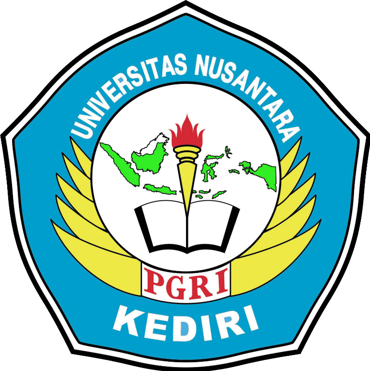

     
   

## 🎉 Pemrograman Berorientasi Objek 🎉

Selamat datang di Mata Kuliah Pemrograman Berorientasi Objek
Program Studi Teknik Informatika
Universitas Nusantara PGRI Kediri

Repository ini digunakan sebagai media penyampaian materi perkuliahan.
Materi akan diperbaharui sewaktu-waktu tanpa pemberitahuan, sehingga tidak bisa dijadikan bahan rujukan ilmiah.
Materi yang ada disertai bahan perkuliahan Teori & Praktikum.
Materi dihimpun dari banyak sumber, sehingga kami tidak menyertakan kutipan ataupun sitasi.

### List Materi :
|Langkah|Topik|Target Pembelajaran|Materi Rujukan|
|:-:|:-:|:-:|:-:|
|01|Dasar Python|Pengenalan Lingkungan Pemrograman Python|[M01](M01/README.md)|
|02|Dasar Python|Dasar Pemrograman Python|[M02](M02/README.md)|